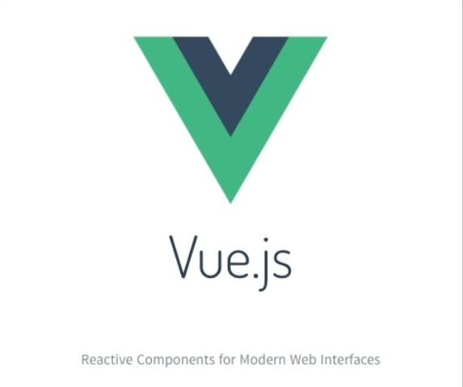
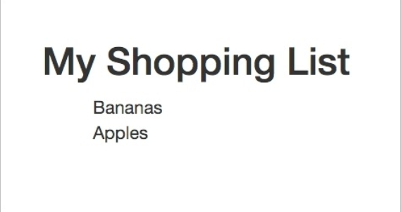
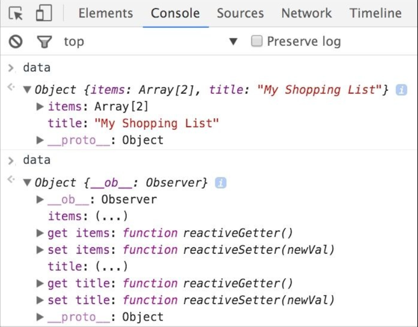
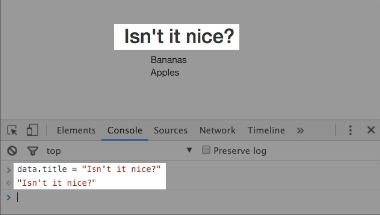
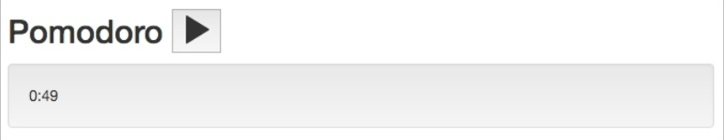
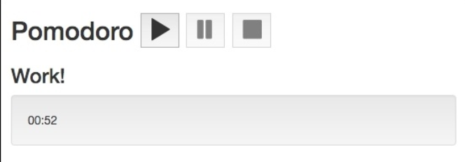

# Going Shopping with Vue.js

> "Vue.js is a JavaScript framework for building astonishing web applications. Vue.js is a
JavaScript library for creating web interfaces. Vue.js is a tool that leverages the use of
MVVM architecture."

这是来自 Jargon 的建议， Vue.js 是一款 JavaScript 库， 它基于数据模型来创建用户界面(Views) http://jargon.js.org/_glossary/VUEJS.md 。

Vue.js 官方站点( https://vuejs.org/ ) 在几个月前说 Vue.js 像是为现代 web 用户界面创建的响应式组件。



现在说 Vue.js 是一款渐进式 JavaScript 框架：


所以 Vue.js 到底是个啥？ 框架？ 工具？ 库？ 它能被用于构建全栈 web 方程式吗？ 还是只能添加一些特殊的功能？ 我应该从我最喜欢的框架切换过来吗？ 如果是， 又是为什么？ 我可以在项目中单独使用它吗？ 它能带来什么优势呢？

在本章， 我们将试着发现这些问题的答案。 我们将在一些简单的事例里初试 Vue.js 。

更多内容如下列表：

* 学习 Vue.js 到底是什么， 它重要的部分及其的历史
* 学习哪些项目使用 Vue.js
* 用 Vue.js 构建一个简单的购物清单并用 jQuery 完成相应的方程式
* 用 Vue.js 构建番茄钟
* 做一点简单的练习

## Vue.js 历史

当时 Evan You， Vue.js 的创建者 ( http://evanyou.me/ )， 在 Google Creative 实验室搞一个项目， 它们需要一款制作快速原型而不是大型的 UI 视图的工具。 书写大量重复的 HTML 是很耗时耗资源的， 所以 Evan 开始寻找一些已有的工具。 出乎意料的是， 这里没有一款工具， 库， 或是框架可以很好地制作快速原型！ 在那时， Angular 被广泛使用， React.js 才刚刚起步， 像 Backbone.js 这样的 MVC 框架被用于大型方程式。 对于这种需要弹性及轻量级的快速原型项目来说， 这些复杂的框架无法胜任。

当你意识到这些东东很酷且不存在时， 你可能自己动手创造它 -- just do it！

### 注意

Vue.js 以制作快速原型工具的身份诞生。 现在它可被用于构建复杂大规模响应式 web 方程式。

这就是 Evan 所做的。 他通过简单， 弹性的响应式数据和可重用组件的方式帮助制造快速原型进而创造一个库的故事。

就像每个库一样， Vue.js 也不断成长发展， 因此提供了越来越多的功能。 现在， 它提供了一种简单的方式来添加创建插件， 书写和使用混入， 为方程式整体添加自定义行为。 Vue 可以像框架一样以弹性灵活的方式构建 web 方程式。

## 关于 Vue.js 最重要的事

Vue.js 允许你简单绑定你的数据模型给呈现层。 它也允许你在整个方程式内简单地重用组件。

在这儿你不需要创建特殊的模型或者集合来注册事件对象。 你不需要遵循一些特别的语法。 你不需要安装无止境的依赖。

<这三句话都在说谁， 你们知道的！(￣o￣) . >

你的模型是原生 JavaScript 对象。 它们可以被绑定给任意视图(text， inputtext， classes， attributes 等)。

你可以简单地添加 *vue.js* 到你的项目内并使用它。 你还可以使用 *vue-cli* 及 Webpack 和 Browserify 来启动整个项目, 它支持热重载并提供开发者工具。

## 我们去采购！

我知道你的周末又近了， 你想去杂货店为下周采购一些东东。 除非你记忆力超群， 否则在出发前你一定需要一个购物清单。 你可能已经在使用了一些方程式来这样做了， 但我们为啥不自己也做一个呢？ 你觉得我们自己创建设计一个购物清单方程式怎么样？ 还等啥， 我们动手吧！ 我们来创建自己的购物清单方程式。 这非常简单只需为购物清单构建交互原型。

这个方程式允许我们增加删除选项并展示我们的购物列表。 实际上呢， 这和 ToDo 列表有点像。 我们以经典的 HTML + CSS + JS + jQuery 组合来实现它。 我们将使用 Bootstrap 框架来添加一些赏心悦目的样式。

## 用 jQuery 实现一个购物清单

你的代码可能就像下面的：

```html
<div class="container">
    <h2>My Shopping List</h2>
    <div class="input-group">
        <input placeholder="add shopping list item" type="text" class="js-new-item form-control">
        <span class="input-group-btn">
          <button class="js-add btn btn-default"
          type="button">Add!</button>
        </span>
    </div>
    <ul>
        <li>
            <div class="checkbox">
                <label>
                  <input class="js-item" name="list"
                  type="checkbox"> Carrot
                </label>
            </div>
        </li>
        <li>
            <div class="checkbox">
                <label>
                  <input class="js-item" name="list" type="checkbox"> Book
                </label>
            </div>
        </li>
        <li class="removed">
            <div class="checkbox">
                <label>
                  <input class="js-item" name="list" type="checkbox"
                  checked> Gift for aunt's birthday
                </label>
            </div>
        </li>
    </ul>
</div>
```

然后是 CSS 代码：

```css
.container {
  width: 40%;
  margin: 20px auto 0px auto;
}
.removed {
  color: gray;
}
.removed label {
  text-decoration: line-through;
}
ul li {
  list-style-type: none;
}
```

最后是 JavaScript/jQuery 代码：

```javascript
$(document).ready(function () {
  /**
  * Add button click handler
  */
  function onAdd() {
    var $ul, li, $li, $label, $div, value;

    value = $('.js-new-item').val();
    //validate against empty values
    if (value === '') {
      return;
    }

    $ul = $('ul');
    $li = $('<li>').appendTo($ul);
    $div = $('<div>')
          .addClass('checkbox')
          .appendTo($li);
    $label = $('<label>').appendTo($div);

    $('<input>')
      .attr('type', 'checkbox')
      .addClass('item')
      .attr('name', 'list')
      .click(toggleRemoved)
      .appendTo($label);

    $label.append(value);
    $('.js-new-item').val('');
  }

  /
  **
  * Checkbox click handler -
  * toggles class removed on li parent element
  * @param ev
  */

  function toggleRemoved(ev) {
    var $el;
    $el = $(ev.currentTarget);
    $el.closest('li').toggleClass('removed');
  }

  $('.js-add').click(onAdd);
  $('.js-item').click(toggleRemoved);
});
```

### Tip
你可以在 https://github.com/PacktPublishing/Learning-Vue.js-2 下载源码。

如果你打开浏览器， 你会看到如下图的东东：


用 HTML + CSS + JS + jQuery 完成一个购物清单方程式

在 JSFiddle https://jsfiddle.net/chudaol/u5pcnLw9/2/ 查看效果。

正如你看到的， HTML 代码里包含一个无序列表， 每个项目都有一个复选框和一点文本， 一个给用户输入的输入框和 **Add!** 按钮。 每次点击 **Add!** 后， 输入的文本将转换到列表中。 点击项目的复选框时， 项目的状态被切换为已买到。

我们来增加一个可以改变清单标题的功能。

所以， 我们需要再添加一点事件监听器和控制器：

```html
<div class="container">
  <h2>My Shopping List</h2>
  <!-- ... -->
  <div class="footer">
    <hr/>
    <em>Change the title of your shopping list here</em>
    <input class="js-change-title" type="text"
    value="My Shopping List"/>
  </div>
</div>
```

```js
function onChangeTitle() {
  $('h2').text($('.js-change-title').val());
}
$('.js-change-title').keyup(onChangeTitle);
```

在 JSFiddle  https://jsfiddle.net/chudaol/47u38fvh/3/ 查看。

## 用 Vue.js 完成购物清单

这是个非常简单的事例。 我们试着用 Vue.js 一步步完成它。 这里有许多用方法引入 *vue.js*， 在本章， 我们将通过 CDN 添加 Vue 文件的方式引入：

```html
<script src="https://cdnjs.cloudflare.com/ajax/libs/vue/2.0.3/vue.js">
</script>
```

我们来渲染列表元素。

创建 HTML：

```html
<div id="app" class="container">
  <h2>{{ title }}</h2>
  <ul>
    <li>{{ items[0] }}</li>
    <li>{{ items[1] }}</li>
  </ul>
</div>
```

现在添加 JavaScript 代码：

```js
var data = {
  items: ['Bananas', 'Apples'],
  title: 'My Shopping List'
};

new Vue({
  el: '#app',
  data: data
});
```

打开浏览器， 你将看到如下列表：



用 Vue.js 完成购物清单

我们来分析一下这个事例。 Vue 方程式以 *new Vue* 关键字开始。 我们是怎么绑定这些标记给方程式数据的呢？ 我们 *vue* 实例传入绑定的 DOM 元素而其它页面中的标记将不受 Vue 影响。

正如你所见， 我们的标记包围在 *#app* 元素内并以第一个参数传入 Vue 配置选项内。 *data* 参数包含着被应用于双花括号内的内容。 如果你了解一些模板预处理器， 将会对这种语法很熟悉。

那又如何？ 你可能惊呼起来。 你要教我啥？ 如何使用模板预处理器？ 谢谢， 手动再见 \(•ω•)o！

别， ＞﹏＜ 我亲爱的读者朋友， 耐心点， 我们继续来完成我们的事例。 有趣的就在后面！

## 用开发者工具分析数据绑定

我们来看看数据绑定是怎么回事。 打开你浏览器的开发者工具， 找到 JavaScript 代码， 在脚本开始前添加一个断点。 现在分析下 *data* 对象在 Vue 初始化前后的变化。 如你所见， 变化很大。 现在 *data* 对象已经绑定为响应式数据了：



data 对象在 Vue 初始化前后的变化

现在如果我们从控制台改变了 *data* 对象的 *title* 属性， 它将自动反应到页面上：



数据绑定： 变化对象的属性将迅速影响视图

## 用双向绑定把用户输入带给 data

所以， 在我们的事例中， 我们可以把原生的 JavaScript 数据模型传递到页面中。 我们提供了一种方程式数据通向视图的单向方式。 你不觉得如果我们提供一种双向的数据绑定会更好吗？

我们现在就看看怎么实现双向的数据绑定， 怎样在页面上改变 *data* 的属性值。

为标题拷贝 HTML 标记， 改变在第一个 jQuery 事例中的输入， 在 input 上添加 *v-model="title"* 的特性。

### Tip

你听说过 Vue.js 中的指令了吗？ 恭喜， 你已经在使用指令了！ 实际上， *v-model* 特性就是 Vue.js 用来提供双向数据绑定的指令。 你可以在 Vue 官方页面了解更多  http://vuejs.org/api/#v-model 。

现在， HTML 代码如下：

```html
<div id="app" class="container">
  <h2>{{ title }}</h2>
  <ul>
    <li>{{ items[0] }}</li>
    <li>{{ items[1] }}</li>
  </ul>
  <div class="footer">
    <hr/>
    <em>Change the title of your shopping list here</em>
    <input v-model="title"/>
  </div>
</div>
```

就这么简单！

刷新页面改变输入， 你将看到标题自动更新：


数据绑定： 改变绑定在模型属性上的文本将影响被绑定的相同属性

很棒吧； 但是这个事例仅仅有两个列表项。 我们需要渲染更多的列表项。

## 用 v-for 指令渲染更多的列表项

我们需要一种机制来遍历 *items* 数组并在 *ul* 中渲染每一个列表项。

幸运的是， Vue.js 提供一种很棒的指令来做这件事。 它就是 *v-for*。 我们将在 *li* 上使用它。 修改我们的标记：

```html
<ul>
  <li v-for="item in items">{{ item }}</li>
</ul>
```

### 注意

你将会学到更多的新指令例如 *v-if, v-else, v-show, v-on, v-bind* 等。

刷新页面查看。 页面没有变化。 试着在控制台往 *items* 数组内添加列表项， 列表变化了：


数据绑定： 改变数组迅速影响列表

现在， 我们用一行标记就有了整个列表。 但是我们还需要一个允许我们切换购买状态的复选框。

## 切换列表项的状态

为了达到这个目的， 我们稍微改变我们的 *items* 数组：

```js
var data = {
  items: [{ text: 'Bananas', checked: true },
          { text: 'Apples', checked: false }],
  title: 'My Shopping List',
  newItem: ''
};
```

我们的标记看起来是这样的：

```html
<ul>
  <li v-for="item in items" v-bind:class="{ 'removed':
  item.checked }">
    <div class="checkbox">
      <label>
        <input type="checkbox" v-model="item.checked"> {{
        item.text }}
      </label>
    </div>
  </li>
</ul>
```

刷新页面查看 *items* 的 *checked* 属性， 观察效果。 每个 *li* 的状态都被绑定到复选框的布尔值上了。

## 使用 v-on 指令添加新的购物清单

现在， 我们需要改造一下我们的的购物清单。 我们需要添加更多的对象给 *data* 对象， 叫它 *newItem* 吧。 我们也可以添加一个方法来把它加到 *items* 数组里。 我们需要 *v-on* 指令来通过点击事件调用添加方法。

我们的 JavaScript 如下：

```js

var data = {
  items: [{ text: 'Bananas', checked: true },
          { text: 'Apples', checked: false }],
  title: 'My Shopping List',
  newItem: ''
};

new Vue({
  el: '#app',
  data: data,
  methods: {
    addItem: function () {
      var text;
      text = this.newItem.trim();
      if (text) {
        this.items.push({
          text: text,
          checked: false
        });
        this.newItem = '';
      }
    }
  }
});
```

我们为 *data* 对象添加了一个新属性叫 *newItem*。 然后我们加了一个新的 *methods* 给 Vue 初始化设置对象并添加了 *addItem* 方法。 所有的 *data* 属性都可以在 *methods* 内通过 *this* 关键字访问到。 因此， 在这个方法内， 我们取得 *this.newItem* 并添加它到 *this.items* 数组。 现在我们必须把这个方法的调用绑定到用户操作上。 就像前面提及的， 我们将使用 *v-on* 指令并应用 *enter* 键盘事件给 **Add!** 点击按钮。

我们的标记是这样的：

```html
<div class="input-group">
  <input v-model="newItem" v-on:keyup.enter="addItem"
  placeholder="add shopping list item" type="text" class="formcontrol">
  <span class="input-group-btn">
    <button v-on:click="addItem" class="btn btn-default"type="button">Add!</button>
  </span>
</div>
```

### 注意
*v-on* 指令附加一个事件监听器给元素。 缩写为 *@* 标志。 所以 *v-on:keyup="addItem"* 等于 *@:keyup="addItem"* 。 阅读更多 *v-on* 指令信息 http://vuejs.org/api/#v-on。

整个代码如下：

```html
<div id="app" class="container">
  <h2>{{ title }}</h2>
  <div class="input-group">
    <input v-model="newItem" @keyup.enter="addItem"
    placeholder="add shopping list item" type="text"
    class="form-control">
    <span class="input-group-btn">
    <button @click="addItem" class="btn btn-default"
    type="button">Add!</button>
    </span>
  </div>

  <ul>
    <li v-for="item in items" :class="{ 'removed': item.checked}">
      <div class="checkbox">
      <label>
        <input type="checkbox" v-model="item.checked"> {{
        item.text }}
      </label>
      </div>
    </li>
  </ul>

  <div class="footer hidden">
    <hr/>
    <em>Change the title of your shopping list here</em>
    <input v-model="title"/>
  </div>
</div>
```

JavaScript 代码如下：

```js
var data = {
  items: [{ text: 'Bananas', checked: true },
          { text: 'Apples', checked: false }],
  title: 'My Shopping List',
  newItem: ''
};

new Vue({
  el: '#app',data: data,
  methods: {
    addItem: function () {
      var text;
      text = this.newItem.trim();
      if (text) {
        this.items.push({
          text: text,
          checked: false
        });
        this.newItem = '';
      }
    }
  }
});
```

JSFiddle： https://jsfiddle.net/chudaol/vxfkxjzk/3/。


## 在已有的项目中使用 Vue.js

我知道你现在感觉绑定模型属性给视图是多么容易， 你开始思考如何在你的项目内使用它了。 但是你可能会觉得使用 Vue.js 很麻烦需要安装一堆文件。

在这儿我告诉你： 完全不需要！ 不需要任何安装， 仅仅引入 *vue.js* 文件就可以了。 就这么简单。

## Vue.js 2.0!

写作此书时， Vue.js 2.0 发布了 https://vuejs.org/2016/04/27/announcing-2.0/ 。 更多内容：

* http://www.infoworld.com/article/3063615/javascript/vuejs-lead-our-javascriptframework-is-faster-than-react.html
*  https://www.reddit.com/r/vuejs/comments/4gq2r1/announcing_vuejs_20/

第二版的 Vue.js 比起前面的版本有了很大的变化， 数据绑定的方式变化了并被写入 API。 运用轻量级的虚拟 DOM 来进行渲染， 支持服务端渲染， 更快更精简。

写作此书时， Vue 2.0 还是 alpha 阶段。 别担心， 尽管如此，我们在本书中所有的事例都将基于最新稳定版的 Vue 2.0， 并完全支持这两个版本。

## 使用 Vue.js 的项目

你可能现在想知道有哪些项目是基于 Vue.js 构建的， 或是作为它们代码基的一部分。 这里有很多开源， 试验性质的和企业项目在使用 Vue.js。 可以在这里找到 https://github.com/vuejs/awesome-vue#projects-using-vuejs 。


## 本书地图

这本书就像大多数技术书籍一样， 以一种你不需要从一而读的方式组织。 你可以选择你感兴趣的章节并跳过剩下的。

本书组织结构如下：
* 第二章， 基础 -- 安装使用， 理论性的知识， 将解释 Vue.js 背后的机制及主要组成部分。 所以， 你对理论不感冒可以跳过本章。 本章我们将经过安装使用和启动步骤。
* 从第三章至第八章， 我们将以构建方程式的方式来浏览 Vue.js 主要功能：
     * 在第三章， 组件 -- 理解与使用， 我们将介绍 Vue 组件并在我们的方程式内应用。
     * 在第四章， 响应式 -- 为你的方程式绑定数据， 我们将使用 Vue 提供的所有数据绑定机制。
     * 在第五章， Vuex -- 在方程式内管理状态， 我们将介绍 Vuex 状态管理系统并解释如何在我们的方程式内使用
     * 在第六章， 插件 -- 自己动手，丰衣足食， 我们将学习如何为 Vue 方程式通过创建使用插件来添加功能。
     * 在第七章， 测试 -- 测试我们所做的一切， 我们将覆盖并浏览 Vue.js 的自定义指令并我们的方程式创建一些指令。
     * 在第八章， 部署 -- 上线！， 我们将学习如何测试并部署我们的 Vue.js 方程式
* 在第九章， 下一步？， 我们将总结我们所学并看看我们还需要做哪些。

## 我们来管理时间！

此时， 我已经知道你已经迫不及待地想通读此书了。 这样可不好， 我们需要管理我们的时间， 劳逸结合。 所以我们来创建一个简单的方程式来实现番茄工作法。

### 注意
番茄工作法是一种时间管理技术以厨房番茄计时器命名。 这种技术以把工作时间打碎为小块的工作时段而组成。 更多番茄工作法信息： http://pomodorotechnique.com/ 。

因此， 我们的目的非常简单。 我们仅仅需要创建一个非常简单的时间计时器， 它将不断递减计时器来轮换工作时间和休息时间。

我们动手吧o(*￣▽￣*)ブ！

我们将引入两个 Vue data 变量， *minute， second*， 显示到我们的页面上。 秒数持续递减直到递减为零时， 分数递减； 当秒数和分数都为零时， 方程式切换工作时间与休息时间：

```js
const POMODORO_STATES = {
  WORK: 'work',
  REST: 'rest'
};
const WORKING_TIME_LENGTH_IN_MINUTES = 25;
const RESTING_TIME_LENGTH_IN_MINUTES = 5;

new Vue({
  el: '#app',
  data: {
    minute: WORKING_TIME_LENGTH_IN_MINUTES,
    second: 0,
    pomodoroState: POMODORO_STATES.WORK,
    timestamp: 0
  },
  methods: {
    start: function () {
      this._tick();
      this.interval = setInterval(this._tick, 1000);
    },

    _tick: function () {
      //if second is not 0, just decrement second
      if (this.second !== 0) {
        this.second--;
        return;
      }
      //if second is 0 and minute is not 0,
      //decrement minute and set second to 59
      if (this.minute !== 0) {
        this.minute--;
        this.second = 59;
        return;
      }
      //if second is 0 and minute is 0,
      //toggle working/resting intervals
      this.pomodoroState = this.pomodoroState ===
      POMODORO_STATES.WORK ? POMODORO_STATES.REST :
      POMODORO_STATES.WORK;

      if (this.pomodoroState === POMODORO_STATES.WORK) {
        this.minute = WORKING_TIME_LENGTH_IN_MINUTES;
      } else {
        this.minute = RESTING_TIME_LENGTH_IN_MINUTES;
      }
    }
  }
});
```

在我们的 HTML 代码中， 我们为 *minute* 和 *second* 创建两个占位符， 和一个番茄钟的开始按钮：

```html
<div id="app" class="container">
  <h2>
    <span>Pomodoro</span>
    <button @click="start()">
    <i class="glyphicon glyphicon-play"></i>
    </button>
  </h2>
  <div class="well">
    <div class="pomodoro-timer">
      <span>{{ minute }}</span>:<span>{{ second }}</span>
    </div>
  </div>
</div>
```

我们依然使用 Bootstrap 作为样式库， 我们的番茄钟是这样的：



用 Vue.js 构建的计时器

我们的番茄钟很棒， 但有一些问题：
* 首先， 我们不清楚哪个状态被切换了。 我们不知道我们是否该工作还是该休息。 我们来引入一个标题来指示番茄钟的状态。
* 另一个问题是分钟和秒钟不一致的显示。 例如， 24 分 5 秒应该显示为 24：05 而非 24：5。 我们来用计算值修复这个问题。
* 还有一个问题是我们的开始按钮可以被多次点击， 每次点击后都会重启计时器。 我们来修复这个问题。 通过引入开始， 暂停， 停止按钮来控制方程式的状态。

## 使用计算属性切换标题

我们用计算属性来修复第一个问题。

### 注意
计算属性是在 *data* 对象内允许我们避免用额外的逻辑过度扰乱模板的属性。 你可以在 Vue 的官方站点找到更多信息：  http://vuejs.org/guide/computed.html 。

在 Vue 的配置对象内添加计算部分和标题属性：

```js
data: {
  //...
},
computed: {
  title: function () {
    return this.pomodoroState === POMODORO_STATES.WORK ? 'Work!' :
    'Rest!'
  }
},
methods: {
  //......
}
```

现在在标记内使用 Vue data 属性：

```html
<h2>
  <span>Pomodoro</span>
  <!- -!>
</h2>
<h3>{{ title }}</h3>
<div class="well">
```

好棒！q(≧▽≦q) 现在我们有了在番茄钟状态变化时自动变化的标题了：


基于计时器状态自动更新的标题

很棒吧！

## 使用计算属性制造左间距

现在解决第二个问题。 我们添加两个计算属性， *min* 和 *sec*， 在 *data* 选项的计算部分并运用简单的算法在零的左边制造一个边距。 当然， 我们可以使用一个非常著名的项目 ( https://github.com/stevemao/left-pad )， 但是为了更简单并不破坏整个互联网 ( http://www.theregister.co.uk/2016/03/23/npm_left_pad_chaos/ )， 我们自己添加一个简单的逻辑：

```js
computed: {
  title: function () {
    return this.pomodoroState === POMODORO_STATES.WORK ? 'Work!' :
    'Rest!'
  },
  min: function () {
    if (this.minute < 10) {
      return '0' + this.minute;
    }
    return this.minute;
  },
  sec: function () {
    if (this.second < 10) {
      return '0' + this.second;
    }
    return this.second;
  }
}
```

并在 HTML 内使用这些属性值：

```html
<div class="pomodoro-timer">
  <span>{{ min }}</span>:<span>{{ sec }}</span>
</div>
```

刷新页面查看效果：


在 Vue.js 用计算属性制造左边距

## 用开始， 暂停， 停止按钮保持状态

所以呢， 现在来修复第三个问题， 我们引入三个方程式状态， *started, paused, stopped*， 我们来创建三个方法来切换这个三个状态。 我们已经拥有了开始方法， 所以我们只需要添加一点逻辑调整状态到 *started*。 我们也添加两个额外的方法， *pause, stop*， 它们将改变番茄钟对应的状态：

```js
const POMODORO_STATES = {
  WORK: 'work',
  REST: 'rest'
};
const STATES = {
  STARTED: 'started',
  STOPPED: 'stopped',
  PAUSED: 'paused'
};
//<...>
new Vue({
  el: '#app',
  data: {
    state: STATES.STOPPED,
    //<...>
  },
  //<...>
  methods: {
    start: function () {
      this.state = STATES.STARTED;
      this._tick();
      this.interval = setInterval(this._tick, 1000);
    },

    pause: function () {
      this.state = STATES.PAUSED;
      clearInterval(this.interval);
    },

    stop: function () {
      this.state = STATES.STOPPED;
      clearInterval(this.interval);
      this.pomodoroState = POMODORO_STATES.WORK;
      this.minute = WORKING_TIME_LENGTH_IN_MINUTES;
      this.second = 0;
    },
    //<...>
  }
});
```

在我们的 HTML 内添加两个按钮并为添加 *click* 监听器， 调用相应的方法：

```html
<button :disabled="state==='started'"
@click="start()">
  <i class="glyphicon glyphicon-play"></i>
</button>
<button :disabled="state!=='started'"@click="pause()">
  <i class="glyphicon glyphicon-pause"></i>
</button>
<button :disabled="state!=='started' && state !== 'paused'"
@click="stop()">
  <i class="glyphicon glyphicon-stop"></i>
</button>
```

现在我们的方程式看起来是这样的：



根据方程式的状态切换开始， 暂停， 停止按钮

在 JSFiddle 查看效果 https://jsfiddle.net/chudaol/b6vmtzq1/1/

做了这么多工作后， 你应该好好休息一下了， 这里有很多可爱的小猫， 来看看吧(●'◡'●) http://thecatapi.com/：


## 练习

在本章的最后， 我将布置一个小练习。 我们在前面构建的番茄钟毫无疑问是很棒的， 但是依旧缺乏一些功能。 一个非常棒的功能就是从 http://thecatapi.com/ 在休息状态下显示一只小猫。 你能实现吗？ 当然， 你可以的！ 但别被小猫萌翻哦(●'◡'●)。

## 总结

我非常高兴你看到这里了， 这意味着你已经知道 Vue.js 是什么， 如果有人问你它是一个工具还是库还是框架时， 你可以准确地找出答案。 你也知道如何用 Vue.js 来启动一个方程式并在已有的项目内使用 Vue 的功能。 你看了那些用 Vue.js 写的项目并开始开发一个自己的项目！ 现在你在采购时有了一个自己用 Vue.js 创建的购物清单方程式了！ 也有了自己的番茄钟。 还有最重要的是， 你可以在番茄钟内放入一只随机的猫咪了(>^ω^<)。

在下一章， 我们将探究 Vue 的幕后， 它是如何运作的， 它使用的架构模式又是怎样的。 对于事例中的每个概念我们将以 demo 的形式来演示它。 然后我们将深入代码并完善我们的方程式， 让它们变得更棒。
