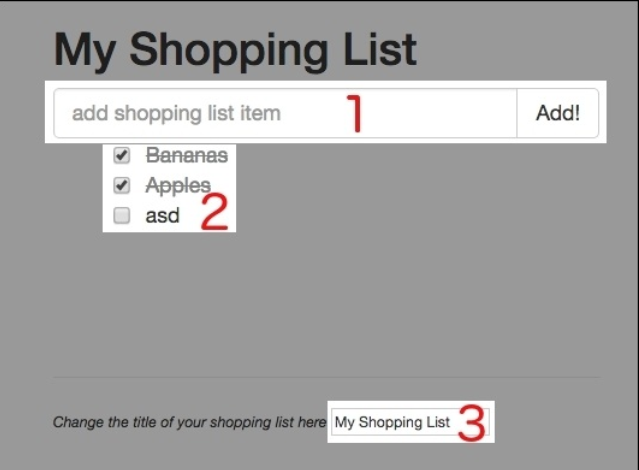
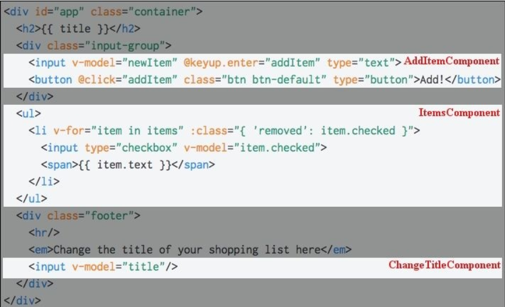

## Fundamentals – Installing and Using
在前一章， 我们熟悉了 Vue.js 。我们已经在两个不同的程序中使用了它。 我们学习了如何在项目中应用 Vue.js。 我们实践了响应式的数据绑定。

现在， 你可能会问自己： Vue 是怎样运作的？ 它又是如何在 数据模型 变化时快速响应 UI 变化的？ 你可能决定在项目中使用它， 想知道用不用遵循一些架构模式或者范例。 在本章我们将探索这些关键的概念， 理解隐藏在 Vue.js 背后的特性。 我们将分析所有安装 Vue.js 的方法， 同时为我们的方程式创建一个骨架， 然后在后续章节不断增强改进。 我们也会学习调试、 测试我们的方程式。

所以呢， 在本章，我们将学习如下内容：
* 什么是 MVVM 架构， 在 Vue.js 中如何体现
* 什么是声明式视图
* Vue.js 如何定义属性， getters、 setters
* 响应式和数据绑定如何运作
* 什么是藏检查机制、 DOM、 虚拟DOM
* Vue.js 1.0 和 2.0 的区别
* 什么是可重用的组件
* 插件、 指令、 自定义插件、 自定义指令如何在 Vue.js 中运作
* 如何安装、 运行、 调试 Vue 方程式

## MVVM 架构模式
你还记得我们是怎么创建 Vue 事例的吗？ 我们以关键字 new Vue({...}) 来创建实例。 你一定记得在配置项中， 我们可以吧数据对象传递给绑定的元素。 数据对象是我们的模型， 而 DOM 元素是 Vue 实例绑定的地方。


Vue 中的经典视图模型事例

同时， 我们的 Vue 实例帮助我们把模型绑定到视图中， 反之亦然。 我们的方程式因此遵循着 Model-View-ViewModel(MVVM) 模式。


Model-View-ViewModel模式简化图

我们的模型包含数据和一些基本逻辑， 视图对之响应。 视图模型控制数据绑定， 保证在模型数据的变化会迅速反应在视图中， 反之亦然。

我们的视图因此完成是数据驱动的。 视图模型响应了对数据流的控制， 这样数据绑定的声明才管用。

## 定义属性， getters、 setters
数据一旦传入 Vue 实例后将发生什么么？ 为什么这些被 Vue 应用的转换会自动地绑定到视图呢？

我们来分析一下我们需要做什么， 我说， 每当我们需要给一个字符串应用一些变化给 DOM 元素的时候，我们该怎样应用这个监听函数？ 在 *var stringVar = 'hello' ; stringVar.onchange(doSomething)* 中有太多的工作要做。

我们可以包装字符串的值， 设置一些 setting 或者 getting 函数， 当每次更新 字符串的时候， DOM 也随之更新。 你会怎样实现这个功能呢？ 当你想这个问题时， 我将准备一些有趣而简短的例子。

在你的购物清单方程式中打开你的开发者工具， 写下如下代码：

```
var obj = {};
var text = '';
```

我们我们 DOM 元素赋值给 h2

```
var h2 = document.getElementsByTagName('h2')[0];
```

如果我们把 *text* 的值赋给 *obj.text* 属性， 我们怎样才能追踪 *h2* 中每一次的属性变化呢？

我们可以使用 *Object.defineProperty* 方法(https://developer.mozilla.org/en/docs/Web/JavaScript/Reference/Global_Objects/Object/define)。

这个方法允许我们创建一个 *getter、 setter* 函数， 因此可以获取这些属性的变化。

```
Object.defineProperty(obj, 'text', {
  get: function ()　{
    retuen text;
  }
  set: function (newVal) {
    text = newVal;
    h2.innerHTML = text;
  }
});
```

现在在控制台改变 *obj.text* 的属性， 观察标题


object.defineProperty 在每次属性变化时被调用

Vue.js 就是应用了这个机制。 当数据被传入到 Vue 实例中时， 它的所有属性都将通过 *object.defineProperty* 方法。 在页面中的每个指令，都被安排了一个 *set* 方法。 打开 *vue.js* 文件并搜索 *set: function reactiveSetter(newVal)* 。增加一个断点并调试购物列表的输入， 直到找到在函数中最后一个叫 *dep.notify()* 的调用：


在 setter 函数中调用观察方法处的断点

在这个函数中， 你可以看到它正在遍历每一个属性的观察器， 并更新它们。 如果你跳过这个调用， 你将不会看到 DOM 的更新。 因为更新
上执行的事件轮询被放在了一个定期执行的队列里。

找到 *runBatcherQueue* 函数， 并放入断点。 再次尝试改变标题的值。 如你所见， 这个函数将遍历正在队列里等待的观察器， 然后调用它们的 *run* 方法。 观察这个方法， 你可以看到它在比较新值和旧值。

```
if (value !== this.value || ...
```
然后会启动一个回掉

```
this.cb.call(this.vm, value, oldValue);
```

如果你再仔细研究一个这个回掉函数， 你会发现它会在最后更新 DOM 值。

```
update: function update(value) {
  this.el[this.attr] = _toString(value);
}
```

很简单不是吗！

### 注意
在这里用的是 Vue.js 1.0版本。

所以呢， Vue.js 的响应式机制非常简单。 观察器被赋到所有指令和数据属性上， 然后在 *Object.defineProperty* 的 *set* 方法上， 依次通知更新每个 DOM 或数据。


数据对象到 DOM 间的数据流

那些拥有指令的 **DOM** 元素都被附着上了监听器， 来依次通知更新每次调用的数据值。

## 和其他框架的比较

当你尝试一个新工具时， 你一定想和其它工具或框架相比较。 你可以在 Vue.js 的官方页面找到一些深度地比较： http://vuejs.org/guide/comparison.html 。 在这些框架中我将在这里列出一些我认为重要的说明。


### React
React 和 Vue 很像。 他们都使用了虚拟 DOM ， 拥有可重用的组件， 响应式数据。 它值得一提， 但是， Vue 从 2.0 才开始使用虚 DOM。 2.0 之前它使用的是真实 DOM。 2.0 版本性能远超 1.0 同时也超过 React ( http://vuejs.org/guide/comparison.html#Performance-Profiles )。

两个框架最大的差别在于使用组件的方式。 你可能已经知道， 在 React 中所有一切都是 JavaScript。 用 JavaScript 开发所有的东东， 甚至是模板， 方程式一直在相同的作用域里，渲染便得非常有弹性。

但是， 一些需要快速原型的初级设计者， 或者是那些不想学习 JSX 的人来说， 这真是个痛点。 在 Vue 组件中， 你也可以使用 JSX， 也可以使用一般的 web 开发结构： 在 *<style>* 标签中写 CSS， 在 *<template>* 中写 HTML，在 *<script>* 标签中写 JavaScript 。 例如比较在 React 中写的渲染函数和在 Vue 组件的模板， 我将展示一个简单的事例来说明这些不同：


```
render () {
  return (
    <ul>
    {items.map(item =>
      <li className={item.checked && 'removed'}>
        <div className='checkbox'>
          <input type='checkbox' checked={item.checked}>
          { item.text}
        </div>
      </li>
      )}
    </ul>
  )
}
```

使用 Vue , 你只需写一些 HTML 代码在 *template* 标签中：

```
<template>
<ul>
 <li v-for="item in items" :class="{ 'removed': item.checked }">
 <div class="checkbox">
 <label>
 <input type="checkbox" v-model="item.checked">{{ item.text }}
 </label>
 </div>
 </li>
</ul>
</template>
```

我个人喜欢把这些东西都分离开， 因此我发现 Vue 这种方式更对口。

另一件很棒的事是 Vue 允许你在组件中使用带有作用域的样式， 只需要在 *style* 标签加上 scoped 属性。

```
<style scoped>
</style>
```

有了这个样式， 当你使用预处理器时，你可以在所在组件定义全局变量并创建或重定义样式。

值得一提的还有两个框架的学习曲线。 学习 React 你可能需要学习 JSX 和 ES2015 的语法， 因为大多数 React的官方事例都在用。 学习 Vue 你完全不需要这些， 就像使用 jQuery 一样，使用 Vue 模型和数据绑定非常简单。 然后选择对你有用的部分就行。

如果你想再深入地比较两个框架， 去看看文档， 精心制作相似的事例， 再看看哪个框架适合你。

### Angular
Angular 1 和 Angular 2 差别很大。 Angular 2 和 Angular 1 完全不一样。 它拥有更好的表现， API 不同了， 底层实现也被重写了。

这两个版本是如此不同以至于在 Vue 的官方文档中分别对这两个框架进行了比较。 但是横向对比这两个版本的 Angular ，你会发现 Vue 比它们更加友好。 对比 Angular 和 Vue 的 hello world 方程式 (https://angular.io/docs/js/latest/quickstart.html )
(http://vuejs.org/guide/index.html#HelloWorld)

> "即使没有 TypeScript, Angular 的快速指南需要 ES2015， 18各 NPM 依赖， 4各文件， 3000多行代码来输出 Hello World."

--http://vuejs.org/guide/comparison.html#Learning-Curve

如果你依然在使用 Angular 1, 值得一提的差别在于 Angular 的脏检查机制， 存在大量观察器时， Angular 性能会明显下降， 而 Vue 只会重解析变化属性的观察器， 其它观察器不会变化。

### Vue
我没写错， 这也值得比较，Vue 最近已经升级到了更快更轻的第二版， 如果你还在用第一版， 绝对值得升级。 你可以在这里查看 2016 年 4 月份发布的相关信息  https://vuejs.org/2016/04/27/announcing-2.0/


## Vue.js 基础

在开始编码之前，让我们来回顾一下 Vue 的特性。 分析下什么事可重用的组件， 如何控制方程式的状态， 谈谈插件， 过滤器， 混入。 在这一部分， 我们将稍微浏览一下这些特性。 后面再深入学习。

### 可重用的组件
既然你知道如何使用数据绑定， 也知道它如何运转， 是时候介绍另一项杀手级特性了。 Vue.js 创建的组件可以像盖房的砖块一样重用。 每个组件拥有自己作用域的样式和别的， 完全独立于其他组件。

创建组件的语法和创建 Vue 实例的语法很相似，你应该使用 *Vue.extend* 而非 *Vue* ：

```
var customComponent = Vue.extend({...})
```


Vue.js 中的自定义组件

例如，把我们的购物列表拆分成组件。 如你所知， 我们的购物列表有三个基本部分： 列表项， 输入项， 标题变更项：


我们购物清单方程式的三个基本项

我们可以把三个基本项变更为组件

```
var data ={
  items: [{text: 'Bananas', checked: true},
          {text: 'Apples', checked: false}
  ],
  title: 'My Shopping List',
  newItem: ''
};
new Vue({
  el: '#app',
  data: data,
  methods: {
    addItem: function () {
      var text;
      text = this.newItem.trim();
      if(text) {
        this.items.push({
          text: text,
          checked: false
          });
          this.newItem = '';
      }
    }
  }
  });
```

现在我们来创建三个组件： ItemsComponent, ChangeTitleComponent, AddItemComponent。 它们都需要数据属性。 AddItem 方法将从主要 Vue 实例转移到 ChangeTitleComponent。 所有必需的 HTML 将从 *index.html* 转移到每个组件。 所以最后，我们的脚本就像下面这样。

```
var data = {
  items: [{text: 'Bananas', checked: true},
          {text: 'Apples', checked: false}
  ],
  title: 'My Shopping List',
  newItem: ''
};
// Declaring components

var ItemsComponents = Vue.extend({
  data: function () {
    return data;
  },
  template: '<ul>' +
  ,            <li v-for="item in items"
              :class="{'removed': item.checked }">' +
  ,              <div class="checkbox">' +
  ,               <label>' +
  ,                <input type="checkbox"
                   v-model="item.checked"> {{ item.text }}' +
  ,               </label>' +
  ,              </div>' +
  ,            </li>' +
  ,          </ul>'

  });

var ChangeTitleComponent = Vue.extend({
  data: function () {
    return data;
  },
  template: '<input v-model="title"/>'
  });

var AddItemComponent = Vue.extend({
  data: function () {
    return data;
  },
  methods: {
    addItem: function () {
      var text;
      text = this.newItem.trim();
      if(text) {
        this.newItem.push({
          text: text,
          checked: false
          });
          this.newItem = "";
      }
    }
  },
  template:
  '<div class="input-group">' +
  '<input v-model="newItem" @keyup.enter="addItem"
  placeholder="add shopping list item" type="text"
  class="form-control">' +
  '<span class="input-group-btn">' +
  ' <button @click="addItem" class="btn btn-default"
  type="button">Add! </button>' +
  '</span>' +
  '</div>'
  });

  // Registering components

  Vue.component('items-component', ItemsComponents);
  Vue.component('change-title-component', ChangeTitleComponent);
  Vue.component('add-item-component', AddItemComponent);

  // Instantiating a Vue instance

  new Vue({
    el: '#app',
    data: data
  });
```

我们需要这样在视图中使用这些组件呢？ 我们只需用组件名替代相应的标记标签。 看起来像这样：


组件化的购物清单

第一个高亮区域我们将以 *<add-item-component></add-itemcomponent>*  标签来替换， 第二个拿 *<items-component></items-component>* 标签替换， 第三个拿 *<change-title-component></change-title-component>* 标签替换。 因此最终是这个样子的：

```
<div id="app" class="container">
  <h2>{{ title }} </h2>
  <add-item-component></add-item-component>
  <items-component></items-component>
  <div class="footer">
  </hr>
  <em>Change the title of your shopping list here </em>
  <change-title-component></change-title-component>
  </div>
</div>
```

我们将在后续章节继续深入组件， 学习更棒的方式来组织它们。

### Vue.js 指令
