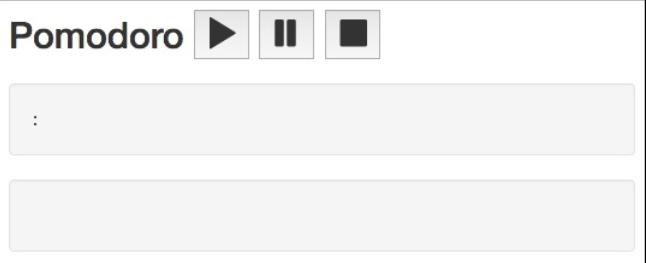
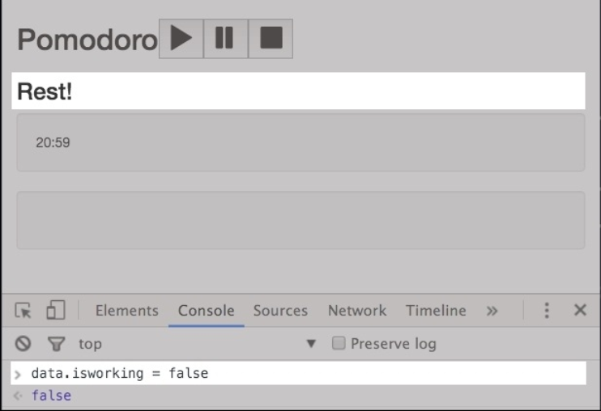
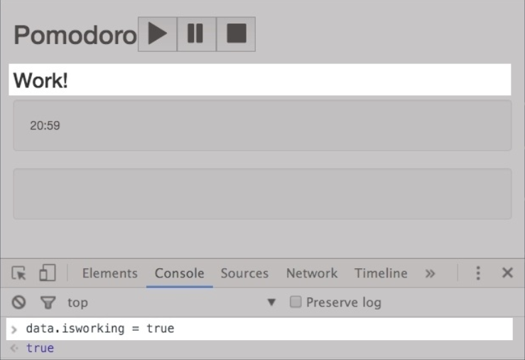
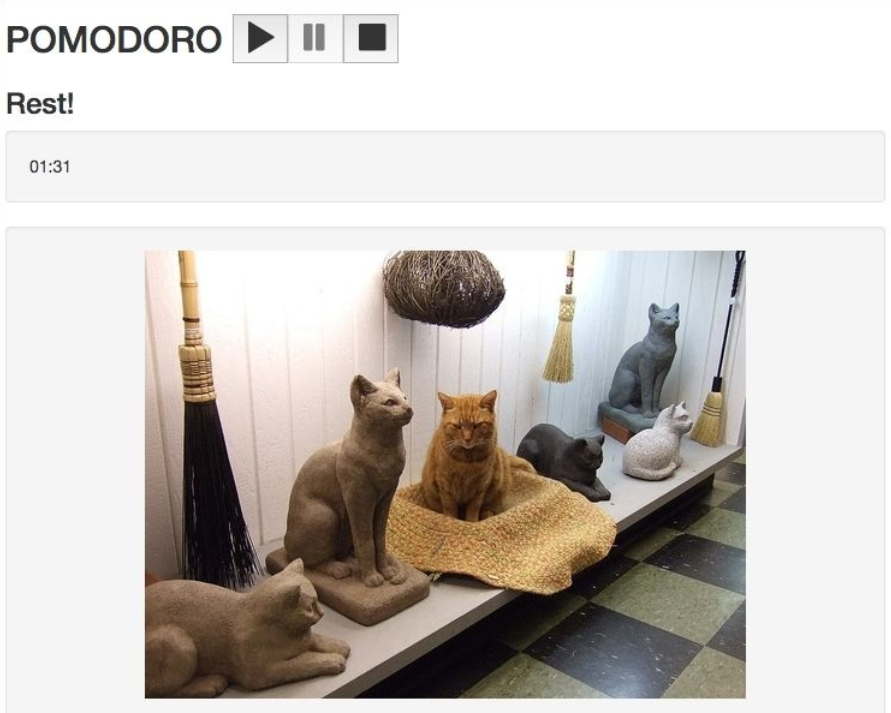
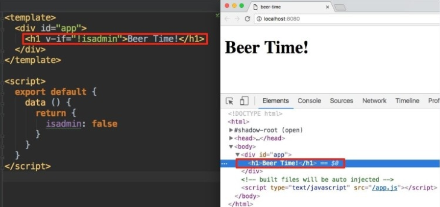
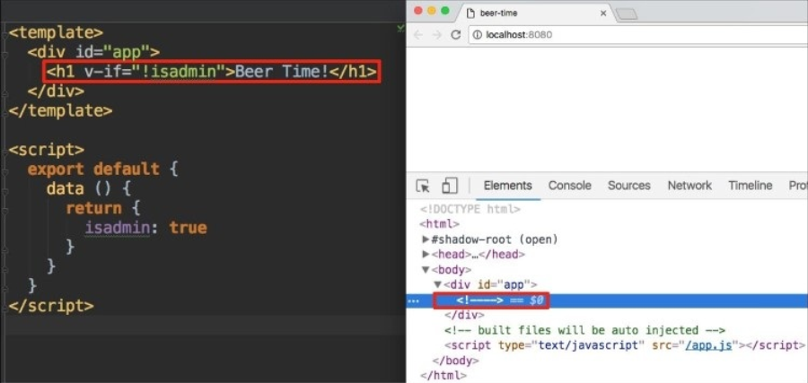
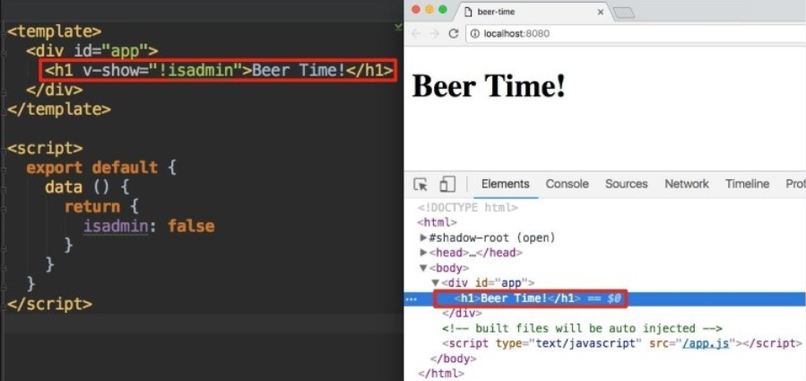
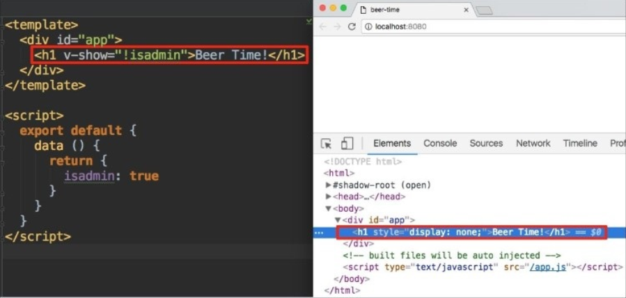
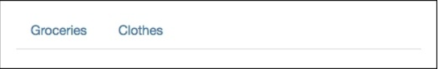

# 响应式 -- 为你的方程式绑定数据

在前一章， 你学习了 Vue.js 最重要的一个概念： 组件。 知道了如何创建、 注册、 调用、 重用组件
。 你理解了单文件组件并在购物清单和番茄钟方程式中应用。

在本章， 我们将深入数据绑定。 我们在前面已经讨论过它了， 你应该对它不再陌生了。 在我们的组件中你将使用所有可能的方式来绑定数据。

总结起来就是：
* 回顾数据绑定语法
* 在方程式里应用数据绑定
* 在相同的模板里用不同的数据来遍历数组并渲染单个元素
* 在我们的方程式中回顾并使用数据绑定和事件绑定简写方式

## 回顾数据绑定
在第一章我们已经讨论了数据绑定和响应式。 现在你已经了解了数据绑定就是从数据到视图层的传播机制， 反之亦然。 在本章， 我们将在方程式中仔细复习所有的数据绑定方式。

## 启动数据

想象我们现在有以下 **HTML** 代码片段：

```html
<div id="hello"></div>
```

同时还有如下 *JavaScript* 对象：

```js
var data = {
  msg: 'Hello'
};
```

我们怎样在页面渲染所有数据呢？ 我们又是怎样在 **HTML** 内获取它们呢？ 事实上， 我们已经在前两章就解决了这两个问题了。 当然我们可以再来一次。

> "Repetitio est mater studiorum"

如果你已经对数据插值十分熟悉， 可以先跳过这部分直接到表达式和过滤器部分。

所以， 我们应该怎样在 div 标签内填充 *msg* 的值呢？ 如果我们使用 jQuery, 老办法将是这样的：

```js
$(".hello").text(data.msg);
```

但是， 如果你在方程式运行期间改变 *msg* 的值并期望改变传递给 DOM , 你必须手动更新。 简单改变 *data.msg* 的值， 什么都不会发生。

```js
var data = {
  msg: 'Hello'
};
$("#hello").text(data.msg);
data.msg = 'Bye';
```

在 *div* 中将毫无疑问出现 *Hello*， 在 JSFiddle 查看效果 https://jsfiddle.net/chudaol/uevnd0e4/。

通过 Vue, 最简单的实现方式是使用双大括号， 在我们的事例中， 我们这样写：

```html
<div id="hello">{{ msg }}</div>
```

*div* 的内容尽管被绑定到了 *msg* 数据上， 当 *msg* 变化时， *div* 的内容会自动更新。 在 JSFiddle 查看效果  https://jsfiddle.net/chudaol/xuvqotmq/1/ 。 *data.msg* 也是随着 Vue 实例而变化的。 页面中的值将是一个新值。

这依旧是单向的数据绑定。 如果我们在 DOM 中改变值， 数据不会发生改变。 因此， 当我们只需要数据的值出现在 DOM 中时这将是完美的解决方案。

现在， 我们非常清楚地知道： 如果我们只想在模板内使用数据对象的值， 我们应该使用双大括号。

我们来继续实现我们的番茄钟方程式。 请在[chapter4/pomodoro](https://github.com/PacktPublishing/Learning-Vue.js-2/tree/master/chapter4/pomodoro) 查看当前的解决方案。 如果你运行了 *npm run dev* 后，你的页面应该像这样：



实现我们的番茄钟

简单看一眼页面， 我们可以看出这里缺少什么。

页面中缺少时间， 小猫， 还有番茄钟的状态。 小猫出现的逻辑依靠与番茄钟的状态。 我们来为番茄钟增加状态和时间。

## 为番茄钟增加状态标题

首先， 我们应该确定这个元素应该属于哪个组件。 看看我们的四个组件。 很显然它属于 *StateTitleComponent* 组件。 查看下面代码， 它实际上已经实现了标题绑定：

```html
//StateTitleComponent.vue
<template>
  <h3>{{ title }}</h3>
</template>

<style scoped>
</style>

<script>
</script>
```

很好！ 在前面的章节里， 我们已经做了大部分工作。 现在我们只需为此增加必须的数据绑定。 在这个组件的 script 标签内， 我们来增加包含 *title* 特性的数据对象。 现在， 我们给它硬编码一个可能的值然后再决定怎么去改变它。 你想怎样改变呢？ *Work!* 还是 *Rest!* ？ 我知道答案， 我们来添加如下代码：

```html
//StateTitleComponent.vue
<script>
export default {
  data () {
    return {
      title: 'Learning Vue.js!'
    }
  }
}
</script>
```

我们先就这样。 我们将在后面的 methods 和 event 控制中继续完善。

### 练习

用相同的方法为番茄钟增加事件， 可以先硬编码。

## 使用表达式和过滤器

在前面的事例中， 我们在双大括号中用了简单的属性键来插值。 事实上， Vue 在花括号里还有更多语法。 我们来看看。

## 表达式

超出意料， 但 Vue 完全支持在花括号写表达式！ 我们来用任意一个番茄钟组件试试这些表达式。 你可以在这里查看一些实践 [chapter4/pomodoro2](https://github.com/PacktPublishing/Learning-Vuejs-2/tree/master/chapter4/pomodoro2) 。

随便在一个组件内尝试下， 例如 *StateTitleComponent.vue* 文件。 我们来添加一些 JavaScript 表达式：

```html
 <!--fixed gitbook bug Math.pow(5, 2) -->
```

事实上， 你需要取消下面这些注释：

```html
//StateTitleComponent.vue
<!--<p>-->
  <!--fixed gitbook bug  Math.pow(5, 2)-->
<!--</p>-->
```

你将会在页面中看到 *25*。 好的。 我们用表达式来替换番茄钟内的一些简单数据绑定。 例如， 在 *CountdownComponent* 组件模板中， 两个指令， *min* 和 *sec* ，就可以被替换成一个表达式， 现在它是这样的：

```html
//CountdownComponent.vue
<template>
  <div class="well">
    <div class="pomodoro-timer">
      <span>{{ min }}</span>:<span>{{ sec }}</span>
    </div>
  </div>
</template>
```

我们可以用下面的代码进行替换：

```html
//CountdownComponent.vue
<template>
  <div class="well">
    <div class="pomodoro-timer">
      <span>{{ min + ':' + sec }}</span>
    </div>
  </div>
</template>
```

我们还可以在哪里加点表达式呢？ 我们再看看 *StateTitleComponent* 。现在， 我们需要硬编码标题。 我们知道， 但是， 标题依赖于番茄钟的状态。 如果是在 *working* 状态， 它将显示 **work!**， 否则应该显示 **Rest!**。 我们来创建一个叫 *isworking* 的特性， 把它分配在 App.vue 组件内， 因为它看起来更像是个全局方程式状态。 我们将重用 *StateTitleComponent* 组件的 *props* 特性。 因此， 打开 App.vue 为 *isworking* 添加一个布尔值， 设为真：

```js
//App.vue
<...>
window.data = {
  kittens: true,
  isworking: true
};
export default {
  <...>
  data () {
    return window.data
    }
}
```

我们在 *StateTitleComponent* 中重用属性， 为每个可能的值增加两个字符串属性， 最后， 在模板内增加判断状态来渲染标题的表达式。 因此， 组件的脚本看起来是这样的：

```html
//StateTitleComponent.vue
<script>
  export default {
    data () {
      return {
        workingtitle: 'Work!',
        restingtitle: 'Rest!'
      }
    },
    props: ['isworking']
  }
</script>
```

我们用 *isworking* 属性来有条件地渲染标题。 因此， *StateTitleComponent* 的模板是这样的：

```jade
<template>
  <div>
    <h3>

      <!-- fixed gitbook bug  with deleting expression-->
    </h3>
  </div>
</template>
```

刷新页面。 奇怪的是， 竟然标题显示的是 *Rest!* ， 可我们明明设置 *isworking* 值为真的。 那是因为我们忘记在 *App.vue* 中调用这个属性值！ 打开 *App.vue* 组件增加下面的代码：

```html
<state-title-component v-bind:isworking="isworking"><state-title-component>
```

现在， 如果你再查看页面， 当前的标题就显示为 *Work!* 了！ 如果你打开控制台并输入 *data.isworking = false*, 你将看到标题改变。

如果 *isworking* 特性为假， 标题就是 *Rest!*， 截图在下面：



如果 *isworking* 特性为真， 标题就是 *Work!*， 截图在下面：



## 过滤器

除了在模板中使用表达式， 我们还可以使用过滤器来转换表达式的值。 过滤器就是写函数。 我们创建它们并用管道符 **|** 应用它。 如果你创建了一个让字符大写的过滤器并命名为 uppercase ，为了使用它， 仅仅是在管道符后调用：

```html
<h3> %%title | lowercase %% </h3>
```

你可以链接很多过滤器， 例如， 如果你有了 A、 B 、C 三个过滤器， 你可以这样做 *{{ key | A | B | C }}*。 过滤器通过 *Vue.filter* 语法创建。 我们来创建我们的 *lowercase* 过滤器：

```js
//main.js
Vue.filter('lowercase', (key) => {
  return key.toLowerCase()
})
```

我们在我们的番茄钟的 *App.vue* 组件中应用。 为了使用过滤器， 我们应该网模板插值传入 “Pomodoro” 字符串。 我们应该传入 JavaScript 字符串表达式， 并使用管道符来应用：

```html
<template>
  <...>
    <h2>
      <span>{{ 'Pomodoro' | lowercase }}</span>
      <controls-component></controls-component>
    </h2>
  <...>
</template>
```

查看页面； **Pomodoro** 标题将以小写语法出现。

我们来回顾 *CountdownTimer* 组件。 现在， 这里只有一个硬编码的值。 但是但当方程式充满功能， 值应该由方程式计算而来。 值的范围为 0 到 60， 值可以是 **20：40** ,但不应该比 10 小。 例如， 现在只有 1 分钟 5 秒， 它会显示 1： 5， 这样不统一。 我们期望它是这样的 *01： 05* 。 所以， 我们需要一个左边填充的过滤器！ 我们来创建一个。

在 *main.js* 文件中添加一个左边填充过滤器：

```js
//main.js
Vue.filter('leftpad', (value) => {
  if (value >= 10) {
    return value
  }
    return '0' + value
})
```

打开 *CountdownComponent* 组件， 来把 *min* 和 *sec* 分割成不同的插值， 并为它们都添加一个过滤器：

```html
//CountdownComponent.vue
<template>
  <div class="well">
    <div class="pomodoro-timer">
      <span>{{ min | leftpad }}:{{ sec | leftpad }}</span>
    </div>
  </div>
</template>
```

用 1 和 5 来替代 *min* 和 *sec*， 分别查看。 数字被 “0” 填充好。

## 练习

创建两个过滤器， *uppercase* 和 *addspace*， 在番茄钟里应用：

* *uppercase* 过滤器必须确切地自说明
* *addspace* 过滤器必须为给定的字符串右边增加空间

不要忘记 **Pomodoro** 不是关键， 所以在插值括号里它不应被认为是一个字符串！ 标题应该像下面截图所示：


番茄钟标题在应用过滤器前后的变化在[ chapter4/pomodoro3 ](https://github.com/PacktPublishing/Learning-Vue.js-2/tree/master/chapter4/pomodoro3)。

## 回顾并应用指令

在前面的部分， 我们知道了方程式中插值并绑定到可见视图层。 尽管过滤器语法非常棒并提供了数据更改的能力， 它依然有很多限制。 例如， 用双大括号实现下面的效果：

* 在输入框内使用插值属性， 并对相应的对应值应用变化
* 为 data 绑定特殊的元素特性
* 依条件来渲染元素
* 遍历数组并渲染一些数组组件
* 为元素创建事件监听器

我们来试试第一个。 例如打开购物清单方程式( [chapter4/shopping-list ](https://github.com/PacktPublishing/Learning-Vue.js-2/tree/master/chapter4/shopping-list) )。 在 *App.vue* 模板中创建输入元素并设置 *{{ title }}*：

```html
<template>
  <div id="app" class="container">
    <h2>{{ title }}</h2>
    <input type="text" value="{{ title }}">
    <add-item-component></add-item-component>
    <...>
  </div>
</template>
```

啊偶！ 错误， 满地都是(T_T)。 **在特性中插值已经被移除了**。 在 Vue 2.0 中你可以简单地在特性中使用插值了吗？ 是的， 也不是。 在特性中插值将不会出现错误但会使标题中的值清零。 在 Vue 2.0 中， 也就是先行版， 实现这种行为， 我们必须使用指令。

### 注意

**指令** 是拥有 *v-* 前缀的特殊特性元素。 为什么是 *v-* 呢？因为 Vue 指令提供了简单的语法， 它有一套丰富的文本插值。 它们在数据每次变化时强有力地响应可见视图的特殊行为。

## 用 v-model 指令启动双向数据绑定

双向绑定会将数据变化传递给 DOM 层， 同时在 DOM 中的绑定数据也会传递回数据。 用这样的方法来向 DOM 绑定数据， 我们可以使用 *v-model* 指令。

我们确信你依然记得第一章的 *v-model* 指令吧：

```html
<input type="text" v-model="title">
```

以这种方式， 标题的值将出现在 input 中， 如果你在 input 中输入一些值， 相应的变化将立即应用给数据并在页面中所有的插值得到相应。

仅仅是用 *v-model* 来替换 handlebars 标记。

试着在输入框中输入一些值。 你可以看到标题值得变化！

记住， 这个指令只能应用给下面的元素：

* input
* select
* textarea

试着删除所有代码。 我们的主要目标是用标题组件改变标题。

## 组件间的双向绑定

记得在前面的章节里， 组件间双向的绑定不可以简单地通过 *v-model* 来实现。 由于架构原因， Vue 阻止了子类简单改变父级的作用域。

我们在子极组件中使用事件系统来改变购物清单标题。

我们将在这一章再做一次。 等过几段之后我们将到 *v-on* 指令再谈。

## 用 v-bind 指令绑定特性

*v-bind* 指令允许我们用表达式绑定一个元素的特性或组件属性。 为了给具体的特性应用， 我们使用冒号分隔符：

```html
v-bind：attribute
```

例如：

* v-bind:src = "src"
* v-bind:class = "className"

表达式可在 “” 中重写。 data 也可以被使用， 就像在前面的例子一样。 我们在 *KittenCompnent* 中添加小猫图片。 打开我们的番茄钟方程式 [chapter4/pomodoro3](https://github.com/PacktPublishing/Learning-Vuejs-2/tree/master/chapter4/pomodoro3) 。

打开 *KittenCompnent* ， 添加 *catimgsrc* 为组件数据， 用 *v-bind* 语法把 *src* 绑定到图片模板：

```html
<template>
  <div class="well">
    
  </div>
</template>
<style scoped>
</style>
<script>
  export default {
    data () {
      return {
        catimgsrc: "http://thecatapi.com/api/images/get?size=med"
      }
    }
  }
</script>
```

打开页面， 燥起来吧(●'◡'●)！



运用数据特性后了 KittenCompnent 组件

## 用 v-if 和 v-show 指令来条件渲染

如果你关注了前面的部分， 如果我让你条件渲染一些东东， 你可能在插值括号里使用 JavaScript 表达式。

但是， 试试在一整个组件内来条件渲染一些元素。 它不像在括号里的表达式那样简单。

*v-if* 指令允许条件式地渲染整个元素， 它可以是一个依赖一些条件的组件元素。 条件可以是任何表达式并使用数据属性。 例如， 我们可以这样做：

```html
<div v-if="1 < 5">hello</div>
```

或者：

```html
<div v-if="Math.random() * 10 < 6">hello</div>
```
或者：

```html
<div v-if="new Date().getHours() >= 16">Beer Time!</div>
```

或者使用组件的数据：

```html
<template>
  <div>
    <h1 v-if="!isadmin">Beer Time!</h1>
  </div>
</template>
<script>
  export default {
    data () {
      return {
        isadmin: false
      }
    }
  }
</script>
```

*v-show* 特性也是一样的。 唯一的不同点在于 *v-if* 将通过相应的条件来选择是否渲染元素， 而 *v-show* 特性将一直渲染元素， 只是在值为 *false* 时应用 *display： none* 。 我们来看看差别。 在 [ chapter4/beer-time](https://github.com/PacktPublishing/Learning-Vue.js-2/tree/master/chapter4/beer-time) 内打开 *beer - time* 项目， 运行 *npm run dev* 。 打开 *App.vue* 组件用 *true/false* 值来试验， 试着用 *v-show* 来替代 *v-if*。 打开开发者工具， 检查 **element** 选项卡。

我们先来看看用 *v-if* 指令的效果。

当条件值为真时， 效果如期； 元素被渲染出现在页面内：



当条件值为真时， 效果如期。

当条件值为假时，元素不被渲染：



当条件值为假时，元素不被渲染。

注意当条件不被满足时， 相应的元素一点也不会被渲染。

我们我看看 *v-show* 指令的效果。当条件为真时， 和使用 *v-if* 一样：



使用 *v-show* 来条件渲染。 条件为真。

现在我们来看看当条件为假时， *v-show* 将发生什么：



使用 *v-show* 来条件渲染。 条件为假。

在这个事例中， 条件为真时， 效果一致， 但当条件为假时， 元素也被渲染出来但加上了 *display: none* 属性。

你如何去决定使用哪一个指令呢？ 在第一次渲染时， 如果条件为假， *v-if* 指令一点也不会渲染元素， 因此减少了初始的计算消耗。 但是， 如果属性在运行期间频繁改变， 渲染元素的成本将会比设置 *display:none* 更昂贵。 因此在频繁改变属性时使用 *v-show* ， 其它情况使用 *v-if*。

我们回到番茄钟方程式。 *KittensCompnent* 组件将会依赖于发你番茄钟的状态而被条件式地渲染。 所以， 在 [chapter4/pomodoro4](https://github.com/PacktPublishing/Learning-Vue.js-2/tree/master/chapter4/pomodoro4) 中打开你的番茄钟方程式。

你觉得应该使用哪个指令？ *v-if* 还是 *v-show* ？ 我们来分析一下。 站在客观的角度， 这个元素应该在初始化时是可视的吗？ 答案是否定的， 因为在初始渲染时， 用户才开始打开番茄钟。 可能使用 *v-if* 更好点。 但是我们来分析另一种情况 -- 频繁地切换状态来使 kittens 组件可见/不可见。 这将发生在番茄钟的倒计时中， 对吗？ 在 15-20 分钟后或在 5 分钟后重置计时， 实际上这也不是很频繁， 渲染带来的代价也不高
。 对于这个例子， 我的意见是， 用那个都行。 我们使用 *v-show* 。 打开 *App.vue* 文件向 *kittens-component* 应用 *v-show* 指令：

```html
<template>
  <div id="app" class="container">
    <...>
    <transition name="fade">
      <kittens-component v-show="!isworking"></kittens-component>
    </transition>
  </div>
</template>
```
打开页面， 试着在开发者工具内切换 *data.isworking* 的值， 观察效果。

## 用 v-for 指令来遍历数组

你可能记得我们用 *v-for* 指令来遍历数组：

```html
<div v-for = item in items>
  item
</div>
```

或者在组件内：

```html
<component v-for = item in items v-bind:componentitem="item"></component>
```

对于数组内的每一个项， 这将渲染一个组件并绑定组件中项的值。 当然， 你应该记得 “” 的绑定语法可以随意使用。

### Tip

别忘了在我们使用的绑定语法应该在组件 *data* 内呈现！

顺便看一个例子， 我们的购物清单方程式 [chapter4/shopping-list](https://github.com/PacktPublishing/Learning-Vuejs-2/tree/master/chapter4/shopping-list)。 它已经在 *ItemsComponent* 内使用了 *v-for* 语法：

```html
<template>
  <ul>
    <item-component v-for="item in items" :item="item"></item-component>
  </ul>
</template>
```

*ItemComponent*， 也需要声明 *props* ：

```html
<script>
  export default {
    props: ['item']
  }
</script>
```

我们来做点有趣的事。 直到现在我们依然只是在处理单个的购物清单。 想象一下你想要为不同的目的建立不同的购物清单。 例如， 你可能要在平常杂货采购中需要一份平常的购物清单。 在节日时你可能需要不同的购物清单。 你可能会在买房子时要一份不同的购物清单。 我们这就用 Vue 中强力的可重用组件来实现我们的购物清单方程式！ 我们将使用 *Bootstrap* 的选项卡面板来展示； 更多信息，请查阅 http://getbootstrap.com/javascript/#tabs 。

在你的 IDE 内打开[购物清单方程式](https://github.com/PacktPublishing/Learning-Vue.js-2/tree/master/chapter4/shopping-list) 。

首先， 我们增加 Bootstrap 的 JavaScript 文件和 jQuery , 因为 bootstrap  依赖它们。 在 *index.html* 内手动添加：

```html
<body>
  <...>
  <script src="https://code.jquery.com/jquery-3.1.0.js"></script>
  <script src="https://maxcdn.bootstrapcdn.com/bootstrap/3.3.7/js/bootstrap.min.js">
  </script>
  <...>
</body>
```

现在我们为我们将做的工作建立一个步骤总览：
1. 首先， 我们需要创建组件。 叫它 *ShoppingListComponent* , 把我们的当前 *App.vue* 内容放到这里面。
2. 我们新的 *ShoppingListComponent* 应该包含 title 和 items 的 *props* 特性。
3. ItemComponent 应该从 *props* 特性内接收 *items* , 而非把它硬编码。
4. 在 *App* 组件数据中， 我们先硬编码一个购物清单的数组， 每一项都应有标题， 数组项， ID。
5. *App.vue* 应该导入 *ShoppingListComponent*, 在模板内， 遍历 *shoppinglists* 数组， 建立一个 *html/jade* 的选项卡结构。

好了， 我们开始吧！

## 创建 ShoppingListComponent 修改 ItemsComponent

在组件文件夹内， 创建一个新的 *ShoppingListComponent.vue* 。复制拷贝 *App.vue* 文件内容到新文件内。 别忘了在 *items-component* 上声明包含 *title* 和 *items* 的 *props* 。 你的代码应该看起来像这样：

```html
//ShoppingListComponent.vue
<template>
  <div>
    <h2>{{ title }}</h2>
    <add-item-component></add-item-component>
    <items-component v-bind:items="items"></items-component>
    <div class="footer">
      <hr/>
      <change-title-component></change-title-component>
    </div>
  </div>
</template>

<script>
import AddItemComponent from './AddItemComponent'
import ItemsComponent from './ItemsComponent'
import ChangeTitleComponent from './ChangeTitleComponent'

export default {
  components: {
    AddItemComponent,
    ItemsComponent,
    ChangeTitleComponent
  }
  props: ['title', 'items']
}
</script>
<style scoped>
  .footer {
    font-size: 0.7em;
    margin-top: 20vh;
  }
</style>
```

注意我们移除了 container 的类。 这部分应该在 *App.vue* 内， 因为它定义了方程式全局的 container 样式。 别忘了 *props* 特性， 绑定 *props* 特性到 *items-component*!

打开 *ItemsComponent.vue* 并确保有包含 *items* 的　*props* 特性：

```html
<script>
  <...>
  export default {
    props: ['items'],
    <...>
  }
</script>
```

## 修改 App.vue

现在我们打开 *App.vue* 。移除在 script 标签和 template 标签内所有代码。 在 script 标签内导入 ShoppingListComponent, 并在 *component* 里调用它：

```html
//App.vue
<script>
  import ShoppingListComponent from './components/ShoppingListComponent'

  export default {
    components: {
      ShoppingListComponent
    }
  }
</script>
```

增加 *data* 特性并创建 *shoppinglists* 数组。 为数组添加任意的数据。 每一个数组对象都有 *id, title, items* 特性。在 *items* 特性内应该包含 *checked* 和 *text* 属性。 例如， 你的数据属性可能看起来是这样的：

```html
//App.vue
<script>
import ShoppingListComponent from './components/ShoppingListComponent'

export default {
  components: {
  ShoppingListComponent
  },
  data () {
    return {
      shoppinglists: [
        {
          id: 'groceries',
          title: 'Groceries',
          items: [{ text: 'Bananas', checked: true },
                  { text: 'Apples', checked: false }]
        },
        {
          id: 'clothes',
          title: 'Clothes',
          items: [{ text: 'black dress', checked: false },
                  { text: 'all stars', checked: false }]
        }
      ]
    }
  }
}
</script>
```

随便再添加点内容： 添加更多的 lists , items。

我们现在来创建通过遍历清单数组而编译到 bootstrap 选项卡面板的结构！ 我们先来定义一个基本的结构。 我们添加必要的类和模板结构假装我们现在只有一个元素。 我们用大写标识所有我们需要在 shopping list 数组内重用的项：

```html
//App.vue
<template>
  <div id="app" class="container">
  <ul class="nav nav-tabs" role="tablist">
    <li role="presentation">
      <a href="ID" aria-controls="ID" role="tab" data-toggle="tab">TITLE</a>
    </li>
  </ul>
    <div class="tab-content">
      <div class="tab-pane" role="tabpanel" id="ID">
        SHOPPING LIST COMPONENT
      </div>
    </div>
  </div>
</template>
```

在这里我们需要遍历 shopping lists 数组内的两个元素 -- 包含着 a 特性的 li 标签和 *tab-pane* 块。 对于第一个元素， 我们必须为每一个购物清单中的 *href* 和 *aria-controls* 特性绑定一个 ID 并插入标题。 在第二个元素内， 我们需要为 *id* 特性绑定 ID， 并在上面绑定 *items* 和 *title* 渲染购物清单列表项！ 我们开始吧。 开始添加 *v-for* 指令给每个元素。

```html
//App.vue
<template>
  <div id="app" class="container">
    <ul class="nav nav-tabs" role="tablist">
      <li v-for="list in shoppinglists" role="presentation">
        <a href="ID" aria-controls="ID" role="tab" datatoggle="tab">TITLE</a>
      </li>
    </ul>
    <div class="tab-content">
      <div v-for="list in shoppinglists" class="tab-pane" role="tabpanel" id="ID">
        SHOPPING LIST COMPONENT
      </div>
    </div>
  </div>
</template>
```
现在用合适的绑定来替换大写标识的部分。 记住对于绑定特性， 我们使用 *v-bind: <相应特性>* = "表达式" 的语法。

对于每个锚元素的 *href* 特性， 我们必须为它定义附加到 ID 选择器的表达式： *v-bind:href = "'#' + list.id"*。 *aria-controls* 特性应该被绑定到 ID 值上。 *title* 可以使用简单的双大括号插值标记。

对于 *shopping-list-component* 组件， 我们必须绑定 *title* 和 *items* 给对应的 list item。 你还记得我们在 *ShoppingListComponent* 的 *props* 内定义的 *title* 和 *items* 属性吗？ 绑定应该像是这样 *v-bind:title = list.title* 和 *v-bind:items= list.items*。

有了合适的绑定特性， 模板看起来应该像这样：

```html
//App.vue
<template>
  <div id="app" class="container">
    <ul class="nav nav-tabs" role="tablist">
    <li v-for="list in shoppinglists" role="presentation">
      <a v-bind:href="'#' + list.id" v-bind:aria-controls="list.id" role="tab" data-toggle="tab">{{ list.title }}</a>
    </li>
    </ul>
    <div class="tab-content">
      <div v-for="list in shoppinglists" class="tab-pane" role="tabpanel" v-bind:id="list.id">
        <shopping-list-component v-bind:items="list.items"></shopping-list-component>
      </div>
    </div>
  </div>
</template>
```

我们基本完工了！ 如果你现在打开页面， 你可以发现两个选项卡出现在页面中：



修改后出现选项卡标题

如果你点击选项卡标题， 响应的面板将会打开。 但这不是我们希望看到的。 我们希望看到第一个面板是被默认打开的。 为了实现这个效果， 我们应该为第一个选项卡增加一个 *active* 类。 但是我们应该怎样在所有由遍历数组产生的面板上操作呢？

幸运的是， Vue 不仅仅在 *v-for* 提供了对每一个遍历项的操作， 还提供多每项索引的遍历。 在模板内的表达式上重用索引变量。 因此， 我们恰当地用 “0” 这个索引来添加 *active* 类。 在 *v-for* 循环内使用索引变量很简单：

```js
v-for= "(list, index) in shoppinglists"
```

类绑定的语法也和其它绑定一样：

```js
v-bind:class = "active"
```

你还记得我们可以在表达式内随便写 JavaScript 语法吗？ 在这个例子内， 我们想写一个条件来解析当前值得索引， 如果索引为 “0” , 值的类是 *active*。

```js
v-bind:class = "index === 0? 'active' : ''"
```

为 *v-for* 修饰符添加 *index* 变量， 为 li 和 tabpanel 元素绑定 *class* 类， 所以最终的模板代码看起来是这样的：

```html
<template><div id="app" class="container">
  <ul class="nav nav-tabs" role="tablist">
    <li v-bind:class= "index===0 ? 'active' : ''" v-for="(list, index) in shoppinglists" role="presentation">
    <a v-bind:href="'#' + list.id" v-bind:aria-controls="list.id" role="tab" data-toggle="tab">{{ list.title }}</a>
    </li>
  </ul>
  <div class="tab-content">
    <div v-bind:class= "index===0 ? 'active' : ''" v-for="(list,index) in shoppinglists" class="tab-pane" role="tabpanel" v-bind:id="list.id">
      <shopping-list-component v-bind:items="list.items"></shopping-list-component>
    </div>
  </div>
  </div>
</template>
```

查看页面。 你应该可以看到一个完好的默认选项卡：


修改绑定正确类后的 shopping list 方程式

最终的 shopping list 方程式代码在[chapter4/shopping-list2](https://github.com/PacktPublishing/Learning-Vuejs-2/tree/master/chapter4/shopping-list2)。

### 使用 v-on 指令来监听事件

用 Vue.js 非常容易去为事件添加监听器。 事件监听也需要特殊修饰符的不同指令。 *v-on* 指令后面添加冒号：

```js
v-on:click = "MyMethod"
```

是的， 那我们在哪声明方法呢？ 你可以不按我说的做， 但大多数组件方法应该在 *methods* 属性内声明！ 所以我们来声明一个叫 *myMethod* 的方法， 就像下面这样：

```html
<script>
  export default {
    methods: {
      myMethod () {
        //do something nice
      }
    }
  }
</script>
```

所有的 *data* 和 *props* 特性在 methods 内都是可以用 *this* 关键字获取的。

我们为 *items* 数组增加一个增加新项数的方法。 我们实际上已经在前面的章节这样做过了， 在我们学习怎样用事件分发系统在父子组件间传递数据时。 我们将在这回顾这一部分。

为了在 *AddItemComponent* 内增加新的项给清单列表， 我们需要以下步骤：

* 确保 *AddItemComponent* 拥有一个叫 *newItem* 的 *data* 属性。
* 在 *AddItemComponent* 内创建 *addItem* 方法， 它用来添加新项并分发添加事件。
* 给 **Add!** 按钮用 *v-on:click* 指令运用事件监听器。 这个事件监听器应该调用默认的 *addItem* 方法。
* 在 *ShoppingListComponent* 内创建一个 *addItem* 方法， 它将接收文本值并把它作为参数添加到 *items* 数组内。
* 为在 *ShoppingListComponent* 内的 *add-item-component* 用自定义 *v-on* 指令来绑定一个 *add* 方法。

我们这就开始！ 使用[ chapter4/shopping-list2](https://github.com/PacktPublishing/Learning-Vuejs-2/tree/master/chapter4/shopping-list2) 文件夹。

打开 *AddItemComponent* 并为 **Add!** 按钮上添加 *v-on* 指令的 *addItem* 方法：

```html
//AddItemComponent.vue
<template>
  <div class="input-group">
    <input type="text" v-model="newItem" placeholder="add shopping list item" class="form-control">
    <span class="input-group-btn">
      <button v-on:click="addItem" class="btn btn-default" type="button">Add!</button>
    </span>
  </div>
</template>

<script>
  export default {
    data () {
      return {
        newItem: ''
      }
    },
    methods: {
      addItem () {
        var text
        text = this.newItem.trim()
        if (text) {
          this.$emit('add', this.newItem)
          this.newItem = ''
        }
      }
    }
  }
</script>
```
切换到 *ShoppingListComponent* 绑定 *v-on:add* 指令在 template 内的 *add-item-component* 调用：

```html
//ShoppingListComponent.vue
<template>
  <div>
    <h2>{{ title }}</h2>
    <add-item-component v-on:add="addItem"></add-item-component>
    <items-component v-bind:items="items"></items-component>
      <div class="footer">
        <hr/>
        <change-title-component></change-title-component>
      </div>
  </div>
</template>
```

现在在 *ShoppingListComponent* 内创建 *addItem* 方法。 接收文本值并把它添加到 *this.items* 数组：

```html
//ShoppingListComponent.vue
<script>
  import AddItemComponent from './AddItemComponent'import ItemsComponent from './ItemsComponent'
  import ChangeTitleComponent from './ChangeTitleComponent'

  export default {
    components: {
      AddItemComponent,
      ItemsComponent,
      ChangeTitleComponent
    },
    props: ['title', 'items'],
    methods: {
      addItem (text) {
        this.items.push({
          text: text,
          checked: false
        })
      }
    }
  }
</script>
```

打开页面尝试为列表添加在输入框内的值， 点击前面的按钮。 成功啦！

现在， 我想让你把自己从开发者模式切换用户模式。 在输入框内输入新值。 当列表项被添加后有那些明显行为？ 你会在键盘上点击回车键吗？ 我猜你会的！ 但在我们的方程式里， 我们还未实现这个功能。 别担心， 我的朋友， 我们只需要为输入框再添加点事件监听器就行啦就像我们在 **Add!** 按钮上做的那样。

听起来很简单， 是不是？ 在我们点击回车键后该触发哪些事件呢？ 对的， 就是键盘点击事件。 所以呢， 我们只需要在添加一个 *v-on:key* 指令就行啦。 问题是任何一个键被按下都该触发这个事件吗。 这不是我们想要的。 当然我们可以在 *addItem* 方法内增加条件判断并检查 *event.code* 特性， 当它为 13 (代表回车键)时， 我们调用方法。 幸运的是， Vue 给方法提供了一种按键修饰符的机制， 它允许我们只在正确的按键被点击时才触发。 它可以使用点修饰符来触发：

```js
v-on:keyup.enter
```

我们来为我们的输入框添加这个机制。 找到 *AddItemComponent* 为输入框添加 *v-on:keyup.enter* 指令：

```html
<template>
  <div class="input-group">
    <input type="text" v-on:keyup.enter="addItem" v-model="newItem" placeholder="add shopping list item" class="form-control">
      <span class="input-group-btn">
        <button v-on:click="addItem" class="btn btn-default" type="button">Add!</button>
      </span>
  </div>
</template>
```

打开页面尝试点击回车键为 shopping list 添加项。 成功啦！

我们对改变标题做同样的事。 唯一的区别在于增加条目， 我们过去使用自定义的 *add* 事件， 在这我们将使用原生的输入事件。 我们已经这么做过啦。 现在只是按下面步骤执行一遍：

1. 在 *change-title-component* 中使用 *v-model* 来绑定标题模型。
2. 在 *ChangeTitleComponent* 中导出在 *props* 内的值。
3. 在 *ChangeTitleComponent* 创建一个 *onInput* 方法用来分发目标对象的原生输入方法。
4. 在 *ChangeTitleComponent* 组件的模板内和 *onInput* 修饰符上绑定输入框的值。

因此， 在 *ShoppingListComponent* 模板内的 *change-title-component* 调用看起来是这样的：

```html
//ShoppingListComponent.vue
<change-title-component v-model="title"></change-title-component>

ChangeTitleComponent will look like the following:
//ChangeTitleComponent.vue
<template>
  <div>
    <em>Change the title of your shopping list here</em>
    <input v-bind:value="value" v-on:input="onInput"/>
  </div>
</template>
<script>
  export default {
    props: ['value'],
    methods: {
      onInput (event) {
        this.$emit('input', event.target.value)
      }
    }
  }
</script>
```

这部分最终版的代码在[ chapter4/shopping-list3](https://github.com/PacktPublishing/Learning-Vuejs-2/tree/master/chapter4/shopping-list3) 。

## 简写
当然， 每次去写 *v-bind* 和 *v-on* 指令也不费多少事。 开发者们更倾向于缩减大量的代码， 是的。 Vue.js 允许我们这样做！ 记住 *v-bind* 的简写形式是 : 符号， *v-on* 的简写形式是 @ 符号。 这意味对于下面这些代码我们可以这样写：

```js
v-bind:items="items"  
:items="items"

v-bind:class=' $index === 0 ? "active" : ""'   
:class=' $index===0 ? "active" : ""'

v-on:keyup.enter="addItem"  
@keyup.enter="addItem"
```

## 练习
用我们刚学过的简写方式重写在购物清单内的所有 *v-bind* 和 *v-on* 指令。

可以在这里查看[ chapter4/shopping-list4](https://github.com/PacktPublishing/Learning-Vuejs-2/tree/master/chapter4/shopping-list4) 。

## 小猫

在本章， 我们没在番茄钟上实现小猫切图效果。 我向你保证在下一章我们将把它当成重点项目。 与此同时， 我希望下面这只小猫会让你感到开心：


小猫问 “接下来是啥呢？”


## 总结

在本章， 我们扩展了所有绑定数据的方式。 你学习了如何使用双花括号来简单地插入数据。 你也学习了怎样使用 JavaScript 表达式来实现过滤器。 你学习运用了诸如 *v-bind, v-model, v-for, v-if, v-show* 这类指令。

我们使用了更丰富有效的数据绑定语法来改善我们的方程式。

在下一章， 我们将用简洁的概念谈谈 Vuex, 一个受 Flux 和 Redux 启发而成的状态管理架构。

我们将创建为两个方程式提供全局的方程式状态管理的仓库并深入它的工作原理。
