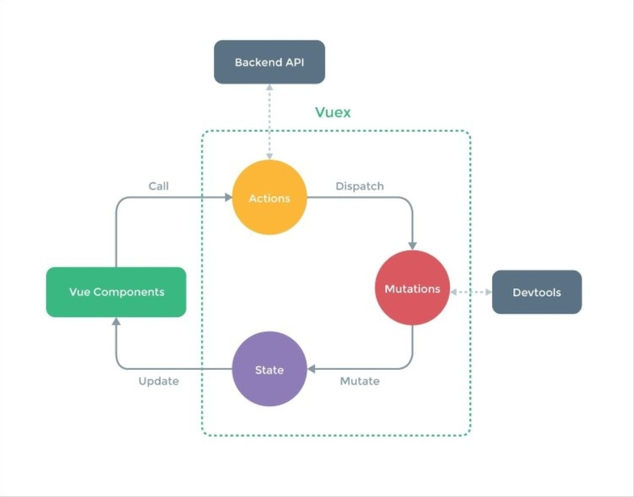

# Vuex – Managing State in Your Application

在前面的章节里， 你学习了 Vue.js 中最重要的概念之一： 数据绑定。 你在我们的方程式中学习并应用一堆绑定数据的方法。 你也学习了怎样去使用指令， 监听事件， 创建并调用方法。 在本章， 你将看到如何去管理呈现方程式全局状态的数据。 我们来聊聊 Vuex, Vuex 是一个专为 Vue.js 方程式开发的状态管理模式。 你将学习如何创建一个全局的数据仓库并如何在组件内检索变化。 我们将定义一个将在方程式中的本地数据， 我们将使用 Vuex 仓库与全局状态合作。

总结起来就是：
* 理解本地和全局状态间的区别
* 理解 Vuex 到底是什么和它的工作机制
* 学习在全局仓库中使用数据
* 学习仓库的 getters, mutations, actions
* 在购物清单和番茄钟方程式中安装使用 Vuex 仓库

## 父子组件间交流， 事件及脑筋急转弯

记得我们的购物清单方程式吗？ 记得我们的 *ChangeTitleComponent* 组件吗， 我们是如何确保在子组件内的输入影响到父组间的标题的？ 你记得每个组件都拥有它自己的作用域， 父级组件的作用域不能被子极组件影响。 因此， 为了从子极组件内传递给父级组件， 我们使用了事件。 你需要用父级组件上 *v-on* 指令调用子组件的 $emit 方法和被分发的事件名称。

如果是原生事件例如 *input*, 会更简单。 仅仅绑定需要的特性作为 *v-model* 到子极组件, 然后在子组件内通过 *$emit* 方法调用事件的名称。

事实上， 这就是我们在 *ChangeTitleComponent* 组件上做的全部。

打开[ chapter5/shopping-list](https://github.com/PacktPublishing/Learning-Vuejs-2/tree/master/chapter5/shopping-list) 文件夹。

你在 *shoppinglistComponent* 组件模板内使用 *v-model* 指令来给 *ChangeTitleComponent* 绑定标题。

```
//ShoppingListComponent.vue
<template>
  <div>
    <...>
    <div class="footer">
      <hr />
      <change-title-component v-model="title"></change-title-component>
    </div>
  </div>
</template>
```

然后， 我们在 *ChangeTitleComponent* 组件内 *props* 特性内声明标题的模型值， 在输入动作上分发 *input* 事件：

```
<template>
  <div>
    <em>Change the title of your shopping list here</em>
    <input :value="value" @input="onInput"/>
  </div>
</template>
<script>
  export default {props: ['value'],
    methods: {
      onInput (event) {
        this.$emit('input', event.target.value)
      }
    }
  }
</script>
```

很直接， 对吗？

如果我们尝试在输入框内改变标题， 我们的的购物清单会相应地改变：



在父级与子极组件间建立了基于事件交流后， 我们能改变标题

看起来我们已经实现了我们的目标。 但是， 如果你打开开发者工具， 你将看到显眼的错误：

```
[Vue warn]: Avoid mutating a prop directly since the value will be overwritten
whenever the parent component rerenders. Instead, use a data or computed
property based on the prop's value. Prop being mutated: "title"
```

哎哟! Vue 实际上是对的， 我们正在改变包含在 *ShoppingListComponent* 组件内的 *props* 特性数据。 这个特性来自主要的父级组件 -- *App.vue*, 相对的， 我们 *ShoppingListComponent* 组件的父级组件。 我们已经知道了我们不能改变来自子组件的父级数据。 如果标题直接属于 *ShoppingListComponent*, 一切没有问题， 但在这个例子中， 我们这样定义会出错。

你应该注意到了， 你可能注意到了这里已经没有更多地方来包含一片不改变的数据了。 看看选项卡的标题。 它一直在显示 **Groceries**。 但我们也想改变它。

小提示： 我已经增加了一个新的组件， *ShoppingListTitleComponent* 。 它来呈现选项卡的标题。 你还记得计算属性吗？ 注意这个组件就包含一个添加 *#* 给 ID 输入， 它通过 *props* 特性生成锚点：

```
<template>
  <a :href="href" :aria-controls="id" role="tab" data-toggle="tab">
  {{ title }}</a>
</template>
<script>
  export default{
  props: ['id', 'title'],
  computed: {
    href () {
      return '#' + this.id
    }
  }
  }
</script>
```

展示选项卡标题的锚包含一个依赖计算属性的 *href* 绑定指令。

所以， 回到标题变化。 当我们想改变在 *ChangeTitleComponent* 内的标题时怎样去改变这个组件的标题？ 如果我们能把事件传播给 *App.vue* 组件， 我们实际上就解决了这两个问题。 父组件无论何时的变化， 它将影响到所有的子组件。

所以， 我们需要一种从 *ChangeTitleComponent* 到主方程式组件之间的数据流。 听起来很难， 但实际上， 我们只需要在 *ChangeTitleComponent* 和它的父级组件上注册我们的自定义事件并分发到方程式主组件。 方程式主组件应该通过更新相应的标题来操控事件。 为了让 *App.vue* 知道购物清单确切的变化， 它的子组件 *ShoppingListComponent* 应该传入呈现的 ID。 为了这样， *App.vue* 应该把 ID 属性传给组件， 购物清单组件应该在它的 *props* 内注册它。

所以， 我们将做以下事：
1. 在 App 组件模板内的 *ShoppingListComponent* 绑定 *id* 属性
2. 在 *ShoppingListComponent* 组件内绑定 *title* 属性而不是在 *change-title-comonent* 内使用 *v-model*。
3. 在 *ChangeTitleComponent* 内为输入框附加自定义事件。
4. 告诉 *ShoppingListComponent* 监听来自 *change-title-component* 自定义的 *changeTitle* 事件， 并通过分发另一个事件来操作它。
5. 为 *shopping-list-component* 附加 *changeTitle* 事件监听器， 通过改变相应的标题来操作它。

我们来修改 *App.vue* 文件模板并绑定购物清单的 ID 给 *shopping-list-component*：

```
//App.vue
<template>
  <div id="app" class="container">
    <...>
      <shopping-list-component :id="list.id" :
      :items="list.items"></shopping-list-component>
    <...>
  </div>
</template>
```

现在在 *ShoppingListComponent* 内注册 *id* 特性：

```
//ShoppingListComponent.vue
<script>
<...>
export default {
  <...>
  props: ['id', 'title', 'items'],
  <...>
}
</script>
```

绑定 *title* 数据属性而非使用 *v-model* 指令：

```
//ShoppingListComponent.vue
<template>
  <...>
  <change-title-component :></change-title-component>
  <...>
</template>

//ChangeTitleComponent.vue
<template>
  <div>
    <em>Change the title of your shopping list here</em>
    <input :value="title" @input="onInput"/>
  </div>
</template>

<script>
export default {
  props: ['value', 'title'],
  <...>
}
</script>
```

分发自定义事件而非在 *ChangeTitleComponent* 内 的输入， 在父级组件内监听这个事件：

```
//ChangeTitleComponent.vue
<script>
export default {
  <...>
  methods: {
    onInput (event) {
      this.$emit('changeTitle', event.target.value)
    }
  }
}
</script>

//ShoppingListComponent.vue
<template>
  <...>
    <change-title-component :
    v-on:changeTitle="onChangeTitle"></change-title-component>
  <...>
</template>
```

在 *ShoppingListComponent* 内创建 *onChangeTitle* 方法， 这个方法将用来分发它自己的 *ChangeTitle* 事件。 在 *App.vue* 组件内用 *v-on* 指令来监听事件。 注意在购物清单组件内的 *onChangeTitle* 方法应该发送它的 ID ， 为了让 *App.vue* 知道哪个购物清单标题已经被改变了。 所以， *onChangeTitle* 方法和它的控制函数就像下面这样：

```
//ShoppingListComponent.vue
<script>
  <...>
  export default {
    <...>
    methods: {
    <...>
      onChangeTitle (text) {
        this.$emit('changeTitle', this.id, text)
      }
    }
  }
</script>

//App.vue
<template>
  <...>
    <shopping-list-component :id="list.id" :
      :items="list.items" v-on:changeTitle="onChangeTitle">
    </shopping-list-component>
  <...>
</template>
```

最后， 我们在 *App.vue* 内来创建 *changeTitle* 方法， 它将在 *shoppinglists* 数组内通过它的 ID 找到购物清单：

```
<script>
  <...>
  import _ from 'underscore'
    export default {
    <...>
    methods: {
      onChangeTitle (id, text) {
        _.findWhere(this.shoppinglists, { id: id }).title = text
      }
    }
  }
</script>
```

注意我们使用了 *underscore* 类的 *findWhere* 方法(http://underscorejs.org/#findWhere ) 来通过它的 ID 来找到购物清单。

就是这样！ 在[ chapter5/shopping-list2 ](https://github.com/PacktPublishing/Learning-Vuejs-2/tree/master/chapter5/shopping-list2) 可以找到代码。

这确实是个挑战。 试着自己再来一遍。 同时， 让我来告诉你什么是全局的什么事本地的。

## 我们为什么需要全局状态仓库

作为一个开发者， 你已经对全局和本地的概念很了解了。 这里有我们在哪里都可以访问到的全局变量， 但是它的方法无法被访问到。

一个组件系统也拥有本地和全局状态。 每个组件有它的本地数据， 但是方程式有全局方程式状态， 这个状态可以被任何组件访问到。 如果我们有一些包含购物清单标题和每个组件可以访问修改的全局变量， 那么我们在前面遇到的挑战将会被轻易地解决。
幸运的是， Vue 的创建者也创建了 Vuex 架构。 这个架构允许我们创建一个全局的方程式仓库--在这里方程式的全局状态可以被存储管理！

## 啥是 Vuex？

正如前面说的， Vuex 是一个用来集中管理状态架构。 它受到 Flux 和 Redux 的启发， 但是更易于理解使用：


Vuex 架构； 图片来自 Vuex GitHub 页面。

照照镜子。 你看到一个好人。 但是， 这里面很复杂。 冷的时候你要怎么做？ 热了有怎么么办？ 饿的时候怎么办？ 非常饿呢？ 抚摸一只毛茸茸的猫的感觉是怎样的？ 人类可以在不同的状态中(快乐， 饥饿， 微笑， 生气等)。 人类也拥有一系列的组件就像手， 胳膊， 腿， 胃， 脸等。 你能想象在没有知觉的情况下有一只手直接影响你的胃吗， 还让你感到饥饿。

我们与集中状态管理系统很像。 我们的大脑包含事物的初始状态(快乐， 饥饿， 微笑， 生气等)。 它也提供一种可以拉取字符来影响状态的机制。 例如， 笑起来， 感到满足， 拍手等。 我们的收， 胃， 嘴和其它组件不能直接影响状态。 但我们可以告诉我们的大脑来分发相应的改变， 这些变化反过来影响了状态。

例如， 当你很饿是， 你吃。 你的胃相应低告诉大脑你吃饱了。 动作分发了你从饥饿到满足的改变。 你的组件嘴被绑定到这个状态， 被表达为微笑。 因此， 组件被绑定到只读的大脑状态， 可以分发大脑改变状态的行为。 单个组件没有意识到其他组件也不能别其它组件直接影响。 它们只会被行为影响。 行为属于大脑， 作为回馈， 状态被修改了。 因此我们的大脑是信息惟一的来源。

### Tip
单一信息源在信息系统中是一种设计架构， 这样方程式内的数据只需要被保存一次。 数据是只读的防止来了方程式的组件状态被其它组件侵蚀。 Vuex 仓库就是以相同的方式来设计的。

##
