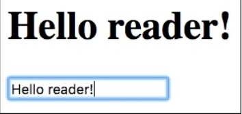
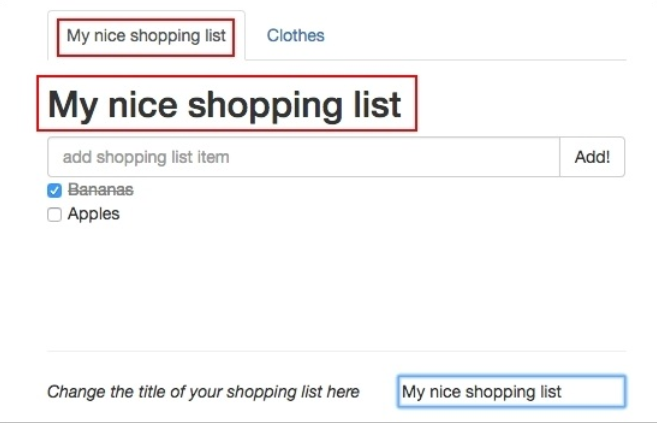

# Vuex – Managing State in Your Application

在前面的章节里， 你学习了 Vue.js 中最重要的概念之一： 数据绑定。 你在我们的方程式中学习并应用一堆绑定数据的方法。 你也学习了怎样去使用指令， 监听事件， 创建并调用方法。 在本章， 你将看到如何去管理呈现方程式全局状态的数据。 我们来聊聊 Vuex, Vuex 是一个专为 Vue.js 方程式开发的状态管理模式。 你将学习如何创建一个全局的数据仓库并如何在组件内检索变化。 我们将定义一个将在方程式中的本地数据， 我们将使用 Vuex 仓库与全局状态合作。

总结起来就是：
* 理解本地和全局状态间的区别
* 理解 Vuex 到底是什么和它的工作机制
* 学习在全局仓库中使用数据
* 学习仓库的 getters, mutations, actions
* 在购物清单和番茄钟方程式中安装使用 Vuex 仓库

## 父子组件间交流， 事件及脑筋急转弯

记得我们的购物清单方程式吗？ 记得我们的 *ChangeTitleComponent* 组件吗， 我们是如何确保在子组件内的输入影响到父组间的标题的？ 你记得每个组件都拥有它自己的作用域， 父级组件的作用域不能被子极组件影响。 因此， 为了从子极组件内传递给父级组件， 我们使用了事件。 你需要用父级组件上 *v-on* 指令调用子组件的 $emit 方法和被分发的事件名称。

如果是原生事件例如 *input*, 会更简单。 仅仅绑定需要的特性作为 *v-model* 到子极组件, 然后在子组件内通过 *$emit* 方法调用事件的名称。

事实上， 这就是我们在 *ChangeTitleComponent* 组件上做的全部。

打开[ chapter5/shopping-list](https://github.com/PacktPublishing/Learning-Vuejs-2/tree/master/chapter5/shopping-list) 文件夹。

你在 *shoppinglistComponent* 组件模板内使用 *v-model* 指令来给 *ChangeTitleComponent* 绑定标题。

```
//ShoppingListComponent.vue
<template>
  <div>
    <...>
    <div class="footer">
      <hr />
      <change-title-component v-model="title"></change-title-component>
    </div>
  </div>
</template>
```

然后， 我们在 *ChangeTitleComponent* 组件内 *props* 特性内声明标题的模型值， 在输入动作上分发 *input* 事件：

```
<template>
  <div>
    <em>Change the title of your shopping list here</em>
    <input :value="value" @input="onInput"/>
  </div>
</template>
<script>
  export default {props: ['value'],
    methods: {
      onInput (event) {
        this.$emit('input', event.target.value)
      }
    }
  }
</script>
```

很直接， 对吗？

如果我们尝试在输入框内改变标题， 我们的的购物清单会相应地改变：


在父级与子极组件间建立了基于事件交流后， 我们能改变标题

看起来我们已经实现了我们的目标。 但是， 如果你打开开发者工具， 你将看到显眼的错误：

```
[Vue warn]: Avoid mutating a prop directly since the value will be overwritten
whenever the parent component rerenders. Instead, use a data or computed
property based on the prop's value. Prop being mutated: "title"
```

哎哟! Vue 实际上是对的， 我们正在改变包含在 *ShoppingListComponent* 组件内的 *props* 特性数据。 这个特性来自主要的父级组件 -- *App.vue*, 相对的， 我们 *ShoppingListComponent* 组件的父级组件。 我们已经知道了我们不能改变来自子组件的父级数据。 如果标题直接属于 *ShoppingListComponent*, 一切没有问题， 但在这个例子中， 我们这样定义会出错。

你应该注意到了， 你可能注意到了这里已经没有更多地方来包含一片不改变的数据了。 看看选项卡的标题。 它一直在显示 **Groceries**。 但我们也想改变它。

小提示： 我已经增加了一个新的组件， *ShoppingListTitleComponent* 。 它来呈现选项卡的标题。 你还记得计算属性吗？ 注意这个组件就包含一个添加 *#* 给 ID 输入， 它通过 *props* 特性生成锚点：

```
<template>
  <a :href="href" :aria-controls="id" role="tab" data-toggle="tab">
  {{ title }}</a>
</template>
<script>
  export default{
  props: ['id', 'title'],
  computed: {
    href () {
      return '#' + this.id
    }
  }
  }
</script>
```

展示选项卡标题的锚包含一个依赖计算属性的 *href* 绑定指令。

所以， 回到标题变化。 当我们想改变在 *ChangeTitleComponent* 内的标题时怎样去改变这个组件的标题？ 如果我们能把事件传播给 *App.vue* 组件， 我们实际上就解决了这两个问题。 父组件无论何时的变化， 它将影响到所有的子组件。

所以， 我们需要一种从 *ChangeTitleComponent* 到主方程式组件之间的数据流。 听起来很难， 但实际上， 我们只需要在 *ChangeTitleComponent* 和它的父级组件上注册我们的自定义事件并分发到方程式主组件。 方程式主组件应该通过更新相应的标题来操控事件。 为了让 *App.vue* 知道购物清单确切的变化， 它的子组件 *ShoppingListComponent* 应该传入呈现的 ID。 为了这样， *App.vue* 应该把 ID 属性传给组件， 购物清单组件应该在它的 *props* 内注册它。

所以， 我们将做以下事：
1. 在 App 组件模板内的 *ShoppingListComponent* 绑定 *id* 属性
2. 在 *ShoppingListComponent* 组件内绑定 *title* 属性而不是在 *change-title-comonent* 内使用 *v-model*。
3. 在 *ChangeTitleComponent* 内为输入框附加自定义事件。
4. 告诉 *ShoppingListComponent* 监听来自 *change-title-component* 自定义的 *changeTitle* 事件， 并通过分发另一个事件来操作它。
5. 为 *shopping-list-component* 附加 *changeTitle* 事件监听器， 通过改变相应的标题来操作它。

我们来修改 *App.vue* 文件模板并绑定购物清单的 ID 给 *shopping-list-component*：

```
//App.vue
<template>
  <div id="app" class="container">
    <...>
      <shopping-list-component :id="list.id" :
      :items="list.items"></shopping-list-component>
    <...>
  </div>
</template>
```

现在在 *ShoppingListComponent* 内注册 *id* 特性：

```
//ShoppingListComponent.vue
<script>
<...>
export default {
  <...>
  props: ['id', 'title', 'items'],
  <...>
}
</script>
```

绑定 *title* 数据属性而非使用 *v-model* 指令：

```
//ShoppingListComponent.vue
<template>
  <...>
  <change-title-component :></change-title-component>
  <...>
</template>

//ChangeTitleComponent.vue
<template>
  <div>
    <em>Change the title of your shopping list here</em>
    <input :value="title" @input="onInput"/>
  </div>
</template>

<script>
export default {
  props: ['value', 'title'],
  <...>
}
</script>
```

分发自定义事件而非在 *ChangeTitleComponent* 内 的输入， 在父级组件内监听这个事件：

```
//ChangeTitleComponent.vue
<script>
export default {
  <...>
  methods: {
    onInput (event) {
      this.$emit('changeTitle', event.target.value)
    }
  }
}
</script>

//ShoppingListComponent.vue
<template>
  <...>
    <change-title-component :
    v-on:changeTitle="onChangeTitle"></change-title-component>
  <...>
</template>
```

在 *ShoppingListComponent* 内创建 *onChangeTitle* 方法， 这个方法将用来分发它自己的 *ChangeTitle* 事件。 在 *App.vue* 组件内用 *v-on* 指令来监听事件。 注意在购物清单组件内的 *onChangeTitle* 方法应该发送它的 ID ， 为了让 *App.vue* 知道哪个购物清单标题已经被改变了。 所以， *onChangeTitle* 方法和它的控制函数就像下面这样：

```
//ShoppingListComponent.vue
<script>
  <...>
  export default {
    <...>
    methods: {
    <...>
      onChangeTitle (text) {
        this.$emit('changeTitle', this.id, text)
      }
    }
  }
</script>

//App.vue
<template>
  <...>
    <shopping-list-component :id="list.id" :
      :items="list.items" v-on:changeTitle="onChangeTitle">
    </shopping-list-component>
  <...>
</template>
```

最后， 我们在 *App.vue* 内来创建 *changeTitle* 方法， 它将在 *shoppinglists* 数组内通过它的 ID 找到购物清单：

```
<script>
  <...>
  import _ from 'underscore'
    export default {
    <...>
    methods: {
      onChangeTitle (id, text) {
        _.findWhere(this.shoppinglists, { id: id }).title = text
      }
    }
  }
</script>
```

注意我们使用了 *underscore* 类的 *findWhere* 方法(http://underscorejs.org/#findWhere ) 来通过它的 ID 来找到购物清单。

就是这样！ 在[ chapter5/shopping-list2 ](https://github.com/PacktPublishing/Learning-Vuejs-2/tree/master/chapter5/shopping-list2) 可以找到代码。

这确实是个挑战。 试着自己再来一遍。 同时， 让我来告诉你什么是全局的什么事本地的。

## 我们为什么需要全局状态仓库

作为一个开发者， 你已经对全局和本地的概念很了解了。 这里有我们在哪里都可以访问到的全局变量， 但是它的方法无法被访问到。

一个组件系统也拥有本地和全局状态。 每个组件有它的本地数据， 但是方程式有全局方程式状态， 这个状态可以被任何组件访问到。 如果我们有一些包含购物清单标题和每个组件可以访问修改的全局变量， 那么我们在前面遇到的挑战将会被轻易地解决。
幸运的是， Vue 的创建者也创建了 Vuex 架构。 这个架构允许我们创建一个全局的方程式仓库--在这里方程式的全局状态可以被存储管理！

## 啥是 Vuex？

正如前面说的， Vuex 是一个用来集中管理状态架构。 它受到 Flux 和 Redux 的启发， 但是更易于理解使用：


Vuex 架构； 图片来自 Vuex GitHub 页面。

照照镜子。 你看到一个好人。 但是， 这里面很复杂。 冷的时候你要怎么做？ 热了有怎么么办？ 饿的时候怎么办？ 非常饿呢？ 抚摸一只毛茸茸的猫的感觉是怎样的？ 人类可以在不同的状态中(快乐， 饥饿， 微笑， 生气等)。 人类也拥有一系列的组件就像手， 胳膊， 腿， 胃， 脸等。 你能想象在没有知觉的情况下有一只手直接影响你的胃吗， 还让你感到饥饿。

我们与集中状态管理系统很像。 我们的大脑包含事物的初始状态(快乐， 饥饿， 微笑， 生气等)。 它也提供一种可以拉取字符来影响状态的机制。 例如， 笑起来， 感到满足， 拍手等。 我们的收， 胃， 嘴和其它组件不能直接影响状态。 但我们可以告诉我们的大脑来分发相应的改变， 这些变化反过来影响了状态。

例如， 当你很饿是， 你吃。 你的胃相应低告诉大脑你吃饱了。 动作分发了你从饥饿到满足的改变。 你的组件嘴被绑定到这个状态， 被表达为微笑。 因此， 组件被绑定到只读的大脑状态， 可以分发大脑改变状态的行为。 单个组件没有意识到其他组件也不能别其它组件直接影响。 它们只会被行为影响。 行为属于大脑， 作为回馈， 状态被修改了。 因此我们的大脑是信息惟一的来源。

### Tip
单一信息源在信息系统中是一种设计架构， 这样方程式内的数据只需要被保存一次。 数据是只读的防止来了方程式的组件状态被其它组件侵蚀。 Vuex 仓库就是以相同的方式来设计的。

## 仓库是如何运作的， 它为什么如此特殊

Vuex 包含两个必需的东东： **state** 和 **mutations**。 State 是一个反映方程式数据初始状态的对象。 Mutations 也是一个包含影响状态的行为函数。 Vuex 仓库只是纯 JavaScript 文件， 它用来导出这两个对象并告诉 Vue 来使用 Vuex。 然后它就可以被其它组件所导入。 如果你在中枢 *App.vue* 中导入它并在方程式初始化时对它注册， 它将可以被所有的子极组件用 *this.$store* 访问到。 所以， 这是一种很简单的方式， 我们创建一个仓库， 在中枢 app 内导入， 在组件内使用：

```
//CREATE STORE
//initialize state
const state = {
  msg: 'Hello!'
}

//initialize mutations
const mutations = {
  changeMessage(state, msg) {
    state.msg = msg
  }
}

//create store with defined state and mutations
export default new Vuex.Store({
  state: state
  mutations: mutations
})


//CREATE VUE APP
<script>
  import store from './vuex/store'
  export default {
    components: {
      SomeComponent
    },
    store: store
  }
</script>


//INSIDE SomeComponent
<script>
  export default {
    computed: {
      msg () {
        return this.$store.state.msg;
      }
    },
    methods: {
      changeMessage () {
        this.$store.commit('changeMessage', newMsg);
      }
    }
  }
</script>
```

这里有个逻辑问题： 为什么要创建一个 Vuex 仓库而不是直接创建一个用来导入共享状态的 JavaScript 文件呢？ 你当然可以这么做， 但你必须确定任何一个组件的状态不会被直接改变。 直接改变仓库很简单， 但这可能引发错误与不一致。 Vuex 提供了一种清晰的方式来防止状态被直接改变。 它是响应式的。 如下：

* Vuex 仓库是响应式的。 一旦组件从它里面取出状态， 它将在每次状态改变时更新视图。
* 组件不可以直接改变仓库的状态。 而是， 组件必须去分发在仓库内声明的变化， 这些变化很容易跟踪。
* 我们的 Vuex 仓库是单个的数据源。

我们来创建一个 greetings 事例， 来看看如何使用 Vuex。

## Greetings 和仓库

我们将创建一个非常简单的 Vue 方程式， 它有两个组件： 一个包含问候信息， 另一个包含我们可以改变问候信息的输入框。 我们的仓库将包含呈现初始问候的状态以及可以改变信息的 mutations 。 我们通过创建一个 Vue 方程式来起步。 我们将使用 *vue-cli* 和 *webpack-simple* 模板：

**vue init webpack-simple simple-store**

安装依赖：

**cd simple-store npm install npm run dev**

方程式运行起来了！ 在浏览器打开 *localhost:8080* 。 实际上， 问候方程式已经在这里了。 我们现在来添加相应的组件：

* ShowGreetingsComponent 将显示问候信息
* ChangeGreetingsComponent 将显示一个可以改变问候信息的输入框

在 *src* 文件夹内， 创建 *components* 子文件夹， 添加 *ShowGreetingsComponent.vue* 文件。

看起来就像这样：

```
<template>
  <h1>{{ msg }}</h1>
</template>
<script>
  export default {
    props: ['msg']
  }
</script>
```

然后， 添加 *ChangeGreetingsComponent.vue* 文件。 它有了一个 *v-model='msg'* 指令：

```
<template>
  <input v-model='msg'>
</template>
<script>
  export default {
    props: ['msg']
  }
</script>
```

现在打开 *App.vue* 文件， 导入组件。 别忘了绑定 *msg* 。 你的 *App.vue* 看起来应该是这样的：

```
<template>
  <div>
    <show-greetings-component:msg='msg'></show-greetings-component>
    <change-greetings-component:msg='msg'></change-greetings-component>
  <div>
</template>
<script>
import ShowGreetingsComponent from './components/ShowGreetingsComponent.vue'
import ChangeGreetingsComponent from './components/ChangeGreetingsComponent.vue'
  export default {
    components: { ShowGreetingsComponent, ChangeGreetingsComponent },
    data () {
      return {
        msg: 'Hello Vue!'
      }
    }
  }
</script>
```

打开浏览器。 你将在我们的方程式内看到输入框； 但是键入任何值标题都不会变化。 我们已经知道会是这样的因为组件不能直接被其它组件直接改变状态！ 首先我们来安装 *vuex* ：

**npm install vuex --save**

在 *src* 文件夹内创建一个 *vuex* 文件夹。 创建一个 *store.js* 文件， 它将是我们的状态管理入口。 首先， 导入两个 *Vue* 和 *Vuex* 并告诉 *Vue* 我们需要 *Vuex*：

```
//store.js
import Vue from 'vue'
import Vuex from 'vuex'
Vue.use(Vuex)
```

现在创建两个常量， *state* 和 *mutations*。 *State* 将包含 *msg* 信息这允许我们修改 *msg* 时导出模块：

```
const state = {
  msg: 'Hello Vue!'
}
const mutations = {
  changeMessage(state, msg) {
    state.msg = msg
  }
}
```

现在初始化 Vuex 仓库：

```
export default new Vuex.Store({
  state: state,
  mutations: mutations
})
```

### Tip

如果我们使用 ES6， 标识 *{state: state, mutations: mutations}* 可以被替换为 *{state, mutations}*

我们整个仓库的代码将会是这个样子的：

```
//store.js
import Vue from 'vue'
import Vuex from 'vuex'
Vue.use(Vuex)
const state = {
  msg: 'Hello Vue!'
}
const mutations = {
  changeMessage(state, msg) {
    state.msg = msg
  }
}
export default new Vuex.Store({
  state,
  mutations
})
```

我们可以在 *App.vue* 内导入仓库。 这样， 我们便通知了所有组件可以使用全局的仓库， 结果就是， 我们可以在 *App.vue* 内移除数据了， 当然我们还需要在组件内绑定数据：

```
//App.vue
<template>
  <div>
    <show-greetings-component></show-greetings-component>
    <change-greetings-component></change-greetings-component>
  </div>
</template>

<script>
  import ShowGreetingsComponent from './components/ShowGreetingsComponent.vue'
  import ChangeGreetingsComponent from './components/ChangeGreetingsComponent.vue'
  import store from './vuex/store'
  export default {
    components: {ShowGreetingsComponent, ChangeGreetingsComponent},
    store
  }
</script>
```

现在， 我们回到组件并重用仓库内的数据。 为了重用仓库内的数据， 我们应该使用计算属性。 Vue 会聪明地响应这个状态变化。 然后， 我们也不需要在组件内导入仓库了。 我们可以使用 *this.$store* 变量访问到它， 我们的 *ShowGreetingsComponent* 看起来像这样：

```
//ShowGreetingsComponent.vue
<template>
  <h1>{{ msg }}</h1>
</template>

<style>
</style>

<script>
  export default {
    computed: {
        msg () {
          return this.$store.state.msg
        }
      }
  }
</script>
```

同样在 *ChangeGreetingsComponent* 组件。 我们只是在 *keyup* 事件上分发 mutation 。 对于这， 我们仅仅需要创建一个 commit 对应的仓库 的 mutation 方法。 我们将在 *keyup* 监听器上调用它：

```
//ChangeGreetingsComponent.vue
<template>
  <input v-model='msg' @keyup='changeMsg'>
</template>

<script>
  export default {
    computed: {
      msg() {
        return this.$store.state.msg
      }
    },
    methods: {
      changeMsg(ev) {
        this.$store.commit('changeMessage', ev.target.value)
      }
      }
  }
</script>
```

打开页面， 改变标题， 成功了！



使用 Vuex 仓库来调用 mutations 并通过组件来改变仓库的状态

我们不再需要绑定 *v-model* 指令了， 因为所有的变化都发生在仓库的 mutation 方法上。 因此， *msg* 属性可以像值一样绑定到输入框上：

```
<template>
  <input :value='msg' @keyup='changeMsg'>
</template>
```

在[ chapter5/simple-store](https://github.com/PacktPublishing/Learning-Vuejs-2/tree/master/chapter5/simple-store) 查看。 在这个例子上， 我们使用的仓库非常简单。 但是， 复杂的单页方程式需求更复杂的结构。 我们应该提取仓库的 getters 和 actions 来分发 mutations 给不同的文件。 我们也可以相应的数据项目来进行分组。 在下一部分， 我们将用 getters 和 actions 来构建一个模块化的结构。

## 储存状态和 getters

我们在组件内使用 *this.$store.state* 关键字这很好。 但是想象我们有下面的场景：

* 在一个存在不同组件通过 *this.$store.state* 来访问其他组件的大规模方程式内， 我们想改变 *somevalue* 的名称时。 这意味着我们必须在用到这个变量的每个组件里改变它的名称！
* 我们想使用状态的 *computed* 值时。 例如， 我们想有一个计数器。 它的初始状态是 0 。 每次使用它是， 我们想增加它的值。 这意味着每个组件都需要包含一个累加函数， 我们将会在每个组件内制造大量的重复代码。

这个场景是可能存在的！ 幸运的是， 这有个好办法。 想象存在一个集中的 getter， 它可以访问仓库的状态并提供一个 getter 函数给每个状态项。 如果需要， 这个 getter 可以应用在一些状态项的计算上。 如果我们需要改变一个特性的名称， 我们只需要在 getter 这一个地方改变就行了。 这是一项良好的公约与实践， 我强烈推荐使用它即使你只有几个状态项。

我们来创建一个 getter 。 在 *vuex* 文件夹内创建 *getters.js* 文件， 导出将返回 *state.msg* 的 *getMessage* 函数：

```
//getters.js
export default {
  getMessage(state) {
    return state.msg
  }
}
```

它应该被仓库导入并在新的 Vuex 对象上导出， 因为仓库知道哪个是它的 getters：

```
//store.js
import Vue from 'vue'
import Vuex from 'vuex'
import getters from './getters'
Vue.use(Vuex)

const state = {
  msg: 'Hello Vue!'
}

const mutations = {
  changeMessage(state, msg) {
    state.msg = msg
  }
}

export default new Vuex.Store({
  state, mutations, getters
})
```

然后， 在我们的组件内， 我们使用 getters 而不再是直接访问仓库状态。 仅仅在两个组件内替换计算属性：

```
computed: {
  msg () {
    return this.$store.getters.getMessage
  }
},
```

打开页面； 没什么变化！

尽管 *this.$store.getters* 标识这么长。 我们， 程序员是很懒的， 对吗？ Vue 也提供了一个简单的方法来认可我们的懒惰。 它提供了 *mapGetters* 辅助函数--提供所有仓库的 getters 给组件。 仅仅导入它并像下面这样使用计算属性：

```
//ShowGreetingsComponent.vue
<template>
  <h1>{{ getMessage }}</h1>
</template>

<script>
  import { mapGetters } from 'vuex'
  export default {
    computed: mapGetters(['getMessage'])
  }
</script>

//ChangeGreetingsComponent.vue
<template>
  <input :value='getMessage' @keyup='changeMsg'>
</template>

<script>
  import { mapGetters } from 'vuex'
  export default {
    computed: mapGetters(['getMessage']),
    methods: {
      changeMsg(ev) {
        this.$store.commit('changeMessage', ev.target.value)
      }
    }
  }
</script>
```

注意我们改变了在模板内的属性名称让它和 getter 方法的名称一致。 但是， 也有可能映射相应的 getter 方法名称给我们需要在组件内使用的属性名：

```
//ShowGreetingsComponent.vue
<template>
  <h1>{{ msg }}</h1>
</template>

<style>
</style>

<script>
  import { mapGetters } from 'vuex'
  export default {
    computed: mapGetters({
      msg: 'getMessage'
    })
  }
</script>

//ChangeGreetingsComponent.vue
<template>
  <input :value='msg' @keyup='changeMsg'>
</template>

<script>
  import { mapGetters } from 'vuex'
  export default {
    computed: mapGetters({
      msg: 'getMessage'
    }),
    methods: {
      changeMsg(ev) {
        this.$store.commit('changeMessage', ev.target.value)
      }
    }
  }
</script>
```

所以， 我们可以为 *msg* 属性提取 getter 给中心仓库的 getters 文件。

现在， 如果你需要给 *msg* 属性添加一些计算， 你只需要在一个地方这样做就行了！


Rick 经常在所有组件内改变代码， 才发现只在一个地方改变也行

例如， 如果我们需要在所有组件内重用 *uppercased message*， 我们可以在 getter 内应用 *uppercase* 函数：

```
//getters.js
export default {
  getMessage(state) {
    return (state.msg).toUpperCase()
  }
}
```

从现在起， 每个使用 getter 的组件取回的状态将有大写的信息：


注意在我们改变输入框内的值时这是怎样地平滑！ 可以在 [chapter5/simple-store2](https://github.com/PacktPublishing/Learning-Vuejs-2/tree/master/chapter5/simple-store2) 文件夹内查看最终代码。

如果我们决定改变特性的名称， 我们将只需要在 getters 函数内变化即可。 例如， 我们想变化 *msg* 的名称， 我们需要这样做：

```
const state = {
  message: 'Hello Vue!'
}
const mutations = {
  changeMessage(state, msg) {
    state.message = msg
  }
}
```

然后， 我们将在相应的 getter 函数内：

```
export default {
  getMessage(state) {
    return (state.message).toUpperCase()
  }
}
```

这就是全部！ 这就是这种架构的威力。 在一些非常复杂的方程式内， 我们可以拥有跟多的 getters 文件， 让它们来导出方程式各种不同的状态。 模块化可以增强可维护性； 试试吧！

## Mutations

在前面的例子中， mutations 不仅仅是一个有名字的简单事件控制函数。 Mutations 控制器函数接收状态为第一个参数。 另一个可被用于传入不同的参数给控制器函数：

```
const mutations = {
  changeMessage(state, msg) {
    state.message = msg
  },
  incrementCounter(state) {
    state.counter ++;
  }
}
```

一个 mutations 特殊之处在于它们本鞥被直接调用。 为了分发 mutation ， 我们应该通过 commit 方法来调用相应的 mutation 和参数。

```
store.commit('changeMessage', 'newMessage')
store.commit('incrementCounter')
```

### Tip
在 Vue 2.0 的先行版内， 分发 mutation 的方法叫 “dispatch” 。 所以你可以这样调用 ： *store.dispatch('changeMessage', 'newMessage')*

你可以创建任意数量的 mutations。 你可以在相同的状态上进行不同的操作。 你甚至可以在分割的文件内声明 mutation 的名称为常量。 这样， 你就可以简单地打入它们不以字符串的形式来使用它们。 所以， 例如， 我们可以在 *vuex* 内创建一个文件， 叫 *mutation_types.js*， 在这里导出所有的常量名称：

```
//mutation_types.js
export const INCREMENT_COUNTER = 'INCREMENT_COUNTER'
export const CHANGE_MSG = 'CHANGE_MSG'
```

在我们的仓库内导入并重用：

```
//store.js
<...>
import { CHANGE_MSG, INCREMENT_COUNTER } from './mutation_types'
  <...>
const mutations = {
  [CHANGE_MSG](state, msg) {
    state.message = msg
  },
  [INCREMENT_COUNTER](state) {
    state.counter ++
  }
}
```

在分发 mutations 的组件内， 我们将导入相应的 mutation 类型并通过变量名称来分发：

```
this.$store.commit(CHANGE_MSG, ev.target.value)
```

这种结构对于大型方程式很有意义。 同时， 你可以分组你的 mutations 类型通过它们各自提供的功能， 只导入那些我们需要的 mutations。


## Actions

当你准备分发一个 mutation 时， 基本上我们在执行操作。 就是说我们 commit 一个 **CHANGE_MSG** mutation 也可以说是我们执行了改变 message 的操作。  为了更简洁和全部提取的目的， 像提取仓库状态项到 getters 和 mutations 名称常量给 mutation_type ，我们可以为 actions 提取 mutations。

### 注意

action 不仅仅是个分发 mutation 的函数！

```
function changeMessage(msg) {store.commit(CHANGE_MSG, msg)}
```

我们来创建一个简单的 *actions* 文件。 我们先来创建几个仓库初始状态， counter 并用 0 来初始化：

```
//store.js
import Vue from 'vue'
import Vuex from 'vuex'
import { CHANGE_MSG, INCREMENT_COUNTER } from './mutation_types'
Vue.use(Vuex)

const state = {
  message: 'Hello Vue!',
  counter: 0
}
const mutations = {
  [CHANGE_MSG](state, msg) {
    state.message = msg
  },
  [INCREMENT_COUNTER](state) {
    state.counter ++;
  }
}
export default new Vuex.Store({
  state,
  mutations
})

Let's also add a counter getter to the getters file, so our getters.js file looks like the following:
//getters.js
export default {
  getMessage(state) {
    return (state.message).toUpperCase()
  },
  getCounter(state) {
    return (state.counter)
  }
}
```

最后， 我们在 ShowGreetingsComponent 内使用计数器的 getter 来展示信息被改变的次数：

```
<template>
  <div>
    <h1>{{ msg }}</h1>
    <div>the message was changed {{ counter }} times</div>
  </div>
</template>

<script>
  import { mapGetters } from 'vuex'
  export default {
    computed: mapGetters({
      msg: 'getMessage',
      counter: 'getCounter'
    })
  }
</script>
```

我们为俩个 mutations 创建 actions 用于计数器和改变信息。
在 *vuex* 文件夹内， 创建 *actions.js* 文件并导出 *actions* 函数：

```
//actions.js
import { CHANGE_MSG, INCREMENT_COUNTER } from './mutation_types'
export const changeMessage = (store, msg) => {
  store.commit(CHANGE_MSG, msg)
}
export const incrementCounter = (store) => {
  store.commit(INCREMENT_COUNTER)
}
```

我们应该使用 ES2015 的参数解构来让代码更简洁。 我们在一个 *export default* 语句内导出所有的 actions：

```
//actions.js
import { CHANGE_MSG, INCREMENT_COUNTER } from './mutation_types'
export default {
  changeMessage ({ commit }, msg) {
    commit(CHANGE_MSG, msg)
  },
  incrementCounter ({ commit }) {
    commit(INCREMENT_COUNTER)
  }
}
```

好的， 现在我们有了 actions。 在我们的 *ChangeGreetingsComponent* 组件内使用！ 为了在组件内使用 actions， 我们应该先导入它们到仓库然后再以新的 *Vuex* 对象导出。 然后 actions 可以以 *this.$store.dispatch* 方法在组件内分发：

```
// ChangeGreetingsComponent.vue
<template>
  <input :value="msg" @keyup="changeMsg">
</template>

<script>
  import { mapGetters } from 'vuex'

  export default {
    computed: mapGetters({
      msg: 'getMessage'
    }),
    methods: {
      changeMsg(ev) {
        this.$store.dispatch('changeMessage', ev.target.value)
      }
    }
  }
</script>
```

所以实际上这有哪些变化呢？ 我们继续写了 *this.$store* ， 惟一的不同是我们使用 commit 方法来分发事件。 你还记得我们怎么找到 *mapGetters* 辅助函数的吗？ 它不是很好用吗？ 事实上 Vue 也为我们提供了 *mapActions* 辅助函数来允许我们避免写 *this.$store.dispatch* 。 仅仅以相同的方式引入 *mapActions* ：

```
//ChangeGreetingsComponent.vue
<template>
  <input :value="msg" @keyup="changeMessage">
</template>

<script>
  import { mapGetters } from 'vuex'
  import { mapActions } from 'vuex'
  export default {
    computed: mapGetters({
      msg: 'getMessage'
    }),
    methods: mapActions(['changeMessage', 'incrementCounter'])
  }
</script>
```

注意我们改变了 *keyup* 上的控制器函数， 所以我们不必映射事件的名称给相应的 actions。

我们应该变化对 *changeMessage* 的调用， 因为我们无法在 actions 上取到任何事件目标值； 因此， 我们应该这样调用：

```
//ChangeGreetingsComponent.vue
<template>
  <input :value="msg" @keyup="changeMessage($event.target.value)">
</template>
```

最后， 我们来绑定 *incrementCounter* action 到用户输入。 例如， 在我们的 *keyup.enter* 事件上调用它：

```
<template>
  <input :value="msg" @keyup="changeMessage"
  @keyup.enter="incrementCounter">
</template>
```

打开页面， 试着改变标题按下回车键， 你将在每次点击回车后看到计数器累加计数：


在页面上使用 actions 来累加计数

现在， 你知道了使用 actions 而非直接访问仓库来模块化我们的方程式是多么简单。 你在你的 Vuex 仓库导出 actions， 并在组件内导入 *mapActions*， 在模板内的时间处理指令上调用它们。

你还记得我们用来比较人类各个身体部分与方程式状态仓库的例子吗？ 想象下你正在运行它。  这里只有一个 action 但是有很多改变被分发， 其中又有很多组件被这些改变所影响？ 当你开始运行时， 你的心跳加快， 出汗， 手臂运动， 因为你理解了这些， 你感到很高兴！ 当你吃饭时， 你也很高兴因为味道很棒。 所以， 不同的 actions 可以分发不止一处改变， 相同的改变也可以被不止一个 action 分发。

相同的事情也发生在我们的 Vuex 仓库， mutations 和 actions 中。 同样在 action 内， 不止一个 mutation 可以被分发。 例如， 我们可以在同一个 action 内改变信息或增加计数分发我们的 mutation 。 我们在 *action.js* 文件内创建 action。 命名为 *handleMessageInputChanges* 并接收一个参数： event 。 它将用 *event.target.value* 来分发 **CHANGE_MSG** mutation ， 在 *event.keyCode* 被按下时， 它将分发 **INCREMENT_COUNTER** mutation：

```
//actions.js
handleMessageInputChanges ({ commit }, event) {
  commit(CHANGE_MSG, event.target.value)
  if (event.keyCode === 13) {
    commit(INCREMENT_COUNTER)
  }
}
```

现在我们在我们的 ChangeGreetingsComponent 组件内的 mapActions 对象上导入 action ， 在 $event 参数上调用：

```
//ChangeGreetingsComponent.vue
<template>
  <input :value="msg" @keyup="handleMessageInputChanges($event)" />
</template>

<script>
import { mapGetters, mapActions } from 'vuex'
export default {
  computed: mapGetters({
    msg: 'getMessage'
  }),
  methods: mapActions(['handleMessageInputChanges'])
}
</script>
```

打开页面， 试着去改变问候信息并通过回车键来累加计数。 成功了！

最终的代码在[chapter5/simple-store3](https://github.com/PacktPublishing/Learning-Vuejs-2/tree/master/chapter5/simple-store3) 文件夹内。

## 在我们的方程式内安装使用 Vuex

现在， 我们知道了 Vuex 是什么， 如何创建仓库， 分发 mutations， 使用 getters 和 actions， 我们可以在我们的方程式内使用并完成它们的数据流和信息链。

你可以用下面的文件夹内的方程式
* Pomodoro: [ chapter5/pomodoro](https://github.com/PacktPublishing/Learning-Vuejs-2/tree/master/chapter5/pomodoro)
* Shopping list: [chapter5/shopping-list2](https://github.com/PacktPublishing/Learning-Vuejs-2/tree/master/chapter5/shopping-list2)

别忘了在每个方程式内运行 *npm install*。

安装 *vuex* 在俩个方程式内定义必要的目录结构。

安装 *vuex*， 仅需要：

```
npm install vuex --save
```

在安装好 *vuex* 后， 在每个方程式的 *src* 文件夹内创建一个 *vuex* 脚手架。 在这个文件夹内， 创建四个文件： *store.js, mutation_types.js, getters.js, actions.js* 。

```
//store.js
import Vue from 'vue'
import Vuex from 'vuex'
import getters from './getters'
import actions from './actions'
import mutations from './mutations'
Vue.use(Vuex)

const state = {
}

export default new Vuex.Store({
  state,
  mutations,
  getters,
  actions
})
```

在 *App.vue* 内导入使用 store：

```
//App.vue
<script>
  <...>
  import store from './vuex/store'
  export default {
    store,
    <...>
  }
</script>
```

在每一个方程式内我们将定义哪一个是全局的哪一个是本地的状态， 定义数据并取消绑定， 分组数据， 用刚学的添加那些被取消的绑定。

## 在购物清单方程式内使用 Vuex 仓库

我希望你依然记得我们在本章一开始所面临的挑战。 我们想以一种简单的方式在组件间建立通信。 在 *ChangeTitleComponent* 内改变标题， 在 *ShoppingListTitle* 和 *ShoppingListComponent* 内接收通知。 我们在 *App.vue* 内移除了硬编码的数组， 并把它拷贝到仓库的状态上：

```
//store.js
<...>
const state = {
  shoppinglists: [
    {
      id: 'groceries',
      title: 'Groceries',
      items: [{ text: 'Bananas', checked: true },
              { text: 'Apples', checked: false }]
    },
    {
      id: 'clothes',
      title: 'Clothes',
      items: [{ text: 'black dress', checked: false },
              { text: 'all-stars', checked: false }]
    }
  ]
}
<...>
```

我们来为购物清单定义 getters：

```
//getters.js
export default {
  getLists: state => state.shoppinglists
}
```

现在， 在 *App.vue* 内导入 *mapGetters* ， 映射 *shoppinglists* 值给 *getLists* 方法， 所以 *App.vue* 组件：

```
//App.vue
<script>
  import ShoppingListComponent from './components/ShoppingListComponent'
  import ShoppingListTitleComponent from
  './components/ShoppingListTitleComponent'
  import _ from 'underscore'
  import store from './vuex/store'
  import { mapGetters } from 'vuex'

  export default {
    components: {ShoppingListComponent,
      ShoppingListTitleComponent
    },
    computed: mapGetters({
      shoppinglists: 'getLists'
    }),
    methods: {
      onChangeTitle (id, text) {
        _.findWhere(this.shoppinglists, { id: id }).title = text
      }
    },
    store
  }
</script>
```

现在我们在仓库内定义 mutation， 来呈现标题的变化。 它应该是个用来接收新标题为参数的函数。 但是， 这里有点难度。 我们不知道哪个购物清单标题应该被改变。 如果我们把一个清单 ID 传入这个函数， 我们可能在实际上是通过 ID 来找到的清单。  当然， 我们可以这样做！ 事实上， 我们的 *ShoppingListComponent* 已经在它父级的 *App.vue* 内接收到了 ID值。 我们只是把这个 ID 从 *ShoppingListComponent* 传到了 *ChangeTitleComponent* 内。 这种方式， 我们将可以在组件内进行必要的调用， 当标题确实被改变时， 不需要通过父级的事件冒泡。

所以， 在 *ShoppingListComponent* 模板内给 *change-title-component* 绑定 ID， 如下：

```
//ShoppingListComponent.vue
<template>
  <...>
    <change-title-component : :id="id" von:changeTitle="onChangeTitle"></change-title-component>
  <...>
</template>
```

别忘了给 *ChangeTitleComponent* 组件加上 *id* 特性：

```
//ChangeTitleComponent.vue
<script>
  export default {
    props: ['title', 'id'],
    <...>
  }
</script>
```

好了， 现在我们的 *ChangeTitleComponent* 已经可以访问到 *title* 和 *id* 了。 我们为仓库增加相应的 mutation。

我们可以以写一个通过 ID 来找到 购物清单的函数开始。 对于此， 我们需要使用 *underscore* 的 *_.findWhere* 方法， 就像我们在 *App.vue* 内做的一样。

在 *mutations.js* 内导入 *underscore* ，添加 *findById* 函数：

```
//mutations.js
<...>
  function findById (state, id) {
    return _.findWhere(state.shoppinglists, { id: id })
  }
<...>
```

我们现在添加 mutation 并调用它， 例如， CHANGE_TITLE 。 这个 mutation 将接收数据对象为参数， 分配接收到的 title 给找到的购物清单选项。 首先， 我们在 *mutation_types.js* 内声明一个 CHANGE_TITLE 常量， 重用它而非把 muattion 的名字作为字符串：

```
//mutation_types.js
export const CHANGE_TITLE = 'CHANGE_TITLE'

//mutations.js
import _ from 'underscore'
import * as types from './mutation_types'
function findById (state, id) {
  return _.findWhere(state.shoppinglists, { id: id })
}
export default {
  [types.CHANGE_TITLE] (state, data) {
    findById(state, data.id).title = data.title
  }
}
```

基本完成了。 我们现在在 *actions.js* 文件内来定义 *changeTitle* action , 在我们的 ChangeTitleComponent 内重用。 打开 *actions.js* 文件， 添加如下：

```
//actions.js
import { CHANGE_TITLE } from './mutation_types'
export default {
  changeTitle: ({ commit }, data) => {
    commit(CHANGE_TITLE, data)
  }
}
```

在最后， 打开 *ChangeTitleComponent.vue* ， 导入 *mapActions* 辅助函数， 映射 *onInput* 方法给 *changeTitle* action， 在模板的对象映射标题给 *event.target.value*  ， ID 映射给 id 参数。 所以， *ChangeTitleComponent* 会变成下面这样：

```
//ChangeTitleComponent.vue
<template>
  <div>
    <em>Change the title of your shopping list here</em>
    <input :value="title" @input="onInput({ title: $event.target.value,
    id: id })"/>
  </div>
</template>

<script>
  import { mapActions } from 'vuex'
    export default {
      props: ['title', 'id'],
      methods: mapActions({
        onInput: 'changeTitle'
      })
  }
</script>
```

你现在可以移除在 *ShoppingListComponent* 和主要 *App* 组件的所有的事件控制代码。

打开页面试着在输入框内输入！ 标题将会在所有地方变化：



使用仓库， mutations， actions -- 所有的组件更新它们的状态将不再需要事件控制机制。

购物清单最终的代码可以在这里被找到[chapter5/shopping-list3](https://github.com/PacktPublishing/Learning-Vuejs-2/tree/master/chapter5/shopping-list3)。

## 在番茄钟方程式中使用 Vuex

最后， 我们回到我们的番茄钟！ 你上一次是在多会儿使用它的？ 我们来用 Vuex 架构构建我们的番茄钟方程式。 我们以 [ chapter5/pomodoro](https://github.com/PacktPublishing/Learning-Vuejs-2/tree/master/chapter5/pomodoro) 文件夹为出发点。


### 激活 start， pause， stop

我们先分析一下我们实际上需要做哪些工作。 看看页面， 这里有三个按钮： start, pause, stop。 这意味着我们的方程式可以有三个状态。 我们在 *store.js* 中定义这三个状态：

```
//store.js
<...>
const state = {
  started: false,
  paused: false,
  stopped: false
}
<...>
```

初始化， 所有的状态都设置为 false。

现在来定义这些状态的 *getters*。 打开 *getters.js* 文件， 为三个状态添加 getter 函数：

```
//getters.js
export default {
  isStarted: state => state.started,
  isPaused: state => state.paused,
  isStopped: state => state.stopped
}
```

在我们的控制按钮上定义每个按钮的状态：

* 开始按钮在方程式开始后应该是不可选的。 但是， 在方程式暂停后应该是可选的， 这样我们才可以重启方程式。
* 暂停按钮只有当方程式是开始时才可选。 但是， 当方程式暂停时它应该是不可选的。
* 停止按钮只有当方程式开始后才可选。

我们把这些翻译成代码， 添加一个 *disabled* 类给我们的条件控制按钮。

### Tip

一旦我们应用了 *disabled* 类， Bootstrap 将关注按钮的行为， 不止为它应用特殊的样式， 而且会暂停这些交互元素。

为了使用刚刚定义的 getters， 我们必须导入 *mapGetters*。 然后， 我们必须告诉组件我们想要在 *computed* 属性对象内使用它们。

```
//ControlsComponent.vue
<script>
  import { mapGetters } from 'vuex'
  export default {
    computed: mapGetters(['isStarted', 'isPaused', 'isStopped'])
  }
</script>
```

现在这些 getters 可以在模板内使用了。 所以我们这样应用 *disabled* 类：

* 开始按钮当方程式开始且未被暂停(isStarted && !isPaused)
* 暂停按钮当方程式没有开始或暂停(!isStarted || isPaused)
* 停止按钮当方程式没有开始(!isStarted)

我们的模板像下面这样：

```
//ControlsComponent.vue
<template>
  <span>
    <button :disabled='isStarted && !isPaused'>
      <i class="glyphicon glyphicon-play"></i>
    </button>
    <button :disabled='!isStarted || isPaused'>
      <i class="glyphicon glyphicon-pause"></i>
    </button>
    <button :disabled='!isStarted'>
      <i class="glyphicon glyphicon-stop"></i>
    </button>
  </span>
</template>
```

你可以看到暂停和停止按钮看起来不一样！ 如果你移动指针到它们上， 指针不会变化， 这意味着它们是不可选的！ 我们来为不可选按钮创建样式：

```
//ControlsComponent.vue
<style scoped>
  button:disabled i {
    color: gray;
  }
</style>
```

好的， 我们的按钮做好了， 我们来激活它们！

我们先来想想在方程式开始， 暂停， 停止时会发生什么：

* 当我们启动方程式后， *started* 应该变成 *true*， *paused* 和 *stopped* 状态还是 *false*。
* 当我们暂停方程式， *paused* 状态是 *true*， *stopped* 状态是 *false*， *started* 状态是 *true* 因为暂停方程式后可以再启动。
* 当我们停止方程式， *stopped* 状态是 *true*， *paused* 和 *started* 状态都为 *false*。 我们把这些行为翻译成mutation_types, mutations, actions!

打开 *mutation_types.js* 添加下面三种 mutation 类型：

```
//mutation_types.js
export const START = 'START'
export const PAUSE = 'PAUSE'
export const STOP = 'STOP'
```

现在我们来定义 mutations! 打开 *mutations.js* 文件为每个 mutation 类型添加三个 mutations 。 我们的决定如下：

* **启动方程式** ： started true, paused and stopped false。
* **暂停方程式** ： started true, paused true, stopped false。
* **停止方程式** ： stopped true, paused and started false。

现在我们把它放入代码内。 在 mutations.js 内导入 mutation_types，  写下三个必要的 mutations：

```
//mutations.js
import * as types from './mutation_types'
export default {
  [types.START] (state) {
    state.started = true
    state.paused = false
    state.stopped = false
  },
  [types.PAUSE] (state) {
    state.paused = true
    state.started = true
    state.stopped = false
  },
  [types.STOP] (state) {
    state.stopped = true
    state.paused = false
    state.started = false
  }
}
```

现在来定义我们的 actions! 打开 *actions.js* 文件， 导入 mutation types， 导出三个函数：

```
//actions.js
import * as types from './mutation_types'export default {
  start: ({ commit }) => {
    commit(types.START)
  },
  pause: ({ commit }) => {
    commit(types.PAUSE)
  },
  stop: ({ commit }) => {
    commit(types.STOP)
  }
}
```

最后激活我们的按钮需要在 *ControlsComponent* 内导入这些 actions 并在 *click* 事件上调用它们。 你还记得怎么在 HTML 元素上调用事件吗？ 如果我们需要 *click* 事件，就像下面这样：

```
@click = 'someAction'
```

所以， 在我们的 *ControlsComponent.vue* ， 我们导入 *mapActions* 对象， 把它映射给组件的 methods 属性， 并应用到相应的按钮点击事件。 这就是全部了：

```
//ControlsComponent.vue
<script>
  import { mapGetters, mapActions } from 'vuex'
  export default {
    computed: mapGetters(['isStarted', 'isPaused', 'isStopped']),
    methods: mapActions(['start', 'stop', 'pause'])
  }
</script>
```

现在在事件控制器指令上调用这些函数， 代码如下：

```
//ControlsComponent.vue
<template>
  <span>
    <button :disabled='isStarted && !isPaused'
    @click="start">
      <i class="glyphicon glyphicon-play"></i>
    </button>
    <button :disabled='!isStarted || isPaused'
    @click="pause">
      <i class="glyphicon glyphicon-pause"></i>
    </button>
    <button :disabled='!isStarted' @click="stop">
      <i class="glyphicon glyphicon-stop"></i>
    </button>
  </span>
</template>
```

试着点击按钮， 如期运行。 干得好！ 在[chapter5/pomodoro2](https://github.com/PacktPublishing/Learning-Vuejs-2/tree/master/chapter5/pomodoro2) 查看代码。 但是， 还远远没有结束。 我们将改造我们的番茄钟为一个实时计时器。

## 绑定番茄钟的 minutes 和 seconds

在前面的部分， 我们定义了番茄汁三个不同的状态： started, paused, stopped。 但是， 别忘了番茄钟到底是干嘛的。 它必须在给定时间后进行计时， 切换时间， 继续计时。

番茄钟在这里有一个非常重要的状态： 切换间两个状态， *working* 和 *resing* 。 这个状态不可以被按钮切换； 这应该包含在我们的方程式内部逻辑内。

我们来定义两个状态： 一个递减的计时器另一个用来区分工作与不工作的状态。 我们假设我们要启动番茄钟， 所以工作状态是 *true*， 倒计时技术应该被设置为一些我们预先定义的时间。 为了模块化和可维护性， 我们在外部文件内定义了工作时间的数量。 我们叫它 *config.js* 。 在项目根目录创建 *config.js* 文件添加如下代码：

```
//config.js
export const WORKING_TIME = 20 * 60
export const RESTING_TIME = 5 * 60
```

通过这些初始化， 我们的番茄钟将倒计时二十分钟， 然后有五分钟的间隔。 当然， 你可以随意定义自己的时间。 我们在我们的仓库内导出 *config.js* ， 重用 WORKING_TIME 值来初始化我们的计时器。 我们来创建一个切换属性， 它负责切换 work/break， 我们命名为 *isWorking*。 我们把它的初始值设为 *true*。

所以我们的新状态如下：

```
//store.js
<...>
import { WORKING_TIME } from '../config'
const state = {
  started: false,
  paused: false,
  stopped: false,
  isWorking: true,
  counter: WORKING_TIME
}
```

所以， 我们已经有了两个新的的属性。 在开始创建 methods， actions, mutations 和其它东东之前， 我们想想依赖于这些属性的可视元素。

我们就这么几个元素， 很容易来定义。
* isWorking 状态影响标题： 当它要运行时我们应该显示 **Work!** ；当它要停止时我们应该显示 **Rest!**
* isWorking 状态也影响着小猫组件的可见性： 它应该在 *isWorking* 为 *false* 时可见。
* 计时器属性影响着 *minute* 和 *second*： 每当时间递减， *second* 也应该递减， 每 60 次的递减后， *minute* 应该递减它的值。
