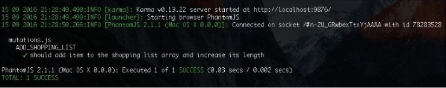
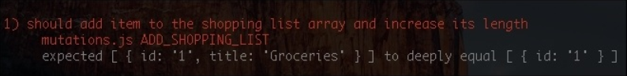
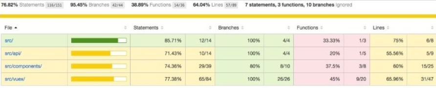
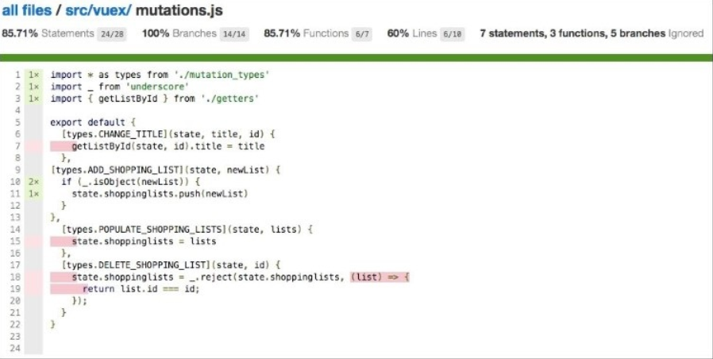
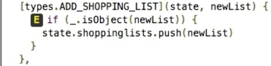
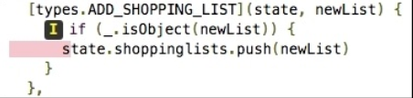
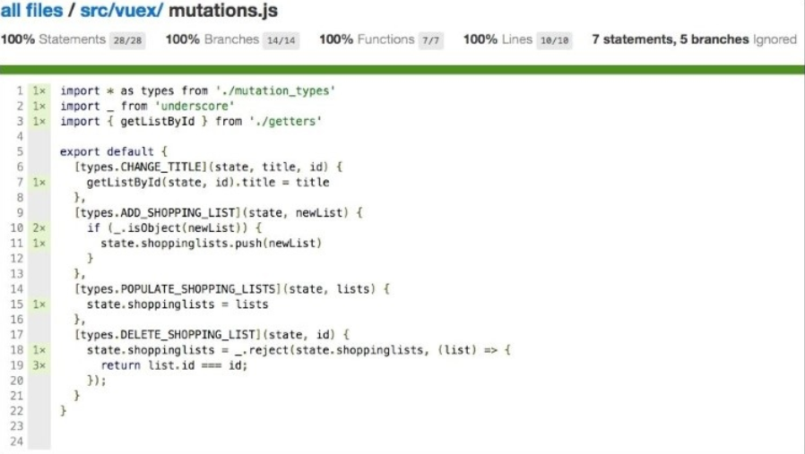

## Testing – Time to Test What We Have Done So Far!

在前一章， 你已经学习了如何创建使用插件。 我们使用了已有的 *resource* 插件， 创建了自己的 *NoiseGenerator* 插件。

在本章， 我们将保证我们的购物清单和番茄钟方程式的质量。 我们要用不同的测试技术来测试这些方程式。 首先， 我们将对 Vue 组件和 Vuex-related 上的 actions ,  mutations, getters 进行单元测试。 然后， 我们将学习如何用 Nightwatch 来完成端对端测试。 所以呢， 在本章， 我们要做以下几件事：

* 谈谈单元测试和端对端测试的重要性
* 对购物清单和番茄钟进行单元测试
* 学习在单元测试中如何去模拟服务器响应
* 用 Nightwatch 对两个方程式进行端对端测试

## 为啥要单元测试

在写单元测试前， 我们来说说我们为啥要写单元测试呢？ 单元测试为什么很重要？ 有时在我写代码时我只想着我的代码测试覆盖率； 我想到达百分百的水平。

代码覆盖率是一项非常重要的指标， 它帮助我们理解代码流程和哪些是需要被测试的。 但是它不保证单元测试的质量。 你可以让你的代码拥有百分百的覆盖率通过测试你所有的函数， 但是如果你的断言写错了， 代码也有可能是错的。 写好单元测试需要像是搞艺术， 需要时间和耐心。 但当你的单元测试足够棒， 集中精神写一些良好的断言时， 将会由以下好处：

* 帮助我们识别算法和逻辑上的错误
* 帮助我们提升代码质量
* 让我们更易写出易于测试的代码
* 防止未来的变化破环我们的功能
* 帮助我们控制工期

易于测试的代码也易于阅读。 易于阅读的代码更加健壮可维护性也更高。 可维护性是方程式质量的标准之一。

## 注意

在 https://chudaol.github.io/presentation-unit-testing/#/ 查看更多单元测试信息。

我们来为我们的方程式写点单元测试。

我们使用 Karma 测试器， Mocha 测试框架， Chai 断言库， Sinon 模拟库。

更多相关信息， 看下表：

* Karma: http://karma-runner.github.io/
* Mocha: https://mochajs.org
* Chaijs: http://chaijs.com/
* Sinon: http://sinonjs.org/

如果你没有使用 *vue-cli webpack* 脚手架启动我们的方程式， 我们通过 *npm* 来安装所有的这些工具。 但是在本例中， 我们不需要安装。 查看你的 *package.json* 文件：

```
"devDependencies": {
  <...>
  "chai": "^3.5.0",
  <...>
  "karma": "^0.13.15",
  "karma-chrome-launcher": "^2.0.0",
  "karma-coverage": "^0.5.5",
  "karma-mocha": "^0.2.2",
  "karma-phantomjs-launcher": "^1.0.0",
  "karma-sinon-chai": "^1.2.0",
  "mocha": "^2.4.5",
  <...>
}
```  

你当然知道为简单的方程式写单元测试有多么简单。 这就像说说话一样。 函数应该返回 X 如果输入为 Y。 我期望它返回 X。

所以如果我们导出一个模块， 就是说， 这个函数返回两个参数的和， 这个函数的单元测试必须以两个不同的参数调用并返回一些期望值。 所以， 假设我们有这样一个函数：

```
function sum(a, b) {
  return a + b
}
```

然后我们的单元测试可能像这样：

```
it('should follow commutative law', () => {
  let a = 2;
  let b = 3;
  expect(sum(a, b)).to.equal(5);
  expect(sum(b, a)).to.equal(5);
})
```

我们不应为我们测试我们认为可能的值时感到愧疚。 空输入， 负输入， 字符串输入都一样！ 你知道这条 tweet( https://twitter.com/sempf/status/514473420277694465 ) 吗？


关于 QA 工程师状态的毒推

想想所有可能的输入和适当的输出。 在期望和断言中进行表达。 运行测试。 看看会发生什么错误。 修复代码。

## 为 Vue 方程式进行单元测试

首先， 我们来查看一些 Vue 方程式和组件的单元测试细节。 为了给组件实例写测试， 首先， 来实例化！ 很对吧？ 情况是， 我们怎样来实例化 Vue 组件来让它的方法变得既可理解既测试？ 为了测试组件的初始状态的基本断言， 你必须导入它们并断言它们的属性。 如果你想测试动态的属性--那些改变被绑定给 DOM 后的组件的属性。 你必须这样做：

1. 导入组件
2. 通过把它传入 Vue 方程式来实例化它
3. Mount

## Tip

当实例被绑定到实体 DOM 时， 一旦实例化， 就会马上编译。 在我们的事例中， 我们不会绑定任何实例给实体 DOM 元素， 因此我们必须通过手动调用 mount 方法($mount) 显示地编译它。

现在你可以使用创建好的实例并访问它的方法。 在伪代码内， 看起来就像这样：

```
import MyComponent from <path to my component>
var vm = new Vue(MyComponent).$mount()
```

现在我们可以访问所有的 *vm* 实例方法并测试。 剩下的像 *data, props* 等等我们都可以模拟。 创建假数据没问题， 因为这让我们有可能去试着简单地去挑选输入并为每个输出测试。

如果你想拥有更真实的场景来测试， 你可以使用 *ref* 特性来为 *Vue* 构建组件。 这个 Vue 实例， 以一种普通的方式实例了仓库和数据， 并绑定数据项给组件。 然后， 你就可以通过 *$refs* 来访问组件实例。 这种绑定看起来像这样：

```
import store from <path to store>
import MyComponent from <path to my component>

// load the component with a vue instance

var vm = new Vue({
template: '<div><test :items="items" :id="id" ref=testcomponent></test></div>',
components: {
  'test': MyComponent
  },
  data() {
    return {
      items: [],
      id: 'myId'
    }
  },
  store
}).$mount();
var myComponent = vm.$refs.testcomponent;
```

现在你可以测试 *myComponent* 的所有方法也不必担心重写它的 *props, methods* 及其他实例相关的东东。 这很好办到； 但是， 如你看到的， 这不是最简单的设置， 你得考虑所有事。 例如， 如果你的组件调用了一些仓库 action， 这个 action 会调用一些 API 的方法， 你应该准备好模拟服务器响应。

我个人喜欢让一切变得更简单， 模拟所有的数据输入， 集中精力在测试函数可能的输出和所有的临界情况上。 但是， 这只是我个人的观点， 我们该多尝试。 在本章， 我们将尝试不同的实现手段。

## 为我们的购物清单方程式写单元测试

在开始写单元测试前， 我们来建立一些规则。 对于我们每个 *.js* 和 *.vue* 文件， 都应该有相对应的测试文件， 它们将拥有相同的名字和一个 *.spec.js* 拓展名。 这些说明遵循下面说明：

* 描述我们将要测试的文件
* 对每个被测试的方法有一个 *describe* 方法
* 对每个描述的事例有一个 *it* 方法

所以， 如果我们有一个 *myBeautifulThing.js* 文件及其说明， 可能是这样的：

```
// myBeautifulThing.js
export myBeautifulMethod1() {
  return 'hello beauty'
}

export myBeautifulMethod2() {
  return 'hello again'
}

// myBeautifulThing.spec.js
import myBeautifulThing from <path to myBeautifulThing>

describe('myBeautifulThing', () => {
//define needed variables

describe('myBeautifulMethod1', () => {
  it('should return hello beauty', () {
    expect(myBeautifulThing.myBeautifulMethod1()).to.equal('hello beauty')
  })
})
})
```

我们以用测试转换所有在 *vuex* 文件夹内的东东为起点。

## 测试 actions, getters, mutations

在这部分， 使用[ chapter7/shopping-list](https://github.com/PacktPublishing/Learning-Vuejs-2/tree/master/chapter7/shopping-list) 这里的代码。 别忘了运行 *npm install* 。 注意这里有两个新的 muattions： ADD_SHOPPING_LIST 和 DELETE_SHOPPING_LIST。 这些 mutations 添加新的购物列表给清单并通过它的 ID 来移除。 它们在 promise 失败处理器内的 *createShoppingList* 和 *deleteShoppingList* actions 上：

```
//actions.js
createShoppingList: (store, shoppinglist) => {
  api.addNewShoppingList(shoppinglist).then(() => {
    store.dispatch('populateShoppingLists')
  }, () => {
    store.commit(ADD_SHOPPING_LIST, shoppinglist)
  })
},

deleteShoppingList: (store, id) => {
  api.deleteShoppingList(id).then(() => {
    store.dispatch('populateShoppingLists')
  }, () => {
    store.commit(DELETE_SHOPPING_LIST, id)
  })
}
```  

因此， 即使我们的后端服务挂了， 功能依然能正常运行。

如果查看你的项目结构， 你将看到这里已经有了一个叫 *test* 的目录啦。 其中有两个目录， *unit* 和 *e2e*。 现在呢， 我们该进入 *unit* 目录。 在这， 你将看到另一个叫 *specs* 的目录。 我们所有的单元测试说明都在这儿。 我们在 *specs* 内先创建一个 *vuex* 目录。 这里存放我们所有的 Vuex 相关文件。

我们以测试 *mutations.js* 方法为起始点。

创建 *mutations.spec.js* 文件。 在这个文件里， 我们应该导入 *mutations.js* 和 mutations 类型， 这样我就可以简单地调用 mutations 了。 看下在 *mutations.js* 内的 mutations 声明。 所有的 mutations 接收 *state* 和一些其它的参数。 我们也来创建一个假的拥有 *shoppinglist* 数组的 *state* 对象， 这样我们就能在我们的测试里使用它了。

在为每个测试前我们重置它为空数组。

所以呢， 准备工作后， 启动后的 spec 看起来是这样：

```
// mutations.spec.js
import mutations from 'src/vuex/mutations'
import { ADD_SHOPPING_LIST, DELETE_SHOPPING_LIST, POPULATE_SHOPPING_LISTS, CHANGE_TITLE } from 'src/vuex/mutation_types'

describe('mutations.js', () => {var state
beforeEach(() => {
  state = {
    shoppinglists: []
  }
})
})

```

现在为 ADD_SHOPPING_LIST mutation 添加一些测试。

再次检查它：

```
[types.ADD_SHOPPING_LIST] (state, newList) {
  state.shoppinglists.push(newList)
},
```

这个 mutation 仅仅添加刚接收到的对象给 *shoppinglists* 数组。 非常直接易于测试。

以创建一个有名字的 *describe* 语句开始：

```
describe('ADD_SHOPPING_LIST', () => {
})
```

现在， 在这个 *describe* 回掉里， 我们可以添加一些需要的断言。 让我们来想想当我们添加一个新的购物清单给购物清单数组后悔发生什么呢？ 首先， 数组的长度会增加， 里面当然有刚添加的购物清单对象啦。 这是最基本需要测试的。 我们的 *it* 函数看起来像是这样：

```
it('should add item to the shopping list array and increase its
length', () => {

//call the add_shopping_list mutations
mutations[ADD_SHOPPING_LIST](state, {id: '1'})

//check that the array now equals array with new object
expect(state.shoppinglists).to.eql([{id: '1'}])

//check that array's length had increased
expect(state.shoppinglists).to.have.length(1)
})
```

创建完这个函数后， 整个 spec 代码看起来是这样的:

```
// mutations.spec.js
import mutations from 'src/vuex/mutations'
import { ADD_SHOPPING_LIST, DELETE_SHOPPING_LIST, POPULATE_SHOPPING_LISTS,
CHANGE_TITLE } from 'src/vuex/mutation_types'

describe('mutations.js', () => {
  var state
  beforeEach(() => {
    state = {shoppinglists: []
    }
  })

  describe('ADD_SHOPPING_LIST', () => {
    it('should add item to the shopping list array and increase its
    length', () => {
      mutations[ADD_SHOPPING_LIST](state, {id: '1'})
      expect(state.shoppinglists).to.eql([{id: '1'}])
      expect(state.shoppinglists).to.have.length(1)
    })
  })
})
```

我们来运行测试！ 在项目目录内打开开发者工具运行：

**npm run unit**

你应该看到如下的输出：



运行测试后的输出

记得那个关于 QA 工程师的玩笑吗？ 我们可以为 *add_shopping_list* 函数测试所有可能的输入。 会发生什么呢， 例如， 如果我们一个对象也没传入呢？ 这样， 这里应该不会添加任何购物清单给清单数组， 对吧？ 我们来试一下。 创建一个新的 *it* 语句， 试着不包含第二个参数来调用函数。 为一个空数组断言。

这个测试看起来就像这样：

```
it('should not add the item if item is empty', () => {
  mutations[ADD_SHOPPING_LIST](state)
  expect(state.shoppinglists).to.have.length(0)
})
```

以 *npm run unit* 命令开始测试。 哇哦！ 失败了！ 错误如下：

```
expected [ undefined ] to have a length of 0 but got 1
```

为啥呢？ 查看对应的 mutation。 它把刚接收到的参数传给了数组。 这就是我们可以蒜煸往里面加东西的原因！ 你还记得我前面说的良好的测试可以帮助我们创建更少错误的代码吗？ 这个例子就是。 现在我们意识到我们应该在添加新项时应该添加一些检查了。 我们就来添加一些检查接收的选项是对象的检查。 打开 ADD_SHOPPING_LIST mutations 重写：

```
//mutations.js
[types.ADD_SHOPPING_LIST](state, newList) {
  if (_.isObject(newList)) {
    state.shoppinglists.push(newList)
  }
}
```

现在运行测试。 通过了！

当然， 我们可以有更精确的检查。 我们可以检查空对象， 并运行一些验证如检查这个对象是否包含 *id, items, title* 等。 我把它当成一个小练习留给你。 试着想出所有可能输入的值及输出的值， 写下所有可能的断言。

## 良好的测试条件

良好的单元测试具有唯一性(改变源代码后测试将失败)。 例如， 在我们添加新列表给列表数组前， 我们设置它的默认标题。 mutation 就像下面这样：

```
[types.ADD_SHOPPING_LIST](state, newList) {
  if (_.isObject(newList)) {
    newList.title = 'New Shopping List'
    state.shoppinglists.push(newList)
  }
}
```

如果运行测试， 测试将失败：



代码变化后单元测试失败了

这样非常好， 当你改变代码后测试失败了。

## 代码覆盖率

你肯定已经注意到在运行测试后出现在控制台的测试统计了。 这些统计展示了测试在运行时达到的不同类型覆盖率。 现在， 它看起来就像这样：


在为 ADD_SHOPPING_LIST mutation 写了两个测试后， mutations.js 的代码测试覆盖率。

你还记得我说过高测试覆盖率不代表我们的测试和代码的质量吗？ 我们确实拥有一些良好的语句， 分支， 行覆盖， 但我们只在单独的文件内测试了单独的函数， 我们并没有为这个函数测试所有情况。 但是数字不会说谎。 我们已经有接近百分百的分支覆盖了， 因为在我们的代码里几乎没有任何分支。

如果你想了解更多细节， 可以打开 *test/unit/coverage/lcov-report* 目录下的 *index.html* 文件。 这里有关于测试的全部信息。 现在， 看起来像这样：



我们的代码基覆盖率

你可以继续挖掘文件夹， 我们来看看 *mutations.js*：



在 actions.js 内准确的覆盖率报告

现在， 你知道了哪些还需测试。 你想试试看如何报告在 *if...else* 中没有覆盖的吗？ 跳过我们第二个测试就行：

```
it.skip('should not add the item if item is empty', () => {
  mutations[ADD_SHOPPING_LIST](state)
  expect(state.shoppinglists).to.have.length(0)
})
```

运行测试刷新 *actions.js* 。 你将看到 **E** 标志出现在 *if* 语句的左侧：



E 标志出现在 *if* 语句附近表示这个分支未被覆盖

这表明我们的测试没有覆盖到 *else* 分支。 如果你跳过第一个测试并留下一个空对象， 你将看到 **I** 标志， 这表明我们跳过了 *if* 分支：




I 标志出现在 *if* 语句附近表示 *if* 分支未被覆盖


为剩余的 mutations 写测试。 完成下面的检查：

* 对于 DELETE_SHOPPING_LIST mutation， 检查我们传入的 ID 已被删除， 如果在之前存在的话。 用 ID 调用在列表内不存在的 mutation 将不会发生任何变化
* 对于 POPULATE_SHOPPING_LISTS mutation， 检查在我们调用 mutation 时  *shoppinglist* 数组被我们传入的数组重写
* 对于 CHANGE_TITLE mutation，检查当我们传入新标题和 ID 时， 这个对象的标题确实被改变

最后， 你的 *mutation.spec.js* 文件可能像这样 https://gist.github.com/chudaol/befd9fc5701ff72dff7fb68ef1c7f06a 。

测试玩玩这些后， *mutation.js* 的覆盖率看起来很好了：



在为 mutations 写完所有单元测试后， *mutations.js*　100% 覆盖率

非常确切， 你可以测试我们的 *getters.js* 。 创建 *getters.spec.js* 文件写入测试来测试我们两个 getters 函数。 最后可能是这样的：https://gist.github.com/chudaol/e89dd0f77b1563366d5eec16bd6ae4a9 。

我们忘记测试最重要的仓库组件 *actions.js* 。 但我们的 *actions.js* 使用了大量的 API ， 该执行 HTTP 请求了。 请求的函数也是异步的。 测试这种东东也可以像测试 getters 和 actions 一样简单吗？ 是的， 可以！ 我们来看看如何用 *sinon.js* 模拟服务器响应， 我们可以在 *mocha.js* 内些异步测试。

## 模拟服务器响应编写异步测试

打开 *actions.js* 文件查看第一个 action 方法：

```
//actions.js
populateShoppingLists: ({ commit }) => {
  api.fetchShoppingLists().then(response => {
    commit(POPULATE_SHOPPING_LISTS, response.data)
  })
}
```

首先， 我们先为这个函数添加一个 *return* 语句让它返回一个 promise。 这样我们就可以使用 *.then* 方法了。 我们的函数就像下面这样：

```
//actions.js
populateShoppingLists: ({ commit }) => {
  return api.fetchShoppingLists().then(response => {
    commit(POPULATE_SHOPPING_LISTS, response.data)
  })
}
```

现在， 看看这回发生什么：
1. 这个函数用 *dispatch* 方法接收 *store*。
2. 它执行了一个 API 调用。
3. 在完成 *fetchShoppingLists* 后， 我们的方法用  POPULATE_SHOPPING_LISTS 和 响应的数据作为参数调用仓库的 *commit* 方法

我们怎么进行单元测试呢？ 如果我们想获得请求并模拟响应， 我们可以查看 *commit* 方法是否被调用了。 步骤如下：

1. 创建模拟的 store 和它的 commit 方法
2. 创建假设的服务器响应
3. 创建将拦截 GET 请求并返回响应的假服务
4. 检查 commit 方法是否被我们模拟的响应和 POPULATE_SHOPPING_LISTS 所调用

这意味着我们的测试看起来是这样的：

```
it('should test that commit is called with correct parameters', () => {
  actions.populateShoppingLists({ commit }).then(() => {
    expect(commit).to.have.been.calledWith(<...>)
  })
})
```

问题是我们的测试是同步的， 代码将永远不会返回我们在 *.then* 回掉的内容。 幸运的是， *mocha.js* 提供异步测试。 详情请看  https://mochajs.org/#asynchronous-code  。 你唯一需要做的就是为 *it()* 传入 *done* 回掉并在测试完成时调用。 以这种方式， 我们的伪代码就像这样：

```
it('should test that commit is called with correct parameters',
(done) => {
  actions.populateShoppingLists({ commit }).then(() => {
    expect(commit).to.have.been.calledWith(<...>)
    done()
  })
})
```

现在就编码！ 创建一个测试说明叫 *actions.spec.js* ， 写入：

```
// actions.spec.js
import actions from 'src/vuex/actions'
import { CHANGE_TITLE, POPULATE_SHOPPING_LISTS } from 'src/vuex/mutation_types'
describe('actions.js', () => {
  describe('populateShoppingLists', () => {
    //here we will add our test case
  })
})
```

现在我们跟着步骤。 首先来模拟服务器响应。 创建一系列的变量在 *beforeEach* 方法内初始化：

```
//actions.spec.js
describe('actions.js', () => {
  var lists
  beforeEach(() => {
  // mock shopping lists
    lists = [{
      id: '1',
      title: 'Groceries'
    }, {
      id: '2',
      title: 'Clothes'
    }]
  })
  describe('populateShoppingLists', () => {
  })
})
```

现在， 模拟仓库的 *commit* 方法：

```
// actions.spec.js
describe('actions.js', () => {
  var lists, storebeforeEach(() => {
    <...>
    //mock store commit method
    store = {
      commit: (method, data) => {},
      state: {
        shoppinglists: lists
      }
    }
  })
  <...>
})
```

现在， 我们必须监视这个 *commit* 方法从而断言它被需要的参数所调用。 我们将使用 *sinon.stub* 方法。 查看 *sinon.js* 文档  http://sinonjs.org/docs/#stubs 。 在给定函数上创建桩文件很容易。 调用 *sinon.stub* 方法并传如一个对象， 这个方法就是我们要监视的：

```
sinon.stub(store, 'commit')
So, our beforeEach function will look like the following:
beforeEach(() => {
  <...>
  // mock store commit method
  store = {
    commit: (method, data) => {},
  state: {
    shoppinglists: lists
  }
  }
  sinon.stub(store, 'commit')
})
```

在每个方法后的内容很重要， 我们恢复了 stub， 为了让每个测试方法在一个不被其他测试影响的干净环境内运行。 对于此， 创建一个 *afterEach* 方法并添加：

```
afterEach(function () {
  //restore stub
  store.commit.restore()
})
```

现在我们只需要用假数据来模拟我们的服务器响应。 我们使用 Sinon 的 *fakeServer* 完成它。 查看 sinon 文档 http://sinonjs.org/docs/#fakeServer 。 我们只需要创建 *fakeServer* 并告诉它来以模拟的响应给 GET 请求：

```
describe('actions.js', () => {
  var lists, store, serverbeforeEach(() => {
    <...>
    //mock server
    server = sinon.fakeServer.create()
    server.respondWith('GET', /shoppinglists/, xhr => {
      xhr.respond(200, {'Content-Type': 'application/json'},
      JSON.stringify(lists))
    })
  })
  <...>
})
```

准备好后， 灭个测试将执行一个调用服务器响应方法的请求。

但是， 我们通过告诉服务器来自动响应每个获取的请求来简化：

```
server.autoRespond = true
```

所以， 我们为模拟服务器的代码是这样滴：

```
beforeEach(() => {
  <...>
  //mock server
  server = sinon.fakeServer.create()
  server.respondWith('GET', /shoppinglists/, xhr => {
    xhr.respond(200, {'Content-Type': 'application/json'},
    JSON.stringify(lists)
  })
  server.autoRespond = true
})
```

在每个测试后的步骤非常重要， 我们恢复我们的假服务为了不影响其它测试。 添加以下方法：

```
afterEach(() => {
  //restore stubs and server mock
  store.commit.restore()
  server.restore()
})
```

现在我们模拟的任何可以模拟的东东， 我们最后可以写点测试事例了！ 所以， 我们在 *it()* 语句创建 *done* 回掉来调用我们的 *populateShoppingLists* 方法， 检查完成的响应。 进入 *describe* 方法写下：

```
it('should call commit method with POPULATE_SHOPPING_LIST and with mocked
lists', done => {
  actions.populateShoppingLists(store).then(() => {
    expect(store.commit).to.have.been.calledWith(POPULATE_SHOPPING_LISTS,
    lists)
    done()
  }).catch(done)
})
```

通过 *npm run unit* 运行测试。 成功了！
现在我们必须模拟 PUT, POST, DELETE 方法的服务器响应。 这些方法不会返回任何数据； 但是， 为了能测试响应， 我们返回假的成功信息， 在每个测试内， 检查那些响应对应的数据。 在说明最上面添加如下变量：

```
var server, store, lists, successPut, successPost, successDelete
  successDelete = {'delete': true}
  successPost = {'post': true}
  successPut = {'put': true}
```

为我们的服务添加下面的假响应方法：

```
server.respondWith('POST', /shoppinglists/, xhr => {
  xhr.respond(200, {'Content-Type': 'application/json'},
  JSON.stringify(successPost))
})
server.respondWith('PUT', /shoppinglists/, xhr => {
  xhr.respond(200, {'Content-Type': 'application/json'},
  JSON.stringify(successPut))
})
server.respondWith('DELETE', /shoppinglists/, xhr => {
  xhr.respond(200, {'Content-Type': 'application/json'},
  JSON.stringify(successDelete))
})
```

我们来看看它是如何运转的， 例如对 *changeTitle* 方法。 在这个测试内， 我们想去测试 *commit* 方法是否会以给定的 ID 和标题来杯调用。 我们的测试：

```
describe('changeTitle', () => {
  it('should call commit method with CHANGE_TITLE string', (done) => {
    let title = 'new title'
    actions.changeTitle(store, {title: title, id: '1'}).then(() => {
    expect(store.commit).to.have.been.calledWith(CHANGE_TITLE,
    {title: title, id: '1'})
    done()
    }).catch(done)
  })
})
```

为了能让这个正常工作， 我们应该模拟仓库的 *dispatch* 方法， 因为它在 *changeTitle* action 内使用。 添加 *dispatch* 属性给我们的仓库模拟并返回完成的 promise：

```
// mock store commit and dispatch methods
store = {
  commit: (method, data) => {},
  dispatch: () => {
    return Promise.resolve()
  },
  state: {
    shoppinglists: lists
  }
}
```

在 https://gist.github.com/chudaol/1405dff6a46b84c284b0eae731974050 查看最终代码。

通过添加对 *updateList, createShoppingList* 的单元测试完成对 *actions.js* 的全部测试。 在 [chapter7/shopping-list2](https://github.com/PacktPublishing/Learning-Vue.js-2/tree/master/chapter7/shopping-list2) 查看全部代码。

## 测试组件

现在我们所有的 Vuex-related 函数被单元测试好了， 是时候运用具体的 Vue 组件测试技术测试我们购物清单方程式的组件了。

你记得我们为了单元测试而准备 Vue 实例吗， 我们必须导入， 初始化， mount 它。 开动起来！ 在 *test/unit/specs* 创建一个组件文件夹。 从测试 *AddItemComponent* 组件开始。 创建一个 *AddItemComponent.spec.js* 文件导入 Vue 和 *AddItemComponent*：

```
//AddItemComponent.spec.js
import Vue from 'vue'
import AddItemComponent from 'src/components/AddItemComponent'

describe('AddItemComponent.vue', () => {

})
```

变量 *AddItemComponent* 可以被所有组件内的初始数据直接使用。 所以我们可以这样断言， 例如， 以 *newItem* 属性来初始化组件数据：

```
describe('initialization', () => {
  it('should initialize the component with empty string newItem', () => {
    expect(AddItemComponent.data()).to.eql({
      newItem: ''
    })
  })
})
```

我们来看看组件内的哪个方法可以单元测试。

这个组件只有一个 *addItem* 方法。 我们检查这个方法：

```
//AddItemComponent.vue
addItem () {
  var text

  text = this.newItem.trim()
  if (text) {
    this.$emit('add', this.newItem)
    this.newItem = ''
    this.$store.dispatch('updateList', this.id)
  }
}
```

这个方法可以访问仓库， 所以， 我们必须使用另一个策略来初始化而非直接使用导入的值。 在这个事例中， 我们应该初始化 Vue 主要的组件， 把 *AddItemComponent* 作为其子极， 并传入所有需要的特性， 然后用 *$refs* 特性访问。 所以， 组件在测试方法内的初始化就像下面这样：

```
var vm, addItemComponent;

vm = new Vue({
  template: '<add-item-component :items="items" :id="id"
  ref="additemcomponent">' +
  '</add-item-component>',
  components: {
    AddItemComponent
  },
  data() {
    return {
      items: [],
      id: 'niceId'
    }
  },
  store
}).$mount();

addItemComponent = vm.$refs.additemcomponent
```

回到方法的功能上。 所以， *addItem* 方法获取了实例的 *newItem* 属性， 修剪它， 检查它是否为真， 如果不是， 分发自定义事件 *add*， 重置 *newItem* 属性， 在仓库上分发 *updateList* action。 我们可以通过分配不同值的 *component.newItem, component.id* 来检查输出是否我我们期待的。

## Tip

积极测试是指通过给定有效的数据来测试系统。 消极测试是指通过给定无效值来测试系统。

在我们的积极测试内， 我们应该用有效字符串初始化 *component.newItem* 属性。 在调用方法后， 我们需要确定多方面的事：

* 组件的 *$emit* 方法已经被 *add* 调用， 文本将被分配给 *newItem* 属性
* *component.newItem* 被重置为空字符串
* 仓库的 *dispatch* 方法已被组件的 *id* 属性所调用

开始！ 从为 *addItem* 函数添加 describe 方法开始：

```
describe('addItem', () => {

})
```

现在在我们为 *component.newItem* 分配值得地方添加 *it()* 方法， 调用 *addItem* 方法， 检查我们需要检查的：

```
//AddItemComponent.spec.js
it('should call $emit method', () => {
  let newItem = 'Learning Vue JS'
  // stub $emit method
  sinon.stub(component, '$emit')
  // stub store's dispatch method
  sinon.stub(store, 'dispatch')
  // set a new item
  component.newItem = newItem
  component.addItem()
  // newItem should be reset
  expect(component.newItem).to.eql('')
  // $emit should be called with custom event 'add' and a newItem value
  expect(component.$emit).to.have.been.calledWith('add', newItem)
  // dispatch should be called with updateList and the id of the list
  expect(store.dispatch).to.have.been.calledWith('updateList', 'niceId')
  store.dispatch.restore()
  component.$emit.restore()
})
```

运行测试查看是否一切正常。 *AddItemComponent* 的最终代码在 [ chapter7/shopping-list3](https://github.com/PacktPublishing/Learning-Vuejs-2/tree/master/chapter7/shopping-list3) 。

试着为购物清单方程式剩下的组件写单元测试。

## 为我们的番茄钟写单元测试

好的！ 我们看看我们的番茄钟！

我们以 mutations 为起点。 打开 [ chapter7/pomodoro](https://github.com/PacktPublishing/Learning-Vue.js-2/tree/master/chapter7/pomodoro) 文件夹。打开 *mutation.js* 文件查看。 这里有四个 mutations： START, STOP, PAUSE, TOGGLE_SOUND。 猜猜我们从哪一个开始。 是的， 我们以 START 方法开始。 在 *test/unit/specs* 下创建 *vuex* 二级文件夹。 添加 *mutations.spec.js* 文件。 启动测试：

```
// mutations.spec.js
import Vue from 'vue'
import mutations from 'src/vuex/mutations'
import * as types from 'src/vuex/mutation_types'

describe('mutations', () => {
  var state

  beforeEach(() => {
    state = {}
    // let's mock Vue noise plugin
    //to be able to listen on its methods
    Vue.noise = {
      start: () => {},
      stop: () => {},
      pause: () => {}
    }
    sinon.spy(Vue.noise, 'start')
    sinon.spy(Vue.noise, 'pause')
    sinon.spy(Vue.noise, 'stop')
  })

  afterEach(() => {
    Vue.noise.start.restore()
    Vue.noise.pause.restore()
    Vue.noise.stop.restore()
  })

  describe('START', () => {
  })
})
```

注意我模拟了所有声音生成器插件的方法。 因为在 spec 内， 我们不需要测试插件功能。 对于这个测试的作用域， 我们应该测试插件的方法。

为了能测试 *start* 方法， 我们想想要怎么做。 当 start 被点击后， 我们知道方程式的 *started, paused, stopped* 状态需要获取确切的值。 我们知道方程式的间隔该开启。 我们以知道是否番茄钟的状态是 *working* ， 声音是否开启， 声音生成器插件的 start 方法应该被调用。 事实上， 这就是我们的方法具体做的：

```
[types.START] (state) {
  state.started = true
  state.paused = false
  state.stopped = false
  state.interval = setInterval(() => tick(state), 1000)
  if (state.isWorking && state.soundEnabled) {
    Vue.noise.start()
  }
},
```

但是即使它没有做那些我们测试的事， 我们将迅速发现并解决问题。 我们来写我们的测试。 以定义测试所有正确设置的属性的 *it()* 方法开始。 为了确保这些属性在调用方法前未设置， 我们断言所有的属性在测试前没有被设置：

```
it('should set all the state properties correctly after start', () => {
  // ensure that all the properties are undefined
  // before calling the start method
  expect(state.started).to.be.undefined
  expect(state.stopped).to.be.undefined
  expect(state.paused).to.be.undefined
  expect(state.interval).to.be.undefined
  // call the start method
  mutations[types.START](state)
  // check that all the properties were correctly set
  expect(state.started).to.be.true
  expect(state.paused).to.be.false
  expect(state.stopped).to.be.false
  expect(state.interval).not.to.be.undefined
})
```

我们来检查 *Vue.noise。start* 方法。 我们知道它只会在 *state.isworking， state.soundEnabled* 为真时才被调用。 我们来写一个积极测试。 在这个测试内， 我们将初始化两个布尔值状态为真， 检查 *noise.start* 方法是否被调用：

```
it('should call Vue.noise.start method if both state.isWorking and state.soundEnabled are true', () => {
  state.isWorking = true
  state.soundEnabled = true
  mutations[types.START](state)
  expect(Vue.noise.start).to.have.been.called
})
```

我们为每个状态添加两个消极测试， *isworking, soundEnabled* 为假：

```
it('should not call Vue.noise.start method if state.isWorking is not true', ()
=> {
  state.isWorking = false
  state.soundEnabled = true
  mutations[types.START](state)
  expect(Vue.noise.start).to.not.have.been.called
})

it('should not call Vue.noise.start method if state.soundEnabled is not true', () => {
  state.isWorking = true
  state.soundEnabled = falsemutations[types.START](state)
  expect(Vue.noise.start).to.not.have.been.called
})
```

我们的 *start* mutation 是被良好测试过的！ 在[chapter7/pomodoro2](https://github.com/PacktPublishing/Learning-Vuejs-2/tree/master/chapter7/pomodoro2) 查看最终代码！ 我建议你现在写下其它的 mutations。

现在， 我们完成了单元测试！

## 啥是端对端测试？

End-to-end (e2e) 测试是一项在整个流程内测试的机制。 在这种测试中， 不需要使用模拟和桩， 而是在真是的系统下进行测试。 完成端对端测试允许我们测试方程式的方方面面 -- APIs， 前端， 后端， 数据库， 服务器加载， 从而保证系统集成的质量。

在网络方程式的例子中， 这些都通过 UI 测试。 每一个测试描述了从打开浏览器到关闭浏览器的所有步骤。 为了达到系统的功能所有执行的步骤都需要被描述。 实际上， 就像是你在你的页面上点击并操作， 但是诗自动化的而且更迅速。 在这部分， 我们将看看 Selenium webdriver 是什么， Nightwatch 是什么， 如何使用它们来为我们的方程式创建端对端测试。

## Nightwatch 与端对端测试

如果你自己尝试过自动化测试或你身边的人有过自动化测试， 你一定知道  Selenium --  Selenium 会打开浏览器点击， 书写， 做任何人类做的事， 而且是以平行的， 良好分布的， 可维护的， 跨浏览器的方式。 实际上， Selenium 仅仅是一个 JAR 文件， 它包含一个 API 在浏览器上来执行不同的操作(点击 输入， 滚动等)。

## 注意

在  http://www.seleniumhq.org/ 查看文档。

当这个 JAR 文件启动时， 它将连接指定的浏览器， 打开 API， 在浏览器上等待命令。 发给 Selenium 服务的命令可以是一堆各式各样的方式和语言。

有许多已有的实现及框架允许你用一些代码来调用 selenium 命令：

* 你可以使用为 Java 准备的原生的 Selenium 框架 (http://seleniumhq.github.io/selenium/docs/api/java/)
* 你可以使用 Firefox 浏览器插件 (https://addons.mozilla.org/enus/firefox/addon/selenium-ide/)
* 你可以使用　Selenide　，　另一个　Java 实现但更易于使用 Selenium 框架( http://selenide.org/ )
* 如果你是 AngularJS 开发者， 你可以使用 Protractor ， 它是一款 AngualrJS 方程式非常棒的端对端测试框架同样使用 Selenium webdriver (http://www.protractortest.org/)

在我们的事例内， 我们将使用 Nightwatch， 一款以 JavaScript 简单地调用 Selenium 的端对端测试框架。

在  http://nightwatchjs.org/ 查看 Nightwatch 文档。

用 *vue-cli webpack* 方法启动的 Vue 方程式已经包含了些 Nightwatch 测试的支持， 我们不必安装其它任何东西。 基本上， 每个测试说明就像这样：

```
module.exports = {
  'e2e test': function (browser) {
    browser
    .url('http://localhost:8080')
      .waitForElementVisible('#app', 5000)
      .assert.elementPresent('.logo')
      .assert.containsText('h1', 'Hello World!')
      .assert.elementCount('p', 3).end()
  }
}
```

这种语法很好且易于理解。 每个高亮的方法是一个 Nightwatch 命令， 在幕后它将转变为 Selenium 命令，并被这样调用。 在官方文档 http://nightwatchjs.org/api#commands 查看全部的 Nightwatch 命令。

## 为我们的番茄钟写端对端测试

所以呢， 我们已经知道了在 UI 测试背后所有的理论， 我们可以为我们的番茄钟方程式创建第一个端对端测试了。 我们来制定我们的执行步骤， 首先， 打开浏览器。 然后检查 *#app* 这个容器在页面上。

我们也需要检查暂停和停止按钮是不可用的且声音切换按钮不在页面上。

然后我们点击开始按钮， 查看声音切换按钮是否已经出现， 开始按钮已经变成不可用， 这里有无数的可能来点击检查， 但是我们还是至少按描述的步骤来执行吧：

1. 打开浏览器 http://localhost:8080 。
2. 检查 #app 元素是否在页面上。
3. 检查 .toggle-volume 标志是不可用的。
4. 检查 '[title=pause]'，  '[title=stop]' 按钮是不可用的， '[title=start]' 是可用的。
5. 点击 '[title=start]'  按钮。
6. 检查 '[title=pause]'，  '[title=stop]'  按钮现在是可用的， '[title=start]' 是不可用的。
7. 检查 .toggle-volume 标志现在是可见的。

我们开始！ 在 *tests/e2e/specs* 文件夹内打开 *text.js* 文件， 删除内容添加以下内容：

```
module.exports = {
  'default e2e tests': (browser) => {
    // open the browser and check that #app is on the page
    browser.url('http://localhost:8080')
        .waitForElementVisible('#app', 5000);
      // check that toggle-volume icon is not visible
      browser.expect.element('.toggle-volume')
        .to.not.be.visible
      // check that pause button is disabled
      browser.expect.element('[title=pause]')
        .to.have.attribute('disabled')
      // check that stop button is disabled
      browser.expect.element('[title=stop]')
        .to.have.attribute('disabled')
      // check that start button is not disabled
      browser.expect.element('[title=start]')
        .to.not.have.attribute('disabled')
      // click on start button, check that toggle volume
      // button is visible
      browser.click('[title=start]')
        .waitForElementVisible('.toggle-volume', 5000)
      // check that pause button is not disabled
      browser.expect.element('[title=pause]')
        .to.not.have.attribute('disabled')
      // check that stop button is not disabled
      browser.expect.element('[title=stop]')
        .to.not.have.attribute('disabled')
      // check that stop button is disabled
      browser.expect.element('[title=start]')
        .to.have.attribute('disabled')
      browser.end()
  }
}
```

你可见过比这个语言还对对人类友好的？ 我们来执行检查， 看看是不是在工作一段时间后， 小猫元素出现在了屏幕上。 为了缩短测试时间， 我们设置测试时间为六秒钟。 在 *config.js* 内改变值：

```
//config.js
export const WORKING_TIME = 0.1 * 60
```

这个元素包含了小猫图片的 *div.well.kittens* 选择器， 所以我们将检查下可见性。 我们在小猫元素出现后的测试内检查， 图片的源包含 *thecatapi* 字符串。 测试如下：

```
'wait for kitten test': (browser) => {
  browser.url('http://localhost:8080')
    .waitForElementVisible('#app', 5000)
  // initially the kitten element is not visible
  browser.expect.element('.well.kittens')
    .to.not.be.visible
  // click on the start button and wait for 7s for
  //kitten element to appear
  browser.click('[title=start]')
    .waitForElementVisible('.well.kittens', 7000)
  // check that the image contains the src element
  //that matches thecatapi string
  browser.expect.element('.well.kittens img')
    .to.have.attribute('src')
    .which.matches(/thecatapi/);
  browser.end()
}
```

运行测试：

**npm run e2e**

你将看到浏览器打开了并自己执行了所有操作。

如此神奇！

我们所有的测试都通过了， 所有的期望都满足； 查看控制台：


所有测试都通过了！

恭喜！ 你已经学习了如何使用 Nightwatch 来写端对端测试了。 在[chapter7/pomodoro3](https://github.com/PacktPublishing/Learning-Vue.js-2/tree/master/chapter7/pomodoro3) 查看代码。 为番茄钟写更多的测试事例。 别忘了我们的购物清单方程式， 它可能拥有更多的 UI 测试情景。 写完它们并检查 Selenium 的工作机制。 如果你决定增强代码， 别只用单元测试， 对它进行回归测试。 每次你修改代码， 运行两种测试：

**npm test**

现在， 你一定写了一些测试。 休息一下， 在你的浏览器打开番茄钟方程式， 等待六秒钟， 感谢我们这些毛茸茸的小伙伴：


实际上这只小猫不是来自 thecatapi。  这是我的猫咪 Patuscas 希望你们休息好哦！


## 总结
在本章， 我们测试了我们的方程式。 我们为 Vuex 方法和 Vue 组件写了单元测试。 我们使用了简单的单元测试和异步单元测试。 我们熟悉了 Sinon 模拟技术像监视方法模拟服务器响应。 我们也学习了如何用 Nightwatch 来创建 UI 测试. 我们的方程式已经经过了测试并将要进行产品部署！ 我们将在下一章学习部署。 我们将专注于用 Heroku 方程式云平台来部署方程式。
