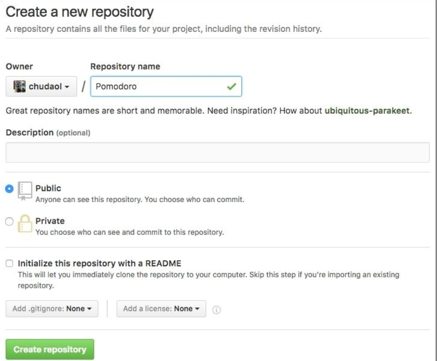
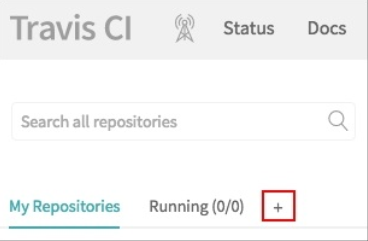
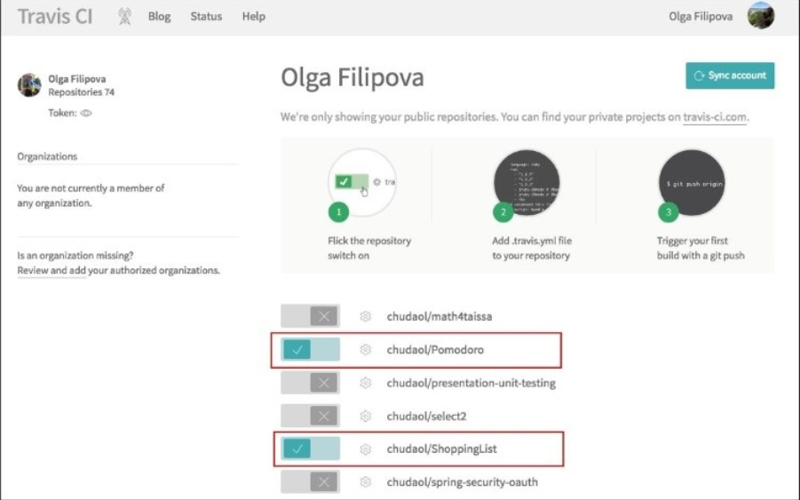
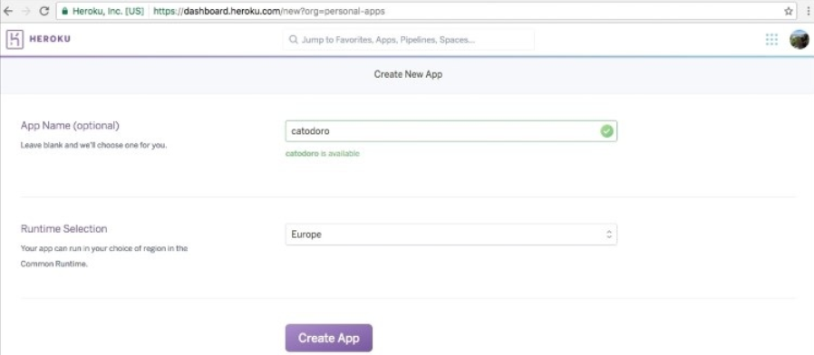
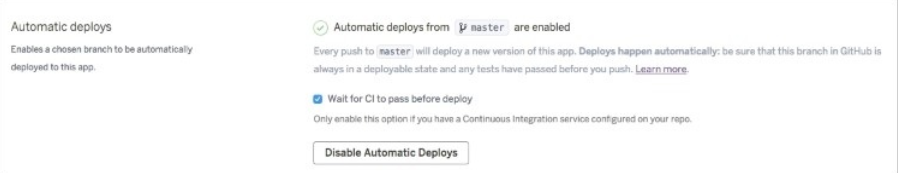
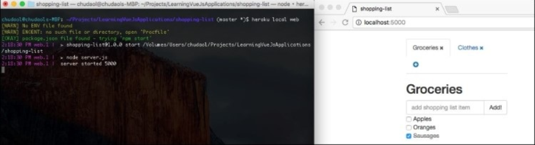

# Deploying – Time to Go Live!

在前面的章节里， 你已经学习了如何测试 Vue 方程式。 我们用不同的测试技术来测试它们。 一开始， 我们为 Vue 组件和 Vuex-related 模块运行了经典的单元测试， 像是 actions, mutations, getters。 然后我们学习了如何使用 Nightwatch 来运行端对端测试。

在本章， 我们将通过把我们的方程式部署到服务器上来让全世界都可以访问到。 我们将保证持续集成开发我们的方程式， 它们将自动被测试部署。

主要来讲， 在本章我们要做以下几件事：
* 用 Travis 持续集成
* 用 Heroku 持续部署


## 软件开发

在开始部署我们的方程式前， 我们先来定义什么是软件开发：

> "Software deployment is all of the activities that make a software system available for  use."       –

> Wikipedia:  https://en.wikipedia.org/wiki/Software_deployment

这个定义说， 在我们执行完所有必要的操作后， 我们的软件将提供给公众。 在我们的事例中， 当我们开发 web 方程式时， 这意味着需要一个公开的 URL， 任何人都可以通过这个 URL 来访问我们的方程式。 这是怎么办到的呢？ 最简单的方式是提供你自己的 IP 地址给你的小伙伴们。 因此， 人们将在你的个人网络中访问你的方程式。 所以呢， 运行你的番茄钟：

**> cd <path to pomodoro>**
**> npm run dev**


查看你的 IP：

**ifconfig**


用 ifconfig 命令行查看 IP 地址

把这个地址分享给和你在统一局域网内的小伙伴们。 在我这就是 *http://192.168.1.6:8080* 。

但是， 只有那些和你在统一局域网的小伙伴才能访问到方程式， 其他人访问不到。

当然你可以使用一些把你的地址转换为公共地址的软件， 例如， **ngrok** ( https://ngrok.com/)。 运行程序后输入如下命令行：

**ngrok http 8080**

这将创建一个在任何地方都可以访问到的地址， 就像普通的网站一样：


使用 ngrok 为你的本地主机提供通道

我的地址是 *http://5dcb8d46.ngrok.io* 。 我可以把这个地址分享给任何人， 它们都可以通过这个地址来访问到番茄钟方程式了！ 但是我可以让我的笔记本运行一晚上， 但我不能让它运行一辈子。 一旦我关掉网络连接， 我的方程式将不能再被访问。 所以呢， 即使我们可以一直开机， 但我不太喜欢这个网站地址。 这个地址由一些字符和数字组成， 而我希望它们是一些有意义的东东。

这里有很多好的方式实现它。 我可以购买， 例如在 **AWS(AmazonWeb Services)** 购买一个虚拟实例服务， 复制我的方程式到这个实例上，在类似 *GoDaddy* 上买个域名， 关联这个域名到购买的实例地址上， 我们就能访问啦。 很神奇吧， 但是很贵。 在我们的方程式达到一定规模时再考虑这个方案吧。

现在， 在本章， 我们将采用一种更便宜， 简单， 健壮的部署方案。 这就是我们为何要在 Heroku 上部署方程式的原因。 Heroku 是一个云应用平台。 首先我们需要在 GitHub 上建立我们的方程式。 你还记得部署的意思是指让我的方程式可以被使用吗？ 我想在部署前让这个方程式测试， 并通过测试。 这就是我们在部署前使用 Travis 来保证我们的方程式质量的原因。 所以， 按照下面的步骤来：

1. 创建 GitHub 项目， 并移入方程式。
2. 用 Travis 持续集成。
3. 链接项目到 Heroku， 并配置。

在下面的三小章， 我将稍微介绍一下 GitHUb， Travis， Heroku。


## 啥是 GitHub？
GitHub 是基于 Git-based 项目的主机提供商。

它可以用在小型私人规模的个人和公共项目中。 它可以用于那些涉及开发大型协同项目中。

每个了解开源软件的人都知道 GitHub。 如果你在读这本关于 Vue 的书， 我相信你一定会跳过这部分的。

## 啥是 Travis？

Travis 是由 GitHub 出品的允许我们连接 GitHub 项目并确保项目质量的工具。 它会在你的项目内运行测试并告诉你构建是否已通过。 在这里  https://travis-ci.org/ 查看更多信息。


## 啥是 Heroku？

Heroku 是一个部署你的方程式的云平台。 它非常易用。 你只需要创建你的方程， 并起一个有意义的名字， 连接 GitHub 上的项目， 就行啦！ 每次你推送给指定的分支， Heroku 将运行你在入口文件内提供的脚本并重新部署。

它是高可配置性的， 也提供了一个命令行界面， 所以你可以完全是用命令行而不必去 Heroku 网站指示板上查看。 我们来自己动手吧！


## 迁移方程式到 GitHub 仓库

我们以为我们的方程式创建一个 GitHub 仓库为起点。

请使用 [ chapter8/pomodoro ](https://github.com/PacktPublishing/Learning-Vue.js-2/tree/master/chapter8/pomodoro) 和 [ chapter8/shopping-list ](https://github.com/PacktPublishing/Learning-Vuejs-2/tree/master/chapter8/shopping-list) 文件。

如果你还没注册 GitHub， 注册一个。 登录帐号并创建两个仓库 *Pomodoro，  ShoppingList* ：



在 GitHub 上创建仓库

一旦你点击了 **Create respository** 按钮，一个带有不同指令的页面将出现。 我们对第二段很感兴趣， **...or create a new
repository on the command line**。 在番茄钟方程式内的命令行按提示复制， 粘贴。移除第一行：

**git init**
**git add**
**git commit -m "first commit"**
**git remote add origion https://github.com/chudaol/Pomodoro.git**
**git push -u origin master**

刷新你的 GitHub 项目页， 你将看到代码出现在这了！

## 用 Travis 持续集成

为了用 Travis 持续集成， 首先你需要用你的 GitHub 帐号连接 Travis 帐号。 打开 https://travis-ci.org/ 点击 **Sign in with GitHub** 按钮：


点击 Sign in with GitHub 按钮

现在你可以添加被 Travis 跟踪的仓库了。 点击加号：



点击加号添加你的 GitHub 项目

在你点击加号后， 整个 GitHub 项目都出现了， 选择你要跟踪的那个：



选择你要跟踪的项目

现在我们已经把项目连接到了 Travs 构建系统了， 所有 commit 和推送到 msater 分支的东东都将被跟踪， 我们需要告诉它在追踪到变化时该做些什么。 Travis 所有的配置都在 *.travis.yml* 文件内。 为两个项目添加 *.travis.yml* 文件。 我们至少需要告诉它 node 使用的版本。 检查你系统内 Node 的版本：

**node --version**

我的是 *v5.11.0* 。 所以：

```js
//.travis.yml
language: node_js
node_js:
- "5.11.0"
```

如果你现在 commit ， push， 你将看到 Travis 自动运行了测试。 默认的， 它为项目运行 *npm test* 命令。 等几分钟后查看结果。 不幸的是， 在执行端对端测试时将失败。 为啥会这样呢？

默认情况下， 虚拟映像的 Travis 构建和测试环境没有安装浏览器。 但我们的 Selenium 测试尝试运行浏览器。 幸运的是， Travis 提供了在构建时执行命令行的机制。 可以在 *before_script* 部分设置。 我们调用必要的安装 Chrome 浏览器命令并导出 CHROME_BIN 变量。 为你的 *.travis.yml* 文件添加如下内容：

```js
before_script:
- export CHROME_BIN=/usr/bin/google-chrome
- sudo apt-get update
- sudo apt-get install -y libappindicator1 fonts-liberation
- wget https://dl.google.com/linux/direct/google-chromestable_current_amd64.deb
- sudo dpkg -i google-chrome*.deb
```

正如你看到的， 为了执行安装及升级系统， 我们必须以 *sudo* 调用命令行。 Travis 在默认情况下不允许你使用 *sudo* 命令以防出现非信任的行为。 但是你可以明确告知 Travis 使用 *sudo* 。 加入下面内容：

```js
sudo: required
dist: trusty
```

现在整个 *.travis.yml* 文件是这样的：

```yml
//.travis.yml
language: node_js
sudo: required
dist: trusty
node_js:
- "5.11.0"


before_script:
- export CHROME_BIN=/usr/bin/google-chrome
- sudo apt-get update
- sudo apt-get install -y libappindicator1 fonts-liberation
- wget https://dl.google.com/linux/direct/google-chromestable_current_amd64.deb
- sudo dpkg -i google-chrome*.deb
```

试着 commit 并查看 Travis 仪表板。

哇哦！ 再次失败了：


在安装 Chrome 后， 由于超时测试失败了

为啥会这样呢？ 我们回忆下运行端对端测试时会发生什么。 每个测试都将打开浏览器执行 UI 操作。 关键是在 UI 内的最后一句。 如果我们需要测试 UI， 我们需要 **图形用户界面 (GUI)** 。 Travis 虚拟映像没有图形显示的。 因此， 没办法打开浏览器显示我们的 UI。 幸运的是， 这有个好东西叫 *Xvfb - X virtual framebuffer* 。

Xvfb 是实现物理显示协议的展示服务器。 所有需要的图形操作都在内存中执行； 因此， 我们不需要物理显示了。 我们通过运行 Vvfb 服务为测试添加虚拟图形环境。 如果你看了 Travis 文档， 你将在这里发现这已被写入建议中： https://docs.travis-ci.com/user/gui-and-headless-browsers/#Using-xvfb-to-Run-Tests-ThatRequire-a-GUI 。 打开 *.travis.yml* 文件添加：

```js
- export DISPLAY=:99.0
- sh -e /etc/init.d/xvfb start
```

完整 YML 文件如下：

```yml
//.travis.yml
language: node_js
sudo: required
dist: trusty
node_js:
- "5.11.0"
before_script:
- export CHROME_BIN=/usr/bin/google-chrome
- sudo apt-get update
- sudo apt-get install -y libappindicator1 fonts-liberation
- wget https://dl.google.com/linux/direct/google-chromestable_current_amd64.deb
- sudo dpkg -i google-chrome*.deb
- export DISPLAY=:99.0
- sh -e /etc/init.d/xvfb start
```

commit 并查看 Travis 仪表板。 番茄钟方程式构建成功了！

番茄钟方程式成功构建

但是购物清单构建失败了。 注意 Travis 甚至变化了每个构建任务选项卡的颜色：


通过构建状态 Travis 改变了选项卡标志的颜色


在构建购物清单时发生了什么？ 在端对端测试里有一步来检查物理显示的标题是否呈现在页面上。 这个标题来自后端服务器， 需启用 *npm run server* 命令。 你还记得我们在第六章中使用的 *vue-resource* 插件吗？ 就是说， 在构建我们的方程式前我们需要告诉 Travis 先运行服务器。 在 *.travis.yml* 文件内添加：

```
- nohup npm run server &
```

Commit 改变并检查 Travis 仪表盘。构建通过了！ 现在我们的构建过程通过了， 我们可以在 README.md 文件内加一个 Travis 按钮了。

在你的方程式的 Travis 页面点击 **build passing** 按钮， 选择 **Markdown** 选项，  拷贝生成的文本到 README.md 文件。


然后你的 README 文件会是这样：


现在， 我们的方程式将会在每次 commit 后自动测试。

在部署方程式前请查看 Heroku 文档并创建帐号 https://signup.heroku.com/dc ， 安装 Heroku Toolbelt (https://devcenter.heroku.com/articles/getting-started-with-nodejs#set-up) 。

现在来部署我们的项目。

## 部署番茄钟

往 Heroku 帐户上添加一个项目。 点击 **Create New App** 按钮。 你可以创建方程式自己的名字：



点击 *Create App* 按钮， 选择 GitHub 方式， 选择你要部署的项目：


然后点击 **Connect** 按钮， 选择 **Automatic deploys from master are enabled， Wait for CI to pass before
deploy** 。



万事俱备， 点击 **Deploy Branch** 按钮， Heroku 将执行构建， 然后你就可以在浏览器内看到方程式了。

## 查看日志

希望你已经安装了 Heroku CLI， 你可以运行 heroku 命令行了， 检查日志， 运行 *heroku logs* ：

**heroku logs --app catodoro --tail**

你将看到持续运行的日志在 Heroku 试着执行构建时。 错误为 *npm ERR! missing script: start* 。 在 *package.json* 内没有启动脚本。

确实， 我们要建立一个启动脚本， 首先得知道如何构建并运行一个 Vue 方程式。 README 文件告诉我们需要运行 *npm run build* 命令行。 本地运行它：


我们知道构建的结果是放在 *dist* 文件夹的。 我们也知道我们需要 *index.html* 文件来启动 HTTP 服务。 我们知道必须来创建一个启动脚本， 然后 Heroku 就知道怎么启动我们的方程式了。

### 准备在 Heroku 上运行方程式

我们可以通过日志文件来集中信息。 在部署前需要以下几个步骤：

* 运行 *npm install* 脚本来加载依赖
* 运行 *npm start* 脚本开启服务

所以我们需要这样做：
* 告诉 Heroku 安装所有的依赖； 我们需要移除 *devDependencies* 部分的项目依赖， 然后 Heroku 才能安装
* 告诉 Heroku 在 *npm install* 后运行构建脚本； 为此我们需要创建 *postinstall* 脚本调用　*npm run*
* 创建 *server.js* 来启动 *index.html* 文件
* 提供一个 Heroku 运行 *server.js* 的服务， 我们需要创建 *start* 脚本来运行 *server.js* 脚本

移除所有的依赖：

```json
"dependencies": {
  "autoprefixer": "^6.4.0",
  "babel-core": "^6.0.0",
  "babel-eslint": "^7.0.0",
  "babel-loader": "^6.0.0",
  "babel-plugin-transform-runtime": "^6.0.0",
  "babel-polyfill": "^6.16.0",
  "babel-preset-es2015": "^6.0.0",
  "babel-preset-stage-2": "^6.0.0",
  "babel-register": "^6.0.0",
  "chalk": "^1.1.3",
  "connect-history-api-fallback": "^1.1.0",
  "cross-spawn": "^4.0.2",
  "css-loader": "^0.25.0",
  "es6-promise": "^4.0.5",
  "eslint": "^3.7.1",
  "eslint-config-standard": "^6.1.0",
  "eslint-friendly-formatter": "^2.0.5",
  "eslint-loader": "^1.5.0",
  "eslint-plugin-html": "^1.3.0",
  "eslint-plugin-promise": "^2.0.1","eslint-plugin-standard": "^2.0.1",
  "eventsource-polyfill": "^0.9.6",
  "express": "^4.13.3",
  "extract-text-webpack-plugin": "^1.0.1",
  "file-loader": "^0.9.0",
  "function-bind": "^1.0.2",
  "html-webpack-plugin": "^2.8.1",
  "http-proxy-middleware": "^0.17.2",
  "inject-loader": "^2.0.1",
  "isparta-loader": "^2.0.0",
  "json-loader": "^0.5.4",
  "lolex": "^1.4.0",
  "opn": "^4.0.2",
  "ora": "^0.3.0",
  "semver": "^5.3.0",
  "shelljs": "^0.7.4",
  "url-loader": "^0.5.7",
  "vue": "^2.0.1",
  "vuex": "^2.0.0",
  "vue-loader": "^9.4.0",
  "vue-style-loader": "^1.0.0",
  "webpack": "^1.13.2",
  "webpack-dev-middleware": "^1.8.3",
  "webpack-hot-middleware": "^2.12.2",
  "webpack-merge": "^0.14.1"
},
"devDependencies": {
  "chai": "^3.5.0",
  "chromedriver": "^2.21.2",
  "karma": "^1.3.0",
  "karma-coverage": "^1.1.1",
  "karma-mocha": "^1.2.0",
  "karma-phantomjs-launcher": "^1.0.0",
  "karma-sinon-chai": "^1.2.0",
  "karma-sourcemap-loader": "^0.3.7",
  "karma-spec-reporter": "0.0.26",
  "karma-webpack": "^1.7.0",
  "mocha": "^3.1.0",
  "nightwatch": "^0.9.8",
  "phantomjs-prebuilt": "^2.1.3",
  "selenium-server": "2.53.1",
  "sinon": "^1.17.3",
  "sinon-chai": "^2.8.0"
}
```

现在创建 *postinstall* 脚本来运行 *npm run build*：

```json
"scripts": {
  <...>
  "postinstall": "npm run build"
},
```

创建一个 *server.js* 文件来启动 *index.html* ：

```js
// server.js
var express = require('express');
var serveStatic = require('serve-static');
var app = express();
app.use(serveStatic(__dirname + '/dist'));
var port = process.env.PORT || 5000;
app.listen(port);
console.log('server started '+ port);
```

好的， 现在我们只需要创建 *start* 脚本了：

```json
"scripts": {
  <...>
  "postinstall": "npm run build",
  "start": "node server.js"
},
```

提交更改， 点击 **Deploy Branch** 按钮， 别忘了查看运行日志！

太棒了， 在成功构建后， 点击 **View** 按钮； 你就能看到自己的方程式了：


成功部署到 Heroku 上的番茄钟方程式

## 部署购物清单方程式

为了部署我们的购物清单方程式我们需要做在番茄钟内做的准备工作。

在 Heroku 上创建新的方程式并连接到 GitHub。 然后拷贝 *server.js* 文件， 处理依赖，创建 *postinstall* 和 *start* 脚本。

但是， 我们依然还差一步， 别忘了我们有 REST API 服务， 我们需要启动它。

我们只需要合并两个服务， 在 *server.js* 内直接开启了全部服务：

```js
//server.js
var express = require('express');
var jsonServer = require('json-server');
var serveStatic = require('serve-static');
var app = express();

app.use(serveStatic(__dirname + '/dist'));
app.use('/api', jsonServer.router('server/db.json'));
var port = process.env.PORT || 5000;
app.listen(port);
console.log('server started '+ port);
```

我们告诉 express app 使用 *jsonServer* 并在 */api/* 上启动 *db.json* 文件。

我们也得改变 Vue resource 上的端口。 在 API 文件夹内打开 *index.js* 用下面的 api 替代 *localhost:3000*：

```
const ShoppingListsResource = Vue.resource('api/' + 'shoppinglists{/id}')
```

我们也应该添加 JSON 服务给 *dev-server.js*； 否则， 我们将不能在开发模式内运行方程式。 所以打开 *build/dev-server.js* 文件， 导入 *jsonServer*：

```js
//dev-server.js
var path = require('path')
var express = require('express')
var jsonServer = require('json-server')
<...>

// compilation error display
app.use(hotMiddleware)
// use json server
app.use('/api', jsonServer.router('server/db.json'));
<...>
```

试着在开发模式下运行方程式 *npm run dev*。 运行成功。

现在我们可以在 *travis.yml* 文件内移除服务器运行指令 (- nohup npm run server &)。 你也可以在 *package.json* 文件内移除服务器脚本。

在本地运行测试检查错误。

基本大功告成了。 我们在本地运行下方程式。

## 在本地运行 Heroku

有时我们需要不停地更改文件， 部署， 所以在本地试着运行方程式会更加节省时间。 幸运的是， Heroku CLI 提供了一种在本地运行方程式的方法， 你只需要运行 *heroku local web* 命令就行了：

**npm run build**
**heroku local web**

在浏览器中打开 http://localhost:5000。 成功了！



我们来提供更改并推送。

现在你可以等待 Travis 成功构建并自动部署在 Heroku 上或者打开你的 Heroku 仪表盘点击 **Deploy Branch** 按钮。 这儿有我们今天部署的两个方程式：

* 番茄钟： https://catodoro.herokuapp.com/
* 购物清单： https://shopping-list-vue.herokuapp.com/

在 GitHub 上找到相应的项目 https://github.com/chudaol/Pomodoro， https://github.com/chudaol/ShoppingList 。

克隆， 部署。此时， 你学会了所有需要的工具， 可以把你的方程式展示给全世界了。 谢谢你一直陪着我走完这段激情之旅！
