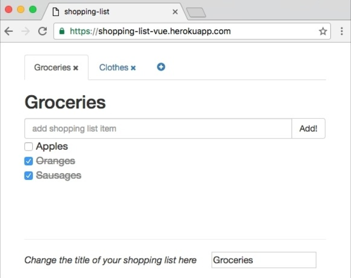
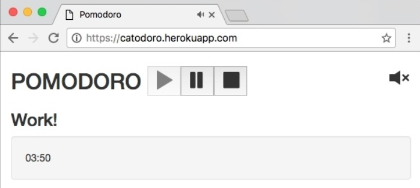
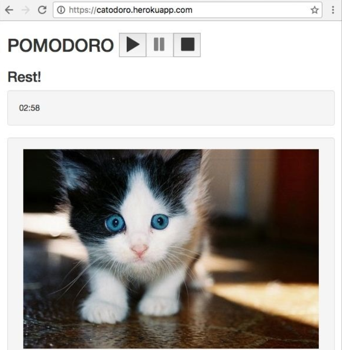

#　What Is Next?

在前一章我们部署了方程式并让全世界的人都可以访问。　我们有持续集成和持续部署我们的方程式。　这意味着我们每次的更改，　方程式将自动测试并部署。

看起来我们在本书的旅程要结束了。　但是，　好戏才刚刚开始。　在学习了所有知识后，　依旧有很多需要学习！　在本章，　我们将总结我们所学的一切。　有如下几件：

* 总结我们所学的一切
* 制作后续事项清单

# 至今的旅程

我们已经走了很长一段， 是时候总结一下啦。

在[第一章]()， 和 *Vue.js 去采购*， 是我们和 Vue.js 的第一见。 我们讨论了 Vue.js 是什么， 能做什么， 它是怎么被创建来的， 附加一些基本事例。

在[第二章]()， 基础 -- 安装使用， 深入 Vue.js。 我们学习了 MVVM 架构模式， 我们看到了 Vue.js 是怎么运行的， 了解 Vue.js 不同的方面如 *components， directives， plugins* 和方程式状态。 我们学习了不同的安装方法， 开始使用简单的编译脚本。 尝试使用 CDN， NPM 并进入到 Vue.js 的源码内。 我们学习了如何调试， 如何用 *Vue-cli* 来生成 Vue.js 方程式脚手架。 我们还用 CSP-compliant 版本的 Vue 创建了一个真正的 Chrome 方程式。

在[第三章]()， 组件 -- 理解与使用， 我们深入了组件系统。 我们学习了如何来定义 Vue 组件， 组件的作用域如何运行， 组件间是如何关联的。 我们开始使用单文件组件。

在[第四章]()， 响应式 -- 为你的方程式绑定数据， 我们深入 Vue.js 的数据绑定和响应式原理。 学习如何使用指令， 表达式， 过滤器。 我们为开发中的方程式带来数据绑定， 让它们变得可交互， 感谢 Vue.js 带来响应式。

在[第五章]()， Vuex -- 在方程式内管理状态， 我们学习了用 Vuex 仓库系统在 Vue 方程式内管理全局状态。 我们学习了如何使用 states， actions， getters， mutations  来创建模块化的良好结构的组件。 我们从此便一直在方程式内运用这些新知识。

在[第六章]()， 插件 -- 自己动手，丰衣足食， 我们学习了 Vue 方程式如何操作插件。 我们使用了已有的插件 *vue-resource* ， 它帮助我们在浏览器刷新时保存方程式的状态。 我们也为自己的方程式创建了一个产生白， 棕， 粉声音的插件。 此时， 我们已经有了功能基本完备的方程式了。

在[第七章]()， 测试 -- 测试我们所做的一切， 我们学习了如何来测试我们的方程式。 我们学习如何书写单元测试， 如何用 Selenium 驱动进行端对端测试。 我们学习了什么是代码覆盖率， 在单元测试内怎么去模拟服务器响应。 我们通过了百分百的覆盖率并用 Selenium 驱动实践了端对端测试。

在[第八章]()， 部署 -- 上线！， 方程式最终上线了。 我们把它们部署到 Heroku 云系统， 现在可以在任何地方访问这些方程式了。 而且， 我们让方程式部署完全自动化。 每次推送变化到主分支， 方程式会自动测试部署。

因此， 在本书内， 我们不仅学习了一个新框架。 我们还运用所学开发了两个简单的方程式。 我们运用了 Vue 最重要的概念让我们的方程式变得响应式， 迅速， 可测试。 但是， 还没完呢。 在本书写就时， Vue 2.0 已经发布。 它带来了一些新东东来学习使用。

## Vue 2.0

Vue 2.0 在 2016 年 9 月 30 日发布了。 查看 Evan You 的文章 https://medium.com/the-vue-point/vue-2-0-is-here-ef1f26acf4b8#.ifpgtjlek 。

通过本书， 我们使用的最新的版本； 但是我参考了最新的版本。 实际上， API 基本不变， 只有轻微的改变， 一些弃用的特性， 最后提供的接口基本不会改变。

然而， Vue 基本上是重写过了！ 当然， 这里有一些部分的代码基本没变， 但是总的来说， 主要的重构和一些概念完全变化了。 例如， 渲染层完全被重写。 性能提升了：




## 回顾我们的方程式

我们来看看迄今为止我们做了哪些。 我们已经用 Vue.js 开发了两个方程式。 现在就回顾一下。

## 购物清单方程式

我们开发的购物清单方程式允许：

* 创建不同的清单列表
* 添加新的清单项兵切换状态
* 重命名购物清单并删除

我们的购物清单方程式在 Heroku 可以找到： https://shopping-list-vue.herokuapp.com/ 。

它的代码托管在 GitHub：https://github.com/chudaol/ShoppingList  。

用 Travis 持续集成： https://travis-ci.org/chudaol/ShoppingList 。

界面易于理解使用：


距离一个真正的购物清单方程式还远， 对吗？


## 番茄钟方程式

番茄钟方程式完成了番茄钟计时功能和声音选择， 还能显示小猫的。 有如下几个功能：

* 开始， 暂停， 停止方程式
* 在工作时听白色的声音， 声音来帮助我们集中精神
* 切换声音
* 在业余时间盯着小猫

我们的番茄钟方程式也在 Heroku ： https://catodoro.herokuapp.com/。

代码托管在 GitHub： https://github.com/chudaol/Pomodoro。

同样以 Travis 构建测试： https://travis-ci.org/chudaol/Pomodoro。

用户界面清晰简单：



五分钟休息时会出现一只小猫：



很可爱吧，但是远不够完美。

## 为啥才是刚刚开始？

在前面的部分， 我们总结了我们在本书发开的方程式。 我们也同意这些方程式远不够完美。 进击更完美的状态就是我们现在的挑战和目的。 这里还有很多工作需要完成。 我们的方程式很棒， 但是缺少 功能， 样式， 标识， 用户体验模式， 接入平台等等。 我们看看还需哪些工作。

## 为我们的方程式添加功能

我们的方程式已经有很多很棒的功能了， 但还可以拥有更多。 它们应该是可以配置的。 更灵活。 也可以对用户更加友好。 我们来看看每个方程式可以添加哪些功能。 这留作你的家庭作业。

### 购物清单方程式

在浏览器内打开方程式。 你可以添加你的列表和列表项。 你可以删除选项和列表。 但是每个人打开方程式都是一样的列表。 这意味着我们必须为每个人提供各自的购物清单方程式， 这需要认证机制。

这里也有一些 UX 问题。 为什么我们需要在输入框内改变标题而不是在标题本身上改变呢？ 实际上， 这个功能是我们最先完成的， 这在当时很有意义， 但现在我们需要改进它。

另一件事就是删除数据。 这没有一种方法来全部删除它们。 如果我们有一个长列表， 当我们删除单个选项时， 需要删除整个购物清单。 我们应该通过点击来删除。

还有一个就是样式问题了。 不同的列表应该有不同的背景色， 不同的字体色， 甚至是不同的字体。 这又一份改进清单：

* 完成认证机制
* 完成行内名称编辑
* 完成清除已选选项
* 完成配置不同清单的样式， 如背景色， 文字色， 字体等

你也可以为每个选项类型提供不同的标志。 你可以看看 Splitwise 方程式照照灵感  https://www.splitwise.com/ 。

### 番茄钟方程式

在浏览器内打开番茄钟方程式。 它简单易用很好。 但是， 添加一些额外的配置将更好。 例如， 改变工作时间， 可能是 15 分钟， 也可能是 30 分钟， 这应该是可以配置的。

我们在维基上看看一个番茄钟到底该是怎样的： https://en.wikipedia.org/wiki/Pomodoro_Technique 。

> "After four pomodoros, take a longer break (15-30 minutes), reset your checkmark count to
zero, then go to step 1."
--https://en.wikipedia.org/wiki/Pomodoro_Technique


哎呀！ 我们应该在四个番茄中后休息的时间长一点。

还有一件重要的事3. 对于任何人， 在努力工作后， 我们希望看到自己的工作进度。 你的番茄钟可以显示一些统计就更好了。

如果在一段时间后这些统计变得可视化就更好的。 为每个人提供一个番茄钟， 所以我们需要认证机制。

而且我们的声音也是被硬编码在方程式：

```
<template>
  <div id="app" class="container" v-noise="'brown'">
  </div>
</template>
```

我们不应该让用户自己切换自己喜欢的声音吗？ 有足够多的点需要改进了：

* 完成认证机制
* 完成储存机制 -- 储存工作统计
* 完成统计展示机制 —— 统计并以适当的形式展示
* 添加配置机制。 配置如下：
  * 配置工作时间
  * 配置休息时间
  * 配置在四个番茄钟后更长的休息时间
  * 配置自定义的声音

正如你看到的， 你依旧有很多工作要做。

## 美化我们的方程式

当前我们两个方程式都是灰色的。 来点设计会更棒的。 我们来让它们更特别。

### 标识

以设计标识开始。 通过一个好的标识让你的产品脱颖而出。 我可以帮助你设计番茄钟的标志， 至少有个想法。 类似于这样：


为购物清单想一个好标志。 会是什么样的呢？ 一个杂货篮？ 一个复选框？ 还是只是一个缩写？ 没有限制！

### 标识和设计

我们的方程式标识需要独特的设计。 通过一些 UX 技术来为方程式开发良好的标识指南。 想想颜色， 字体， 元素怎样出现在页面上

### 动画和变换

动画和变换是带给方程式灵性强有力的方式。 但是， 绝不能滥用。 把他们用在合适的地方才有意义。 例如， 鼠标悬浮在列表标题上会高亮标题， 购物清单选项在被切换时可以有一些弹跳。 番茄钟方程式的每个状态都有不同的背景色。 可以通过背景的不同来体现时间。 机会是无限的。 运用你的想象力来 Vue 的力量来实现你的主意。

## 扩展我们的方程式到其它设备

我们两个方程式都是 web 方程式。 但我们的购物清单方程式不应只作为一款 web 方程式。 当然你可以在家里写好购物清单然后再手机浏览器上浏览， 但这不是最佳的方式。 使用 Weex(https://github.com/alibaba/weex) 来把我们的 web 方程式带到手机上。 我们两个方程式都可以扩展成 Google Chrome 方程式， 就像我们在第二章里学到的一样。  尽力扩展你的方程式。 期待你的作品。

## 总结

这是本书的最后一章。 说实话， 我对此有点伤感。 我们一起度过了愉快的时光。 我知道我不认识你， 但我感觉已经认识了你。 我们就像在一起对话一样。 对于所有开发的东东， 我不能说这全部是由我一个人开发的； 但我感觉我们就像在一起工作一样。

这种感觉很搞笑， 实际上， 因为当你阅读此书时已经是将来的事了。 而你读到这时是和过去的我在交流。 我喜欢书和科技这种不仅在人与人间而且是在时空与时空间建立的联系的方式。

我真的希望你也能成为像我一样 Vue.js 的粉丝。

我真的希望你完善至少一个我们开发至今方程式并给我看看。 我将很乐意帮助你。 欢迎给我留言 *chudaol@gmail.com*。

感谢你和我一路走来， 希望我们在下一本书相见。
